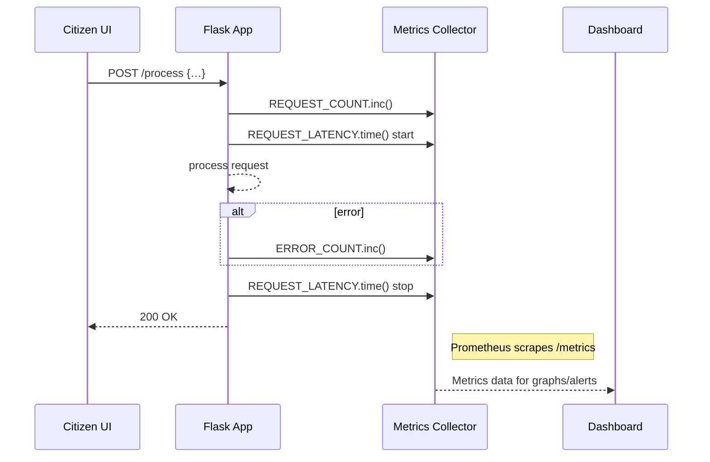

# Chapter 12: Monitoring and Metrics

Welcome back! In the last chapter we added [Human-in-the-Loop (HITL) Oversight](11_human_in_the_loop__hitl__oversight_.md) to our AI pipelines. Now it’s time to add the “control room dashboard” for HMS-DEV: **Monitoring and Metrics**. With this in place, we can continuously track processing times, error rates, user satisfaction scores, and more—so stakeholders are alerted to problems and can measure the impact of AI-driven changes.

---

## 12.1 Why Monitoring and Metrics?

Imagine the U.S. Mission to the United Nations uses HMS-DEV to process visa applications with an AI assistant. They want to know:

- How long does each application take?  
- Are error rates rising after a new AI update?  
- How satisfied are embassy staff with the recommendations?  

Without monitoring, problems could go unnoticed for days. With metrics and dashboards, you get real-time visibility—just like mission control tracking spacecraft telemetry.

---

## 12.2 Key Concepts

1. Metric  
   A numerical measure, e.g. request_latency_seconds or ai_error_count.

2. Collector / Exporter  
   Code that gathers these metrics and makes them available for scraping.

3. Dashboard  
   A visual display (graphs, tables) of your metrics over time.

4. Alert  
   A rule that notifies you (email, Slack) when a metric crosses a threshold.

5. Stakeholders  
   Engineers, data-governance teams, and agency leaders who rely on these insights.

---

## 12.3 Instrumenting Your Application

Let’s add basic metrics to a Python Flask service using Prometheus. We’ll track:

- A counter for total requests  
- A histogram for request durations  
- A counter for errors

### 12.3.1 Install and Initialize

```bash
pip install prometheus-client flask
```

*This brings in the Prometheus client library and Flask.*

### 12.3.2 Add Metrics to Your Code

```python
# app.py
from flask import Flask, request
from prometheus_client import Counter, Histogram, generate_latest

app = Flask(__name__)

REQUEST_COUNT = Counter('request_count', 'Total HTTP requests')
REQUEST_LATENCY = Histogram('request_latency_seconds', 'Latency of HTTP requests')
ERROR_COUNT = Counter('error_count', 'Total errors')

@app.route('/process', methods=['POST'])
def process():
    REQUEST_COUNT.inc()                         # Count every request
    with REQUEST_LATENCY.time():                # Measure duration
        data = request.json
        # ... do AI-driven work ...
        if data.get('invalid'):
            ERROR_COUNT.inc()                   # Count errors
            return {'error': 'bad input'}, 400
        return {'status': 'ok'}

@app.route('/metrics')
def metrics():
    return generate_latest()                    # Expose metrics
```

- `REQUEST_COUNT.inc()` increments a counter.  
- `REQUEST_LATENCY.time()` wraps the request to record its duration.  
- `/metrics` exposes all collected metrics for scraping.

---

## 12.4 Visualizing on a Dashboard

1. Point Prometheus to scrape `http://your-service:5000/metrics`.  
2. In Grafana (or any dashboard), create panels:  
   - A line graph of `request_latency_seconds`.  
   - A gauge or counter chart of `error_count`.  
3. Define alerts, for example:  
   - If average latency > 2s for 5 minutes, send a Slack notification.  

This gives your team real-time insight into service health and AI performance.

---

## 12.5 Under the Hood: Sequence Walkthrough

Here’s what happens when a citizen submits a request and you capture metrics:



1. UI calls your service.  
2. Your code updates counters and histograms.  
3. Prometheus scrapes `/metrics` periodically.  
4. Grafana (Dashboard) visualizes and alerts.

---

## 12.6 Custom Middleware for Metrics

If you have many endpoints, you can factor metrics into middleware:

```python
# metrics_middleware.py
from prometheus_client import Counter, Histogram

REQ_COUNT = Counter('req_count', 'HTTP requests')
REQ_LATENCY = Histogram('req_latency', 'Latency')

def prometheus_middleware(app):
    @app.before_request
    def start_timer():
        request.start_time = REQ_LATENCY.time()

    @app.after_request
    def record_metrics(response):
        REQ_COUNT.inc()
        request.start_time.observe_duration()
        return response
```

Then in your main file:

```python
from flask import Flask
from metrics_middleware import prometheus_middleware

app = Flask(__name__)
prometheus_middleware(app)
# ... define routes and /metrics ...
```

*This keeps your instrumentation DRY and easy to apply across services.*

---

## 12.7 Conclusion

In this chapter, you learned how to:

- Define and collect key performance metrics (request counts, latency, errors).  
- Instrument your Flask service with Prometheus to expose a `/metrics` endpoint.  
- Visualize these metrics in a dashboard tool and set up alerts.  
- Use middleware to keep your code clean.  

With **Monitoring and Metrics** in place, your stakeholders—from developers to policy teams—have a real-time dashboard to track AI performance, catch issues fast, and measure impact across HMS-DEV.  

Happy monitoring!

---

Generated by [AI Codebase Knowledge Builder](https://github.com/The-Pocket/Tutorial-Codebase-Knowledge)