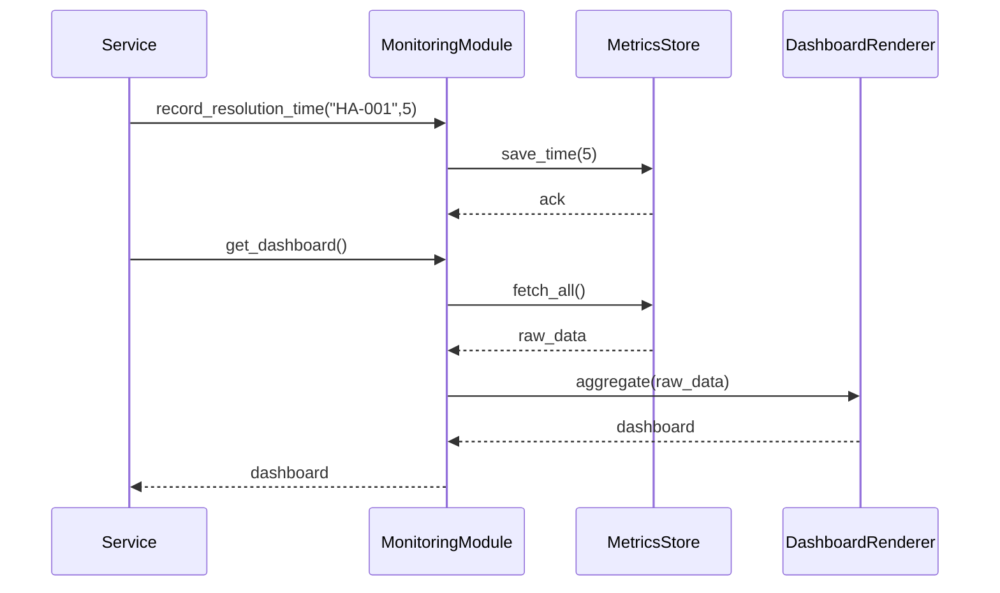

# Chapter 12: Monitoring & Metrics Module

In [Chapter 11: External System Synchronization](11_external_system_synchronization_.md) we learned how HMS-SCM keeps calendars and external systems in lockstep. Now we’ll build the **Monitoring & Metrics Module**—a dashboard and analytics suite that tracks key performance indicators (like resolution time, stakeholder satisfaction, conflict counts) and feeds into continuous improvement, much like a federal performance scorecard under the Government Performance and Results Act (GPRA).

## Why Do We Need a Monitoring & Metrics Module?

Imagine the U.S. Access Board wants to see, each month, how quickly citizen inquiries are resolved, how satisfied stakeholders are with responses, and how many conflicts arose in case reviews. A central dashboard provides:

- Transparency into outcomes  
- Early warnings when targets slip  
- Data to drive process improvements  
- Accountability for teams and agencies  

Without a unified metrics system, every team builds its own reports—leading to inconsistent KPIs, data silos, and blind spots.

## Central Use Case

**Scenario:** The State Grants Office wants to:

1. Record each application’s resolution time (in days).  
2. Log stakeholder satisfaction scores from post-service surveys.  
3. Count conflicts or escalations when legal or policy issues arise.  
4. Display an all-in-one dashboard for program managers.

By the end of this chapter, you’ll see how to record events, aggregate them, and render a simple dashboard.

## Key Concepts

- **Metrics Collector**  
  An API to record raw events (times, scores, conflict flags).  
- **Metrics Store**  
  A lightweight database or in-memory store that holds all events.  
- **Dashboard Renderer**  
  Aggregates stored data into averages, totals, and charts.  
- **Alerts & Notifications**  
  Triggers warnings if KPIs cross thresholds (e.g., average resolution > 7 days).  
- **Continuous Improvement Loop**  
  Feeds dashboard insights back into process optimization ([Chapter 9](09_process_optimization_workflow_.md)).

## Using the Monitoring & Metrics Module

Here’s how a service might record some metrics and then fetch the dashboard:

```python
# example_usage.py
from monitoring import MonitoringModule

mon = MonitoringModule()

# Record events
mon.record_resolution_time(case_id="HA-001", days=5)
mon.record_satisfaction(case_id="HA-001", score=4.2)
mon.record_conflict(case_id="HA-002")

# Fetch aggregated dashboard
dashboard = mon.get_dashboard()
print(dashboard)
# -> {
#      "avg_resolution_time": 4.5,
#      "avg_satisfaction": 4.2,
#      "total_conflicts": 1
#    }
```

Each `record_*` call stores raw data; `get_dashboard()` returns aggregated KPIs.

## What Happens Under the Hood?



1. The Service calls `record_*` on the `MonitoringModule`.  
2. `MonitoringModule` saves the raw event in `MetricsStore`.  
3. On `get_dashboard()`, it fetches all data and calls `DashboardRenderer` to compute averages and totals.  
4. The final dashboard is returned.

## Inside the Code

Below are the minimal supporting files. Each block is under 20 lines.

### File: monitoring.py

```python
# monitoring.py
from metrics_store import MetricsStore
from dashboard_renderer import DashboardRenderer

class MonitoringModule:
    def __init__(self):
        self.store = MetricsStore()
        self.renderer = DashboardRenderer()

    def record_resolution_time(self, case_id, days):
        self.store.save_time(days)

    def record_satisfaction(self, case_id, score):
        self.store.save_score(score)

    def record_conflict(self, case_id):
        self.store.increment_conflicts()

    def get_dashboard(self):
        data = self.store.fetch_all()
        return self.renderer.aggregate(data)
```

This class ties together storage and rendering.  

### File: metrics_store.py

```python
# metrics_store.py

class MetricsStore:
    def __init__(self):
        self.data = {"times": [], "scores": [], "conflicts": 0}

    def save_time(self, days):
        self.data["times"].append(days)

    def save_score(self, score):
        self.data["scores"].append(score)

    def increment_conflicts(self):
        self.data["conflicts"] += 1

    def fetch_all(self):
        return self.data
```

Stores raw lists of times and scores, plus a conflict counter.  

### File: dashboard_renderer.py

```python
# dashboard_renderer.py

class DashboardRenderer:
    def aggregate(self, data):
        times = data["times"]
        scores = data["scores"]
        return {
          "avg_resolution_time": sum(times)/len(times) if times else 0,
          "avg_satisfaction": sum(scores)/len(scores) if scores else 0,
          "total_conflicts": data["conflicts"]
        }
```

Computes simple averages and total counts.  

## Conclusion

You’ve now built the **Monitoring & Metrics Module**, giving HMS-SCM:

- A standard way to record performance events  
- An aggregated dashboard for program managers  
- The foundation for alerts and continuous improvement  

This completes our core HMS-SCM tutorial. With governance, workflows, AI oversight, synchronization, and now monitoring in place, you have a full platform to manage human-machine processes in the public sector.  

Happy monitoring and improving!

---

Generated by [AI Codebase Knowledge Builder](https://github.com/The-Pocket/Tutorial-Codebase-Knowledge)