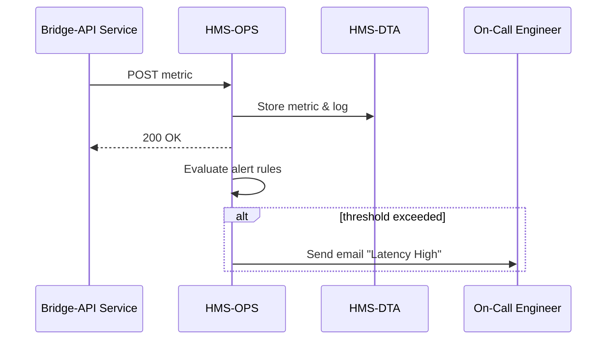

# Chapter 12: Operational Monitoring & Logging (HMS-OPS)

*[Jump back to Chapter 11: Marketplace Service (HMS-MKT)](11_marketplace_service__hms_mkt__.md)*  

---

## 1. Why Do We Need HMS-OPS?

Picture this:  
The Federal Highway Administration just bought a “Bridge-Status API” plugin from the Marketplace. At 2 a.m. the new endpoint suddenly slows from **200 ms** to **12 seconds**.  

If no one notices, 911 dispatchers who rely on that data might show “Unknown” for a critical bridge.  

HMS-OPS is the **24/7 security-camera room** for our platform.  
It:

1. Watches every API, agent, and database.  
2. Records everything (metrics & logs) in real-time.  
3. Rings an alarm if anything drifts from healthy norms—before citizens feel pain.

When OPS shouts, **humans and automated agents can jump in fast**, keeping trust intact.

---

## 2. Key Concepts in Plain English

| Term              | Analogy (Security-Camera Room)                                  |
|-------------------|------------------------------------------------------------------|
| **Metric**        | A vital sign on the heart-rate monitor (e.g., `latency=200 ms`). |
| **Log Entry**     | A timestamped note in the incident notebook.                    |
| **Probe**         | A guard who walks by every minute to check doors are locked.     |
| **Alert**         | The flashing red light and siren.                                |
| **Dashboard**     | The big wall of TVs showing every camera feed.                   |
| **SLO / SLA**     | The “acceptable heart-rate range” agreed with management.        |

---

## 3. 3-Minute Hands-On Tour

We will:

1. Send a metric.  
2. View a live dashboard.  
3. Create an alert that emails you if latency > 2 seconds.

### 3.1 Send a Metric

```bash
curl -X POST https://api.hms/ops/metrics -d '{
  "service": "bridge-api",
  "metric":  "latency_ms",
  "value":   185
}' -H "Content-Type: application/json"
# → { "status":"STORED" }
```

Explanation: One line of JSON tells OPS the latest latency reading.

### 3.2 View the Dashboard (read-only)

```bash
curl https://api.hms/ops/dashboards/bridge-api
# → { "latency_ms": { "p50":190,"p95":250 }, "uptime":"99.99%" }
```

OPS already aggregates percentiles so you instantly see trends.

### 3.3 Create an Alert

```python
# set_alert.py  (≤18 lines)
import httpx, json
rule = {
  "service": "bridge-api",
  "metric":  "latency_ms",
  "threshold": 2000,        # 2 seconds
  "action": "email",
  "target": "oncall@dot.gov"
}
r = httpx.post("https://api.hms/ops/alerts", json=rule).json()
print(r)   # → { "alertId":"AL-5001","status":"ACTIVE" }
```

From now on, if `latency_ms` exceeds **2000**, the on-call engineer gets an email (or SMS, Slack, etc.).

---

## 4. What Happens Behind the Curtain?



Plain-English walk-through:

1. **Bridge-API** posts its latest latency.  
2. OPS stores it (immutable) in [Central Data Repository (HMS-DTA)](07_central_data_repository__hms_dta__.md).  
3. OPS evaluates all alert rules for this service.  
4. If any rule fires, OPS notifies the on-call target. All of this happens in < 1 second.

---

## 5. Peeking Inside OPS

### 5.1 Minimal Metric Ingest Route (Node.js, 15 lines)

```js
// services/ops/ingest.js
router.post('/metrics', async (req, res)=>{
  const { service, metric, value } = req.body;
  await Metrics.insert({ service, metric, value, ts: Date.now() });
  await Alerts.evaluate(service, metric, value);   // may trigger actions
  res.json({ status:'STORED' });
});
```

Explain:  
• One DB insert.  
• Immediately checks if any alert rules trip.  
• Returns a simple JSON success.

### 5.2 Alert Evaluation Helper (Python-style, 17 lines)

```python
def evaluate(service, metric, value):
    rules = db.find("alerts", {"service":service,"metric":metric,"active":True})
    for r in rules:
        if value > r["threshold"]:
            send(r["action"], r["target"],
                 f"[ALERT] {service} {metric}={value} > {r['threshold']}")
            db.insert("logs", {"alert":r["id"],"value":value})
```

Beginners’ read-through: loop over rules → compare threshold → call `send()` → log it.

### 5.3 Simple Dashboard Query (SQL, 8 lines)

```sql
SELECT percentile_cont(0.5) WITHIN GROUP (ORDER BY value) as p50,
       percentile_cont(0.95)               (ORDER BY value) as p95
FROM metrics
WHERE service = 'bridge-api'
  AND metric  = 'latency_ms'
  AND ts > now() - interval '1 hour';
```

OPS runs queries like this to pre-compute dashboard numbers.

---

## 6. How HMS-OPS Connects to Other Layers

| Layer | What It Gets From / Gives To OPS |
|-------|----------------------------------|
| [HMS-SVC](05_backend_service_layer___apis__hms_svc__.md) | Sends health metrics & structured logs. |
| [HMS-AGX](02_ai_representative_agent__hms_agx__.md) | Reads metrics to decide load-shedding; can also open incident tickets via OPS API. |
| [HITL](03_human_in_the_loop__hitl__oversight_.md) | Displays “System Health” strip so reviewers know if backend issues could skew decisions. |
| [HMS-ACH](10_financial_transaction_system__hms_ach__.md) | Emits payment-batch success/failure logs; OPS alerts finance if reconciliation fails. |
| [HMS-MFE](04_micro_frontend_interface_library__hms_mfe__.md) | Embeds OPS widgets (`<OpsSparkline>`, `<OpsIncidentFeed>`) in any dashboard through micro-frontends. |

---

## 7. Frequently Asked Questions

**Q: Do services push metrics, or does OPS pull them?**  
Both. Push is the default (`POST /metrics`), but OPS can also run **Probes**—HTTP pings every few seconds—to double-check critical endpoints.

**Q: Can I add custom alert actions (e.g., PagerDuty, Teams)?**  
Yes. Drop a new action script in `ops/actions/`. The evaluate helper auto-detects it.

**Q: How long are logs kept?**  
Raw logs stay 90 days in hot storage; metrics are down-sampled for long-term trends and archived per agency retention policy.

**Q: Does OPS slow my service down?**  
No. Ingest is an **asynchronous fire-and-forget** write; even if OPS is briefly offline, local sidecars buffer metrics.

---

## 8. What You Learned

• HMS-OPS is the **always-awake guard tower** watching latency, errors, and audit trails across every module.  
• You posted a metric, built a dashboard, and set an email alert in minutes.  
• Under the hood, tiny routes, a simple rule engine, and immutable storage keep the platform safe and transparent.  

Ready to learn how AI agents stay “on topic” by sharing the right context—and nothing else?  
Continue to [Model Context Protocol (HMS-MCP)](13_model_context_protocol__hms_mcp__.md).

---

Generated by [AI Codebase Knowledge Builder](https://github.com/The-Pocket/Tutorial-Codebase-Knowledge)