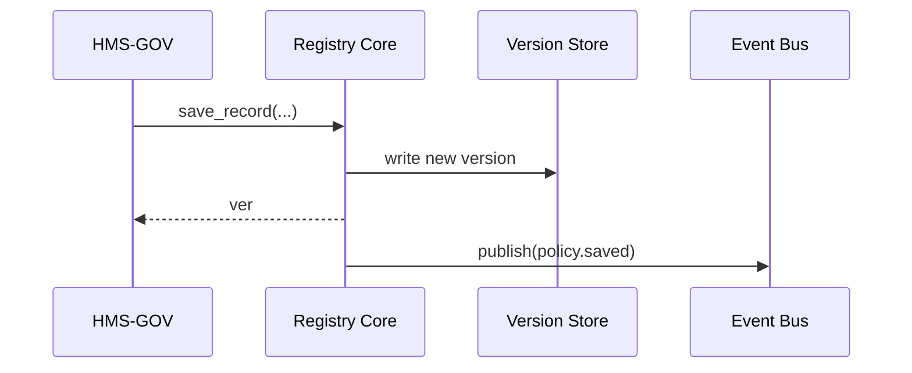

# Chapter 12: Policy & Process Registry  
*(File: `12_policy___process_registry_.md`)*  

[← Back to Chapter&nbsp;11: Event Bus & Real-Time Monitoring](11_event_bus___real_time_monitoring_.md)

---

## 1. Why Do We Need a Registry?  

### Use-Case: “Where Did The 15-Minute Passport Rule Come From?”  

Last month the **Bureau of Consular Affairs** bragged that routine passports are now processed in **15 days instead of 30**.  
A journalist files a **FOIA** request asking:  

> “Give me every revision of the passport-queue policy since 2018 and the reason each change was made.”  

Without a single, versioned library of policies you would have to:  

* comb through Git commits,  
* dig in team chats,  
* hope nobody edited a doc offline.  

The **Policy & Process Registry (PPR)** solves this by acting as a **law library with built-in time machine**: every workflow, rule, and AI proposal lives here—versioned, annotated, searchable.

---

## 2. Key Concepts (Plain-English Cheat-Sheet)

| Term | Analogy | One-Line Description |
|------|---------|----------------------|
| Record | Book on a shelf | A single policy, workflow, or AI rule. |
| Version | New edition | Snapshot of a Record at a point in time. |
| Rationale | Sticky note | Short text that explains *why* the change happened. |
| Tag | Color sticker | Optional label like `urgent`, `pilot`, `sunset-2025`. |
| Diff | Side-by-side pages | Highlight of what changed between two versions. |
| Provenance Chain | Accession number | Cryptographic link that shows the edition order (tamper-evident). |

Remember these six and you “speak PPR”.

---

## 3. Storing Your First Policy (10 Lines)

```python
from ppr import save_record, get_history

policy = {
    "id": "PASS_Q_LEN",
    "content": {"days": 15},
    "rationale": "Cut backlog; no extra risk",
    "tags": ["passport", "queue"]
}

save_record(policy)
print(get_history("PASS_Q_LEN"))
```

Output (pretty-printed):

```
[
  {"ver":1, "by":"alice", "days":15, "ts":"2024-06-05T12:00Z"}
]
```

Beginners’ takeaways  
1. `save_record` is the **one public call** to write.  
2. `get_history` is the **one public call** to read.  
3. No SQL, no Git—super simple.

---

## 4. What Happens Under the Hood?



Four participants—easy to follow.

---

## 5. Internal Walk-Through (Code Light)

### 5.1 File Layout

```
ppr/
 ├─ core.py        # public API
 ├─ store.py       # versioned storage
 └─ utils.py       # diff + hash helpers
```

### 5.2 core.py (18 Lines)

```python
import time, store, utils, event_bus

def save_record(rec, user="system"):
    prev = store.latest(rec["id"])
    ver  = (prev["ver"] + 1) if prev else 1
    entry = {
        "id": rec["id"],
        "ver": ver,
        "ts":  time.strftime("%Y-%m-%dT%H:%MZ", time.gmtime()),
        "by":  user,
        "content": rec["content"],
        "rationale": rec.get("rationale",""),
        "tags": rec.get("tags", []),
        "hash": utils.make_hash(rec["content"], prev)
    }
    store.write(entry)
    event_bus.publish("policy.saved", {"id": rec["id"], "ver": ver})
    return ver

def get_history(rec_id):
    return store.history(rec_id)
```

**Highlights**  
* `ver` auto-increments.  
* `utils.make_hash` links to previous hash—forms the **Provenance Chain**.  
* On success we emit `policy.saved`; dashboards update in real time.

### 5.3 store.py (≤ 16 Lines)

```python
_db = {}   # {id: [versions...]}

def write(entry):
    _db.setdefault(entry["id"], []).append(entry)

def latest(rec_id):
    return _db.get(rec_id, [])[-1] if rec_id in _db else None

def history(rec_id):
    return list(_db.get(rec_id, []))
```

In production this would hit Postgres or S3; the **API shape stays identical**.

### 5.4 utils.py (8 Lines)

```python
import hashlib, json
def make_hash(content, prev):
    raw = json.dumps(content, sort_keys=True) + (prev["hash"] if prev else "")
    return hashlib.sha256(raw.encode()).hexdigest()[:12]
```

Change any byte in an old version and the chain breaks—auditors will notice.

---

## 6. Using the Registry for FOIA Discovery

```python
from ppr import get_history
revs = get_history("PASS_Q_LEN")
for v in revs:
    print(v["ver"], v["ts"], v["rationale"])
```

Typical console:

```
1 2023-02-10T14:00Z “Pilot to reduce queue”
2 2023-08-15T09:12Z “Extended after GAO report”
3 2024-06-05T12:00Z “15-day nationwide launch”
```

VOILÀ—ready for the journalist, no cardboard boxes of paper.

---

## 7. How Other Layers Use PPR

| Layer | Purpose |
|-------|---------|
| [Governance Layer](01_governance_layer__hms_gov__.md) | Pulls latest rules before approving a new proposal. |
| [AI Representative Agent](05_ai_representative_agent__a2a_node__.md) | Reads past rationales to avoid repeating failed ideas. |
| [Human-in-the-Loop Oversight](06_human_in_the_loop_oversight__hitl__.md) | Adds reviewer comments as new **rationale** entries. |
| [Event Bus](11_event_bus___real_time_monitoring_.md) | Receives `policy.saved` & `policy.diff` for dashboards. |
| [Compliance & Audit Ledger](14_compliance___audit_ledger_.md) | Snapshots every new version for immutable storage. |

---

## 8. Beginner FAQ  

**Q: Can I edit or delete a version?**  
A: No—append-only. To retract a policy, save a **new version** that sets a `tags: ["deprecated"]`.  

**Q: How big can the content be?**  
A: Designed for JSON/YAML under 1 MB. Store videos elsewhere; save the URL here.  

**Q: What about private notes?**  
A: Add `tags: ["internal"]`. Access is enforced by the [Access & Authorization Matrix](03_access___authorization_matrix_.md).

---

## 9. Quick Checklist  

☑ `save_record` and `get_history` are the only two functions you need.  
☑ Every save creates a **version**, **rationale**, and **hash link**.  
☑ Events emit to the bus; auditors can replay everything.  
☑ Immutable, append-only—perfect for FOIA and court discovery.

---

## 10. Conclusion & What’s Next  

You now have a **time-traveling law library** that keeps every change—and the *why* behind it—at your fingertips. No more frantic email searches when Congress calls.

Up next, we’ll teach the system to **learn from those versions** and suggest better workflows automatically in the [Process Optimization Engine](13_process_optimization_engine_.md).

---

Generated by [AI Codebase Knowledge Builder](https://github.com/The-Pocket/Tutorial-Codebase-Knowledge)