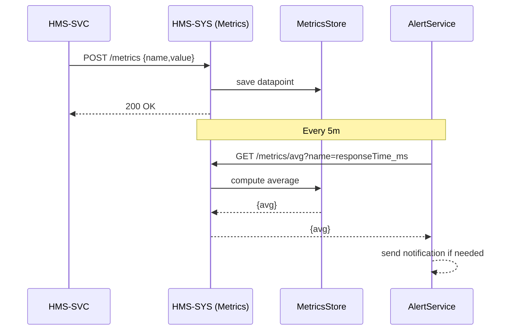

# Chapter 12: Real-Time Monitoring & Metrics

Welcome back! In [Chapter 11: Human-In-The-Loop Workflow](11_human_in_the_loop_workflow_.md), we learned how humans review AI proposals before they go live. Now it’s time to build your “city scoreboard”—the **Real-Time Monitoring & Metrics** system that tracks how well your processes run, alerts on slipped targets, and shows wins on a public dashboard.

---

## 1. Why Real-Time Monitoring & Metrics?

Imagine FEMA (Federal Emergency Management Agency) is coordinating disaster relief requests. They need to know, in real time:

- How long each request takes from submission to response  
- Whether the average response time stays under 4 hours  
- If citizen satisfaction dips below 90%  
- How many requests are processed per hour  

A transparency dashboard gives everyone—from the public to agency directors—a live view of performance. It also triggers alerts (email, Slack, AI Agents) whenever a metric crosses a threshold, so teams can jump in and fix problems immediately.

---

## 2. Key Concepts

1. **Metric**  
   A named measurement (e.g., `responseTime`, `throughput`, `satisfactionRate`).

2. **Gauge vs. Counter**  
   - *Gauge*: current value (e.g., open requests = 42)  
   - *Counter*: ever-increasing count (e.g., total requests processed = 12,345)

3. **Threshold & Alert**  
   A rule like “if `responseTime_avg > 4h`, send an alert.”

4. **Dashboard**  
   A public page showing live graphs, tables, and status lights.

5. **Data Pipeline**  
   Events flow from services → metrics collector → store → dashboard or alert service.

---

## 3. Using the Monitoring API

Below is how a service (like our permit workflow) can record metrics.

File: `src/services/metricsService.js`
```js
// Minimal metrics publisher
export function recordMetric(name, value) {
  fetch('/api/metrics', {
    method: 'POST',
    headers: {'Content-Type':'application/json'},
    body: JSON.stringify({ name, value, timestamp: Date.now() })
  })
}
```
Whenever an event happens—say a request completes—you call:
```js
recordMetric('responseTime_ms', end - start)
```
This sends data points to your Monitoring API.

---

## 4. Threshold Alerts Example

File: `src/services/alertService.js`
```js
// Alert if average > threshold
export async function checkThreshold(name, threshold) {
  const res = await fetch(`/api/metrics/avg?name=${name}`)
  const { avg } = await res.json()
  if (avg > threshold) {
    alert(`⚠️ ${name} average is ${avg}, above ${threshold}`)
  }
}
```
You might run `checkThreshold('responseTime_ms', 14400000)` every 5 minutes (4 hours in ms).

---

## 5. What Happens Under the Hood?



1. Your workflow posts each metric.  
2. The Metrics API stores raw points.  
3. A periodic alert job queries aggregates.  
4. If thresholds are crossed, an alert fires.

---

## 6. Inside: Simple In-Memory Store

File: `server/services/metricsStore.js`
```js
const data = {}  // { name: [ {value,timestamp}, ... ] }

export function savePoint({name, value, timestamp}) {
  data[name] = data[name] || []
  data[name].push({value, timestamp})
}

export function getAverage(name) {
  const points = data[name] || []
  const sum = points.reduce((s, p) => s + p.value, 0)
  return points.length ? sum / points.length : 0
}
```
Our Metrics API routes call `savePoint()` on POST and `getAverage()` on GET. In production you’d replace this with a time-series DB.

---

## 7. Dashboard Sketch

Below is a minimal React component that polls and displays one metric.

```jsx
import React, {useEffect, useState} from 'react'

function AvgResponseTime() {
  const [avg, setAvg] = useState(0)
  useEffect(() => {
    async function fetchAvg() {
      const res = await fetch('/api/metrics/avg?name=responseTime_ms')
      const json = await res.json()
      setAvg(Math.round(json.avg / 1000)) // seconds
    }
    fetchAvg()
    const iv = setInterval(fetchAvg, 5000)
    return () => clearInterval(iv)
  }, [])
  return <div>Avg Response Time: {avg}s</div>
}
export default AvgResponseTime
```
This renders a live-updating average on your dashboard.

---

## Conclusion

In this chapter you learned how **Real-Time Monitoring & Metrics**:

- Records gauges and counters from your services  
- Stores data points and computes aggregates  
- Triggers alerts when targets slip  
- Displays live dashboards for transparency  

With this in place, your agency can practice true data-driven governance—spotting issues instantly and celebrating improvements publicly.

---

Generated by [AI Codebase Knowledge Builder](https://github.com/The-Pocket/Tutorial-Codebase-Knowledge)