# Chapter 12: Universal Identity & Access (Account & AuthN)

[← Back to Chapter 11: Micro-Frontend Interface Layer (HMS-MFE)](11_micro_frontend_interface_layer__hms_mfe__.md)

---

## 1. Why Another Layer?  
Picture a **policy clerk** opening the HUD portal to upload an Excel budget.  
One tab away, an **Inspector General** reviews fraud reports; another tab hosts an **AI bot** that crunches those reports.

Without strict identity & access:

* The clerk could _accidentally_ see (or delete) fraud evidence.  
* The bot might copy files it should only read.  
* Auditors would have no single place to ask, **“Who did what?”**

Universal Identity & Access (UIA) is the platform’s **digital passport office**.  
It hands every human, service, and bot one secure ID card and makes sure:

1. They log in once (SSO) and roam everywhere.  
2. They can do **only** what their role allows (RBAC).  
3. Every click is stamped into an immutable audit ledger.

---

## 2. Central Use-Case – “The Shared Portal Login”

1. **Sam (policy clerk)** visits `hud.gov` and hits **“Sign In”**.  
2. UIA shows Sam two options: **username + password** _or_ **PIV card + PIN**.  
3. Sam chooses password + **SMS 2-Factor**; receives a token valid for 8 hours.  
4. When Sam opens the **Budget Upload** micro-frontend, the token is passed under the hood.  
5. An API call checks Sam’s role: *“policy_clerk”* → **✅ Upload allowed**.  
6. Sam clicks **Fraud Dashboard** by mistake.  
   *API sees role mismatch → ❌ HTTP 403. An audit entry is written.*  

Nothing to install, no second login screen, zero chance to clobber evidence.

---

## 3. Key Concepts (Beginner-Friendly Table)

| Concept | Friendly Analogy | 1-Line Job |
|---------|------------------|------------|
| Digital Passport | Real passport book | Proves **who** you are everywhere you travel. |
| Role-Based Access Control (RBAC) | Job badge (“Clerk”, “IG”) | Maps **what** actions you may take. |
| Scope Token | Movie ticket stub | Limits access even further (“read only”, “expires in 8 h”). |
| 2-Factor Auth (2FA) | Bank’s text code | Stops bad actors who stole a password. |
| Single Sign-On (SSO) | TSA Pre✓ lane | Log in once, breeze through other services. |
| FedRAMP Audit Trail | Capitol CCTV | Immutable record for inspectors & GAO. |

---

## 4. Hands-On: Issue & Verify a Token in 20 Lines

We'll build a **tiny** passport office:  

```python
# file: uia.py  (≤20 lines)
import time, hmac, hashlib, base64, json

SECRET = b'super-fedramp-key'        # env var in real life

def issue(user_id, role, ttl=28800):         # 8 h default
    pay = {"sub": user_id, "role": role, "exp": time.time()+ttl}
    raw = json.dumps(pay).encode()
    sig = hmac.new(SECRET, raw, hashlib.sha256).digest()
    token = base64.urlsafe_b64encode(raw+sig).decode()
    return token

def verify(token, need_role=None):
    blob = base64.urlsafe_b64decode(token.encode())
    raw, sig = blob[:-32], blob[-32:]
    if not hmac.compare_digest(sig, hmac.new(SECRET, raw, hashlib.sha256).digest()):
        raise ValueError("Bad signature")
    pay = json.loads(raw)
    if pay["exp"] < time.time(): raise ValueError("Expired")
    if need_role and pay["role"]!=need_role:  raise PermissionError("Role mismatch")
    return pay        # valid!
```

Explanation  
1. `issue` signs a JSON payload (`sub`, `role`, `exp`).  
2. `verify` confirms the HMAC, expiration, and role.  
3. **< 20 lines**, but covers signing, expiry, and RBAC.

---

### 4.1 Quick Test

```python
tok = issue("sam@hud.gov", "policy_clerk")
print( verify(tok, need_role="policy_clerk") )
```

Output (truncated):

```python
{'sub': 'sam@hud.gov', 'role': 'policy_clerk', 'exp': 1710700000.0}
```

Change `need_role="inspector_general"` → raises `PermissionError`.

---

## 5. How Front-End Bricks Re-Use the Token

Remember the page shell from [Chapter 11](11_micro_frontend_interface_layer__hms_mfe__.md).  
Add **one line**:

```html
<script> localStorage.setItem('UIA', '<?= token ?>'); </script>
```

Every micro-frontend simply fetches:

```js
const token = localStorage.getItem('UIA');
fetch('/api/budget', { headers:{Authorization:`Bearer ${token}`} });
```

No extra login screens, yet role checks still fire on every request.

---

## 6. What Happens Under the Hood?

```mermaid
sequenceDiagram
    participant User as Sam
    participant MFE as Budget Upload UI
    participant UIA as UIA Gateway
    participant API as Budget API
    participant Log as Audit Ledger

    User->>MFE: Click "Upload"
    MFE->>API: POST file  + Bearer token
    API->>UIA: verify(token,"policy_clerk")
    UIA-->>API: ✔️ / ❌
    API-->>Log: write(entry)
    API-->>MFE: success or 403
```



Only five actors; UIA sits in the middle, cheap to reason about.

---

## 7. Deeper Dive: 2FA & FedRAMP Logging (Tiny Snippets)

### 7.1 SMS One-Time Code (12 Lines)

```python
# file: uia/2fa.py
import random, time
CODE_DB = {}
def send_code(user):
    code = f"{random.randint(0,999999):06}"
    CODE_DB[user] = (code, time.time()+300)
    print("SMS to user:", code)     # integrate with Twilio in prod

def check_code(user, code):
    real, exp = CODE_DB.get(user, (None,0))
    if time.time()>exp:  raise ValueError("Code expired")
    if code!=real:       raise ValueError("Bad code")
```

### 7.2 FedRAMP Audit Entry (8 Lines)

```python
# file: uia/audit.py
import json, time
def log(event, user, ok):
    entry = {"ts":time.time(),"event":event,"user":user,"ok":ok}
    open("fedramp.log","a").write(json.dumps(entry)+"\n")
```

Every `verify()` call inside `uia.py` now does `log("verify", pay["sub"], True)`.

---

## 8. Integrations with Other HMS Layers

* **Micro-Frontend Shell** auto-injects the token so every brick “just works” – see [Chapter 11](11_micro_frontend_interface_layer__hms_mfe__.md).  
* UIA consults **Governance Layer** rules to forbid dangerous role combos (e.g., *“contract_signer”* + *“auditor”*) – see [Chapter 1](01_governance_layer__ai_governance_model__.md).  
* When an AI agent acts, it swaps its human token for a **bot scope token** issued by UIA – see [AI Representative Agent Framework](08_ai_representative_agent_framework__hms_agt___hms_agx__.md).  
* All audit lines stream into dashboards inside [System Observability & Ops Center](19_system_observability___ops_center__hms_ops__.md).

---

## 9. 90-Second Lab

1. Save `uia.py` and `2fa.py`.  
2. In a Python shell:

```python
from uia import issue, verify
from uia.2fa import send_code, check_code

send_code("sam@hud.gov")     # read SMS code in console
code = input("Enter SMS code: ")
check_code("sam@hud.gov", code)

tok = issue("sam@hud.gov", "policy_clerk")
print("Token:", tok[:40], "...")

print( verify(tok, need_role="policy_clerk") )
```

3. Open `fedramp.log` – every operation is already recorded.

Congratulations 🎉 —you just issued a FedRAMP-style passport, passed 2FA, enforced RBAC, and produced an audit trail in under two minutes.

---

## 10. Recap & What’s Next

In this chapter you learned:

1. UIA gives every person, service, and bot a **digital passport**.  
2. **Token + Role** checks are only ~20 lines of code yet meet FedRAMP demands.  
3. Single Sign-On and 2FA integrate seamlessly with Micro-Frontends and APIs.  
4. Every verification call is stamped into an immutable audit ledger.

With identities now secure, we can safely **orchestrate multi-step activities across many services**.  
Let’s see how: [Chapter 13: Activity Orchestrator (HMS-ACT)](13_activity_orchestrator__hms_act__.md)

---

---

Generated by [AI Codebase Knowledge Builder](https://github.com/The-Pocket/Tutorial-Codebase-Knowledge)