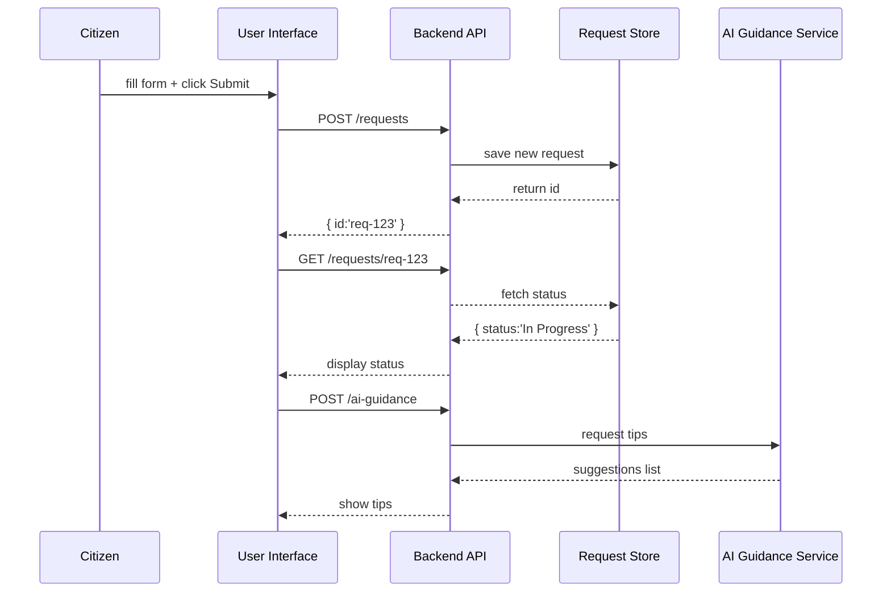

# Chapter 12: User Portal

In the previous chapter we built the secure [Admin/Gov Portal](11_admin_gov_portal_.md) for policy makers. Now it’s time to open the doors to citizens and stakeholders with the **User Portal**—the online “town hall” where people submit requests, track progress, and get AI-powered guidance.

---

## 1. Why We Need a User Portal

Imagine a resident spots a dangerous pothole on Main Street. They go to the city’s website, log in, report the problem, and later check to see when crews will fix it. A good User Portal lets:

- Citizens authenticate with their account.  
- Residents file complaints and service requests.  
- Everyone track the real-time status of their cases.  
- An AI helper suggest next steps or similar past solutions.

Without a single gateway, people would call different departments, wait on hold, or get lost in isolated forms. The User Portal centralizes feedback, makes government more transparent, and speeds up service.

---

## 2. Key Concepts

1. **Authentication**  
   Verifying who you are (e.g., login with username/password or government SSO).

2. **Request Submission**  
   A form where users describe their issue (pothole, broken light, permit question).

3. **Request Tracking**  
   A dashboard showing each request’s status (e.g., “Received”, “In Progress”, “Completed”).

4. **AI-Driven Guidance**  
   Smart suggestions—“We saw a similar case fixed in 2 days. Would you like tips on preparing photos?”  

---

## 3. Solving Our Use Case

We’ll create a minimal **UserPortalService** that lets citizens submit a pothole report, check its status, and ask for AI tips.

### 3.1 Submitting a Request

```javascript
// user_portal_service.js
class UserPortalService {
  constructor(apiClient) {
    this.api = apiClient;       // wraps HTTP calls
  }

  async submitRequest(data) {
    // e.g., { type:'pothole', location:'Main St', description:'Huge crater' }
    return this.api.post('/requests', data);
  }
}
```
This sends the citizen’s data to our backend and returns a new request ID.

### 3.2 Checking Status

```javascript
// Inside UserPortalService
async getStatus(requestId) {
  // e.g., '/requests/req-123'
  return this.api.get(`/requests/${requestId}`);
}
```
Calling `getStatus` returns current state and updates, like `{ id:'req-123', status:'In Progress' }`.

### 3.3 Getting AI Guidance

```javascript
// Inside UserPortalService
async getGuidance(requestData) {
  // AI suggests photos, keywords, or next steps
  return this.api.post('/ai-guidance', requestData);
}
```
The AI service might reply:
```json
{ 
  "tips": [
    "Upload a photo of the pothole edges.",
    "Provide nearest cross-street for faster routing."
  ]
}
```

---

## 4. What Happens Under the Hood?



1. **Submit**: Citizen enters details and sends to `/requests`.  
2. **Store**: The API saves it and returns a request ID.  
3. **Track**: The UI polls `/requests/:id` for updates.  
4. **Guide**: The UI calls `/ai-guidance` to show smart tips.

---

## 5. Inside the Implementation

### 5.1 Non-Code Walkthrough

1. **UI Layer** calls `UserPortalService`.  
2. **Service** uses an **ApiClient** to hit endpoints.  
3. **Backend API** routes `/requests` and `/ai-guidance`.  
4. **Data Store** holds request records.  
5. **AI Service** analyzes text and returns suggestions.

### 5.2 Minimal Backend Routes

File: `backend/api/routes/requests.js`
```javascript
const express = require('express');
const router = express.Router();
const store = { requests: {} };

// Submit a request
router.post('/requests', (req, res) => {
  const id = `req-${Date.now()}`;
  store.requests[id] = { id, ...req.body, status:'Received' };
  res.status(201).json({ id });
});

// Get request status
router.get('/requests/:id', (req, res) => {
  const rec = store.requests[req.params.id];
  if (!rec) return res.status(404).end();
  res.json({ id: rec.id, status: rec.status });
});

module.exports = router;
```

File: `backend/api/routes/aiGuidance.js`
```javascript
const express = require('express');
const router = express.Router();

// Simple AI stub
router.post('/ai-guidance', (req, res) => {
  res.json({
    tips: [
      "Attach a clear photo.",
      "Give the exact address or block."
    ]
  });
});

module.exports = router;
```

These routes power our User Portal’s requests and AI tips.

---

## 6. Summary

In this chapter you learned how the **User Portal**:

- Authenticates citizens and stakeholders  
- Lets people submit and track requests (like pothole repairs)  
- Provides AI-driven guidance to help users give the right information  

With this public-facing gateway in place, HMS-SME now closes the loop from citizen input all the way through governance, policy, AI, human review, metrics, and back out to stakeholders—truly a modern, transparent “town hall” online.

---

Generated by [AI Codebase Knowledge Builder](https://github.com/The-Pocket/Tutorial-Codebase-Knowledge)