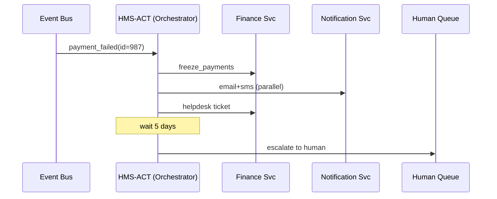

# Chapter 12: Workflow Orchestration (HMS-ACT)

*Just left our “city-ops center” in [Management Layer (HMS-SVC / HMS-OPS / HMS-OMS)](11_management_layer__hms_svc___hms_ops___hms_oms__.md).  
Now we need a **conductor** that tells those services **when** to start playing, **in what order**, and **who gets a solo**.*

---

## 1. Why Do We Need a Conductor?

### Central Use-Case – “Handle a Failed Benefit Payment”

1. A citizen’s **disability payment** bounces (bank closed account).  
2. The platform must instantly:
   1. Freeze further payments.  
   2. Notify the citizen by SMS + e-mail.  
   3. Create a help-desk ticket.  
   4. Wait 5 days—if no new bank info—escalate to a human case officer.  

Missing **any** step risks legal penalties and angry phone calls.  
**HMS-ACT** is the baton that waves each team (micro-service, AI agent, human approver) in the correct order—no dropped beats.

---

## 2. Key Concepts (Plain English)

| Term | Beginner-Friendly Meaning |
|------|--------------------------|
| Trigger | The event that starts a workflow (e.g., “payment_failed”). |
| Step / Task | One atomic action: call an API, run a model, or ask a human. |
| Dependency | “Don’t start Step B until Step A is ✔ finished.” |
| Timeout | Maximum wait before giving up or taking another path. |
| Compensation | A “undo” step if something fails (e.g., re-credit an account). |
| Parallel Block | Run several steps side-by-side to save time. |

---

## 3. Declaring a Workflow in 15 Lines

`workflows/payment_failed.yaml`

```yaml
id: payment_failed_flow
trigger: payment_failed
steps:
  - id: freeze_payments
    call: POST /finance/freeze
  - id: notify_citizen
    parallel:
      - call: POST /notify/email
      - call: POST /notify/sms
  - id: create_ticket
    call: POST /helpdesk/ticket
  - id: wait_for_fix
    wait_days: 5
  - id: escalate
    call: POST /hitl/escalate
    when: step(wait_for_fix).timeout
```

Explanation—every line is human-readable YAML:

1. `trigger` – starts when **payment_failed** event arrives.  
2. Two notifications run **in parallel**.  
3. `wait_for_fix` holds the baton for 5 days; if citizen updates bank info, workflow auto-completes; otherwise `escalate`.  

---

## 4. A 19-Line Orchestrator Prototype

`act/orchestrator.py`

```python
import yaml, time, requests, threading

WF = yaml.safe_load(open("workflows/payment_failed.yaml"))

def run_flow(event):
    ctx = {}
    for step in WF["steps"]:
        if "parallel" in step:
            threads = [threading.Thread(target=call, args=[s["call"], ctx])
                       for s in step["parallel"]]
            [t.start() for t in threads]; [t.join() for t in threads]
        elif "wait_days" in step:
            ctx["deadline"] = time.time() + step["wait_days"]*86400
            while time.time() < ctx["deadline"]:
                time.sleep(3600)            # 1-hour polls
                if ctx.get("bank_updated"): return  # citizen fixed it
        elif step.get("when") and not eval_cond(step["when"], ctx):
            continue
        else:
            call(step["call"], ctx)

def call(endpoint, ctx):
    print("▶", endpoint)
    # real version: requests.post(...); here we just log
```

What it does (in plain words):

1. Reads the YAML once.  
2. Loops through steps, handling **parallel** blocks and **waits**.  
3. Ends when all steps succeed or the citizen resolves the issue.

*(Helper `eval_cond` can be a 3-line lambda that checks timeouts; omitted for brevity.)*

---

## 5. Watching the Conductor Work



Only **five** participants—easy to trace.

---

## 6. How Does HMS-ACT Talk to Other Layers?

| Layer | Interaction |
|-------|-------------|
| [Management Layer](11_management_layer__hms_svc___hms_ops___hms_oms__.md) | Spins worker pods that **run** workflows. |
| [Policy Engine (HMS-CDF)](02_policy_engine__hms_cdf__.md) | Every step passes through `CDF` to ensure it’s allowed. |
| [Human-in-the-Loop (HITL)](07_human_in_the_loop__hitl__oversight_.md) | Orchestrator inserts/re-queues tasks that require human approval. |
| [Monitoring & Observability](14_monitoring___observability__hms_ops__.md) | Emits “step_started”, “step_failed” metrics for dashboards. |
| [Secure Data Repository (HMS-DTA)](13_secure_data_repository__hms_dta__.md) | Stores an **immutable log** of each workflow instance. |

---

## 7. Under the Hood (Step-By-Step)

1. **Trigger** event arrives via RabbitMQ / SQS.  
2. ACT **loads YAML** and spawns a *state file* (JSON) per instance.  
3. Each **step**:
   • calls the Backend API Gateway,  
   • waits for 2xx,  
   • records outcome in the state file.  
4. If a step fails:  
   • ACT checks for `compensation` tasks and runs them,  
   • marks the workflow **failed**,  
   • notifies Monitoring and (optionally) HITL.  
5. Finished state file ships to **HMS-DTA** for audits.

Folders:

```
hms-act/
 ├─ orchestrator.py
 ├─ workflows/
 │   └─ payment_failed.yaml
 ├─ state/
 └─ logs/
```

---

## 8. Hands-On Mini-Lab

1. Copy snippet files into the structure above.  
2. Simulate an event:

```python
from act.orchestrator import run_flow
run_flow({"id": 987, "trigger": "payment_failed"})
```

3. Observe console:

```
▶ POST /finance/freeze
▶ POST /notify/email
▶ POST /notify/sms
▶ POST /helpdesk/ticket
(waiting...)
▶ POST /hitl/escalate
```

4. Open `state/`—you’ll find JSON timelines of each run.

---

## 9. Frequently Asked Questions

**Q: What’s the difference between HMS-ACT and cron jobs?**  
Cron fires *one* script. ACT chains **many** tasks, supports parallelism, human gates, compensation, and full audit trails.

**Q: Does each agency write YAML by hand?**  
They can, but most will use drag-and-drop editors served as MFEs (see [Interface Layer – Micro-Frontends](08_interface_layer___micro_frontends__hms_mfe__.md)).

**Q: How big can workflows get?**  
Start small—10-20 steps is common. ACT shards giant flows into sub-workflows to stay readable.

**Q: Can workflows call AI agents?**  
Absolutely—steps can invoke an agent endpoint from [AI Representative Agent (HMS-AGT)](05_ai_representative_agent__hms_agt___hms_agx__.md).

---

## 10. Wrap-Up & What’s Next

You learned:

* HMS-ACT is the **conductor**: listens for triggers, runs tasks in order, handles waits, and escalates when needed.  
* Workflows are plain YAML—easy to read, diff, and version.  
* A 19-line Python prototype shows the core loop: **load → step → log → next**.  
* ACT ties together policy, humans, monitoring, and secure storage.

Ready to see where all those logs and state files live long-term?  
➡️ Continue to [Secure Data Repository (HMS-DTA)](13_secure_data_repository__hms_dta__.md)

---

Generated by [AI Codebase Knowledge Builder](https://github.com/The-Pocket/Tutorial-Codebase-Knowledge)