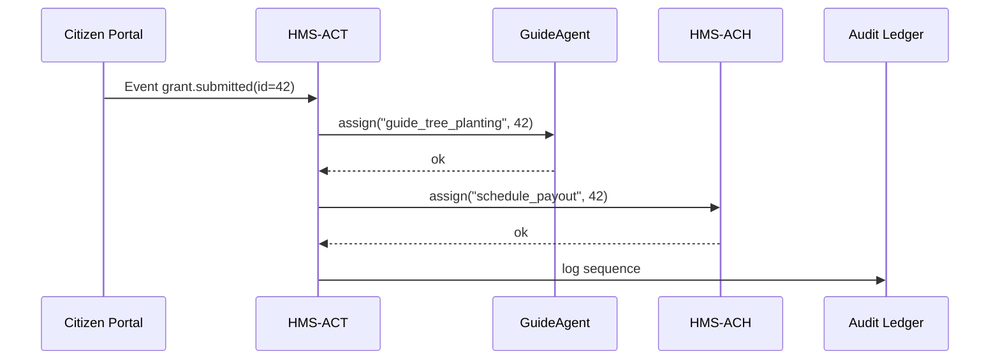
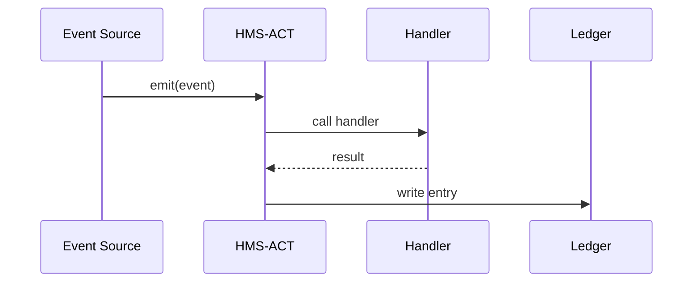
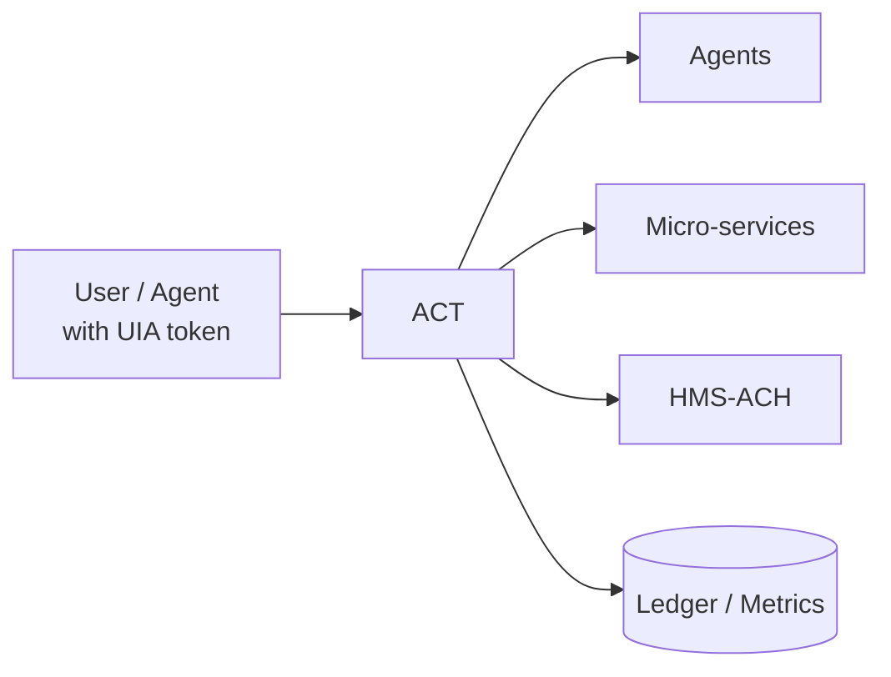

# Chapter 13: Activity Orchestrator (HMS-ACT)

[← Back to Chapter 12: Universal Identity & Access (Account & AuthN)](12_universal_identity___access__account___authn__.md)

---

## 1. Why Do We Need an “Air-Traffic Controller” for Software?

A quick story:

> The Forest Service launches an online grant for communities that plant wildfire-resilient trees.  
> A **citizen** submits the form → a **Payment Service** must schedule funds → an **AI Agent** must e-mail planting guidelines → an **Auditor** must sign off.  
> If any step fails, Congress will ask _“Who did what, and when?”_

Without a single brain coordinating these moves, tasks collide or fall through the cracks.  
**HMS-ACT** is that brain: an event-driven **Activity Orchestrator** that:

1. Listens for events (`grant.submitted`, `payment.cleared`, `alert.error`).  
2. Picks the right **agent** or **micro-service** to handle each event.  
3. Writes every decision to a time-stamped **ledger** so program managers can **replay** the entire story later.

Think of ACT as the **air-traffic controller** that keeps every plane (task) at the right altitude and landing strip.

---

## 2. Central Use-Case – “Tree-Planting Grant Flow”



When Grant **#42** is submitted:

1. ACT matches the event to two activities (`guide_tree_planting` and `schedule_payout`).  
2. Sends each activity to the correct handler.  
3. Logs the full chain for auditors.

If something explodes tomorrow, managers **replay** Grant #42 and see the exact second each step ran.

---

## 3. Key Concepts (Beginner-Friendly)

| Term | Analogy | 1-Sentence Job |
|------|---------|----------------|
| Event | “Plane appears on radar” | A fact that just happened (`grant.submitted`). |
| Activity | Flight plan | Work that must run because of the event. |
| Handler | Pilot | Code or AI agent that executes the activity. |
| Dispatch Table | Tower schedule board | Maps events → activities → handlers. |
| Ledger | Black-box recorder | Immutable log of every dispatch & result. |
| Replay | Flight re-enactment | Re-runs the ledger to diagnose issues. |

---

## 4. Hands-On: A 20-Line Orchestrator

Below is a **toy** HMS-ACT you can paste into `act.py`.

```python
# file: act.py  (≤20 lines)
import time, json, uuid

DISPATCH = {                 # event → [activity, handler]
  "grant.submitted": [("guide_tree_planting", "GuideAgent"),
                      ("schedule_payout",    "HMS-ACH")],
  "payment.failed" : [("notify_admin",       "AlertBot")]
}

LEDGER = []                  # in-memory; prod → HMS-OPS

def emit(event, payload):
    eid = uuid.uuid4().hex
    _log("EVENT", event, eid, payload)
    for act, hdl in DISPATCH.get(event, []):
        _assign(eid, act, hdl, payload)

def _assign(eid, act, hdl, data):
    ticket = {"event_id": eid, "activity": act,
              "handler": hdl, "ts": time.time()}
    _log("DISPATCH", **ticket)
    _call_handler(hdl, act, data)

def _call_handler(hdl, act, data):
    print(f"🛫 {hdl} handling {act} for #{data['grant_id']}")

def _log(kind, *_, **entry):
    LEDGER.append({"kind": kind, **entry})
```

### What does it do?

1. `emit()` – receives an event, looks up activities, loops through them.  
2. `_assign()` – records the dispatch + delegates to the handler.  
3. `_call_handler()` – stub that just prints (real code would import the service).  
4. Every step is appended to **LEDGER** (later shipped to [System Observability & Ops Center](19_system_observability___ops_center__hms_ops__.md)).

---

### Quick Test

```python
from act import emit, LEDGER
emit("grant.submitted", {"grant_id": 42})
print(json.dumps(LEDGER, indent=2)[:250], "...")
```

Expected console:

```
🛫 GuideAgent handling guide_tree_planting for #42
🛫 HMS-ACH handling schedule_payout for #42
[
  {"kind":"EVENT","event":"grant.submitted","eid":"..."},
  {"kind":"DISPATCH","event_id":"...","activity":"guide_tree_planting",...}
  ...
] ...
```

You just orchestrated two activities and captured the audit trail in < 30 seconds!

---

## 5. Step-By-Step Under the Hood



1. **Source** (web, API, agent) emits an event.  
2. **ACT** consults its table, calls each **Handler**.  
3. Success/failure is pushed to the **Ledger**.

---

## 6. Advanced Goodies You Get for Free

| Feature | Where Implemented | 1-Line Benefit |
|---------|------------------|----------------|
| Role Checks | ACT forwards caller’s UIA token → handlers verify via [Universal Identity & Access](12_universal_identity___access__account___authn__.md). | No one fakes an activity. |
| Policy Guard | Each handler call passes through [Compliance Guardrail Framework (HMS-ESQ)](05_compliance_guardrail_framework__hms_esq__.md). | Illegal tasks are blocked instantly. |
| Human Override | If a handler raises `NeedsHuman`, ACT emits `hitl.pending` so [HITL Oversight](02_human_in_the_loop__hitl__oversight_mechanism_.md) can step in. | Humans stay in control. |
| Metrics | LEDGER entries stream to [System Observability & Ops Center](19_system_observability___ops_center__hms_ops__.md). | Real-time dashboards. |

---

## 7. Peek at Internal Files (All ≤ 20 Lines)

### 7.1 `dispatch_table.yml`

```yaml
grant.submitted:
  - activity: guide_tree_planting
    handler: GuideAgent
  - activity: schedule_payout
    handler: HMS-ACH

payment.failed:
  - activity: notify_admin
    handler: AlertBot
```

A human-readable table so non-developers can see what’s wired where.

### 7.2 Minimal Replayer

```python
# file: replay.py  (14 lines)
import json, act

def replay(ledger_path, grant_id):
    for line in json.load(open(ledger_path)):
        if line.get("kind")=="DISPATCH" and \
           line.get("payload",{}).get("grant_id")==grant_id:
            act._call_handler(line["handler"],
                              line["activity"],
                              {"grant_id":grant_id})

# usage:
#   replay("ledger.json", 42)
```

Run this in a war-room to re-execute every step for Grant #42 exactly as it happened.

---

## 8. Where to Put HMS-ACT in the Big Picture



* All requests are **identity-stamped** (Chapter 12).  
* Handlers can be AI agents (Chapter 8) or classic services (Chapter 16).  
* Money flows through [HMS-ACH](07_financial_clearinghouse__hms_ach__.md).  
* Metrics land in [HMS-OPS](19_system_observability___ops_center__hms_ops__.md).

---

## 9. 60-Second Mini-Lab

1. Copy `act.py` and `dispatch_table.yml`.  
2. Add a fake handler:

   ```python
   # file: handlers/guide_tree_planting.py
   def run(data): print("Sent guide PDF for grant", data['grant_id'])
   ```

3. Replace `_call_handler()` in `act.py` with:

   ```python
   import importlib
   def _call_handler(hdl, act, data):
       mod = importlib.import_module(f"handlers.{act}")
       mod.run(data)
   ```

4. `python -c "from act import emit; emit('grant.submitted', {'grant_id':1})"`

   Output:

   ```
   Sent guide PDF for grant 1
   🛫 HMS-ACH handling schedule_payout for #1
   ```

You just hot-plugged a new handler without touching ACT’s core!

---

## 10. Recap & What’s Next

In this chapter you:

1. Learned why an **Activity Orchestrator** prevents chaos in multi-step government workflows.  
2. Saw the core pieces: **event → dispatch → handler → ledger → replay**.  
3. Built a 20-line orchestrator, dispatched real tasks, and logged everything.  
4. Connected ACT with Identity, Compliance, Agents, and Payments across the HMS-CDF stack.

Next we’ll explore how multiple **agents** talk to each other in a standardized way via a dedicated bus:  
[Chapter 14: Agent Exchange Bus (HMS-A2A)](14_agent_exchange_bus__hms_a2a__.md)

---

---

Generated by [AI Codebase Knowledge Builder](https://github.com/The-Pocket/Tutorial-Codebase-Knowledge)