# Chapter 13: AI Agent Lifecycle Management  
*(“Hire, Supervise, and Retire Your AIs—Just Like Federal Employees”)*  

[← Back to Chapter&nbsp;12: AI Representative Agent (HMS-A2A)](12_ai_representative_agent__hms_a2a__.md)

---

## 1. Motivation — The “Passport Photo Validator That Got Old” Story  

The U.S. Department of State uses an AI agent to approve or reject passport photos:

* **Day-1** accuracy: 98 % (great!).  
* Two years later phones add new *portrait blur* modes → accuracy quietly drops to 88 %.  
* Citizens wait weeks for re-submission notices; call-center volume spikes.  

Nobody was “watching the watcher.”  
AI **Agent Lifecycle Management (ALM)** is the HR department for models:

1. Hire (train & deploy).  
2. Supervise (measure & detect drift).  
3. Promote (re-train) or Retire (replace).  

Without ALM, stale AIs hurt citizens just as badly as broken code.

---

## 2. Big Picture in One Sentence  

Every agent carries a **birth certificate** (training data hash), keeps a **performance record** (metrics), and owns a **retirement plan** (triggers).  
ALM automates the paperwork.

---

## 3. Key Concepts (Beginner-Friendly Table)

| Concept | 1-Line Definition | Analogy |
|---------|------------------|---------|
| Birth Certificate | YAML file that proves *where/when/how* the model was trained | SF-50 hiring form |
| Performance Record | Live metrics vs. targets (`accuracy ≥ 95 %`) | Annual employee review |
| Drift Detector | Rule that spots big metric drop | supervisor noticing declining output |
| Retrain Job | Script that rebuilds the model with fresh data | Professional development course |
| Retirement Trigger | Condition to disable & swap agent | Mandatory retirement age |
| Agent Registry | Database of all active/retired agents | Federal personnel file cabinet |

---

## 4. Walk-Through: Manage the Passport Photo Agent in **3 Steps**

### 4.1. Register (Hire) the Agent  

`passport_photo.yml` (≤ 15 lines)

```yaml
agent_id: PASSPORT_PHOTO_V1
birth_certificate:
  data_hash: "sha256:ab12…"
  trained_on: 2022-04-01
performance_targets:
  accuracy: 0.95          # 95 %
  false_positive: 0.02
retirement_plan:
  drift_drop: 0.03        # if accuracy ↓ by 3 %
  max_age_days: 730       # 2 years
owner: STATE_DEPT_VISA_OFFICE
```

**What this means**

* Under 95 % accuracy **or** after 2 years → ALM will trigger a retrain/retire workflow automatically.

---

### 4.2. Monitor & Detect Drift (Supervise)

`drift_checker.py` (18 lines)

```python
import yaml, requests

cfg = yaml.safe_load(open("passport_photo.yml"))
aid = cfg["agent_id"]

metrics = requests.get(f"https://metrics.gov/agents/{aid}").json()
accuracy = metrics["accuracy"]

drop = cfg["performance_targets"]["accuracy"] - accuracy
if drop >= cfg["retirement_plan"]["drift_drop"]:
    # Raise a drift alert
    requests.post("https://alm.gov/alerts",
                  json={"agent": aid, "reason": f"Accuracy drop {drop:.2%}"})
    print("⚠️  Drift detected!")
else:
    print("✅  All good.")
```

Beginner notes:

1. Pulls latest metric.  
2. Compares against target.  
3. Sends alert if drop ≥ 3 %.

---

### 4.3. Retrain or Retire (Act)

`retrain_or_retire.py` (19 lines)

```python
import requests, yaml, datetime

aid = "PASSPORT_PHOTO_V1"
cfg = yaml.safe_load(open("passport_photo.yml"))

# Check age
age_days = (datetime.date.today() -
            datetime.date.fromisoformat(cfg["birth_certificate"]["trained_on"])
           ).days

if age_days > cfg["retirement_plan"]["max_age_days"]:
    action = "retire"
else:
    action = "retrain"

resp = requests.post("https://alm.gov/actions",
                     json={"agent": aid, "action": action})
print(f"📝  Requested {action}: ticket {resp.json()['ticket']}")
```

*If action = retrain*, ALM spins up a training job; *if retire*, ALM swaps in the new version (e.g., `V2`).

---

## 5. Under the Hood — What Actually Happens?

```mermaid
sequenceDiagram
participant Drift as Drift Checker
participant ALM as ALM Service
participant Train as Training Svc
participant Gov as HMS-GOV
participant Reg as Agent Registry

Drift->>ALM: "accuracy drop 4 %"
ALM->>Gov: validate retirement policy
Gov-->>ALM: ✅ ok
ALM->>Train: start retrain job
Train-->>ALM: new model (V2)
ALM->>Reg: register V2, mark V1 retired
```



Only five actors—each familiar from earlier chapters.

---

## 6. Internal Implementation (Mini Peek)

### 6.1. ALM API (`alm/api.py`, 18 lines)

```python
from fastapi import FastAPI
import uuid, datetime, yaml, pathlib

app = FastAPI()
REG = pathlib.Path("registry.yml")          # single YAML for demo

def load():  return yaml.safe_load(REG.read_text()) or {}
def save(d): REG.write_text(yaml.safe_dump(d))

@app.post("/actions")
def act(agent:str, action:str):
    db = load()
    ticket = str(uuid.uuid4())
    db.setdefault(agent, {})["tickets"] = db.get(agent, {}).get("tickets", []) + [ticket]
    if action == "retire":
        db[agent]["status"] = "RETIRED"
    elif action == "retrain":
        db[agent]["status"] = "TRAINING"
    db[agent]["updated"] = datetime.datetime.utcnow().isoformat()
    save(db); return {"ticket": ticket}
```

Less than 20 lines manage the agent registry & status.

### 6.2. Registry File After Action (`registry.yml`)

```yaml
PASSPORT_PHOTO_V1:
  status: TRAINING
  tickets:
    - 2f9d-...
  updated: 2024-10-05T12:34:00Z
```

---

## 7. Folder Map (Simplified)

```
hms-alm/
 ├─ api.py                # ALM service
 ├─ drift_checker.py
 ├─ retrain_or_retire.py
 ├─ passport_photo.yml    # birth certificate
 └─ registry.yml          # created at runtime
```

Everything remains tiny & transparent.

---

## 8. How ALM Hooks into Other HMS Layers

| Layer / Chapter | Purpose |
|-----------------|---------|
| [Governance Layer](02_governance_layer__hms_gov__.md) | Validates birth certificates & retirement rules. |
| [Monitoring Dashboard](16_monitoring___metrics_dashboard_.md) | Displays agent health; sends metrics to drift checker. |
| [Human-in-the-Loop Override](15_human_in_the_loop__hitl__override_.md) | Lets supervisors approve or veto retrain/retire tickets. |
| [Management Layer](05_management_layer__hms_mgt___hms_svc__.md) | Rolls out the new model version once ALM gives the green light. |

---

## 9. Tips & Gotchas

1. **Track Data Hashes** – A retrain on dirty data is worse than no retrain.  
2. **Keep Targets Realistic** – 100 % accuracy is a fantasy; use historical averages.  
3. **Automate Small, Review Big** – Auto-retire for minor models; require HITL for critical ones like fraud detection.  
4. **Archive Retired Models** – Auditors may demand to re-run past decisions.  
5. **Alert, Don’t Spam** – Send one ticket per drift event, not 1 000 identical emails.

---

## 10. Recap & Next Steps  

You now know how to:

1. Register an AI agent with a “birth certificate.”  
2. Continuously measure performance & detect drift.  
3. Auto-trigger retrain or retirement—with audit trails.  
4. Integrate ALM seamlessly with governance, monitoring, and HITL layers.

Ready to see how these lifecycle events feed into broader **process improvement loops** across agencies?  
Continue to [Process Optimization Workflow](14_process_optimization_workflow_.md).

---

Generated by [AI Codebase Knowledge Builder](https://github.com/The-Pocket/Tutorial-Codebase-Knowledge)