# Chapter 13: AI Performance & Accountability Loop

*(Just arrived? Peek at the human safety-net we added in [Human-in-the-Loop (HITL) Oversight](12_human_in_the_loop__hitl__oversight_.md) to see how humans veto or approve AI suggestions before they leave the building.)*  

---

## 1. Why Do We Need Another “Loop”?

**Story – “Late-Night Buses That Vanish”**

1. The Department of Transportation’s **RoutePlan-Bot** publishes a new **midnight bus schedule** meant to save fuel.  
2. Citizens immediately complain on 311: “🚌 never showed!” 
3. A week later city managers discover ridership **fell 35 %**, wiping out the fuel savings.

The bot wasn’t malicious—it just optimized **for cost, not rider satisfaction**.  
What we were missing is a **feedback loop** that:

* measures real-world outcomes (ridership, complaints),  
* compares them to **Key Performance Indicators (KPIs)** we care about,  
* automatically **flags under-performance** before citizens suffer,  
* and sends a **review docket** to the same accountability board that handles human staff.

That loop is the **AI Performance & Accountability Loop**.

---

## 2. The 10-Second Elevator Pitch

```mermaid
flowchart LR
  AGT["🤖 Agent"] --> Score["📊 KPI Scorecard"]
  Score --> Trigger["🚨 Threshold Check"]
  Trigger --> Docket["🗂️ Review Docket"]
  Docket --> Board["🏛️ Accountability Board (human)"]
```



1. Every agent output gets a **score**.  
2. Scores breaching a threshold open a **docket**.  
3. Humans on the **board** decide: keep, retrain, or retire the bot.  
4. Decisions feed back into the next KPI cycle.

---

## 3. Key Concepts (One-by-One)

| Term | Beginner Analogy | What It Means Here |
|------|------------------|--------------------|
| KPI Library | Official report card | List of metrics (e.g., “Avg. wait-time ≤ 10 min”) |
| Scorecard Service | Exam grader | Calculates actual vs. target after each agent action |
| Threshold Rule | Pass/Fail line | Condition like “< 90 % satisfaction for 3 days” |
| Review Docket | HR case file | JSON packet with evidence sent to a board queue |
| Accountability Board | Performance board | Group of humans who approve fixes or retire the bot |

---

## 4. Setting It Up — **3 Tiny Files**

We’ll protect the **RoutePlan-Bot** with two KPIs:

* `wait_time_avg ≤ 10` minutes  
* `complaints_per_1000_riders ≤ 2`

### 4.1 KPI Library (10 lines)

```yaml
# file: kpi_routeplan.yml
id: routeplan_v1
metrics:
  wait_time_avg:
    target: 10        # minutes
    source: "iot.bus/*"
  complaints_per_1000_riders:
    target: 2
    source: "311.calls/*"
threshold:
  when: "failures >= 3 in 7d"
board_queue: "dot.review"
```

*Plain YAML so even non-coders can read it.*

### 4.2 Agent Reports Its Result (Python, 11 lines)

```python
# file: report_score.py
import httpx, os, json
score = {
  "agent_id": "routeplan-bot",
  "kpi_id":   "routeplan_v1",
  "values": {                 # measured yesterday
      "wait_time_avg": 12,
      "complaints_per_1000_riders": 3}
}
httpx.post("http://scorecard/submit",
           json=score,
           headers={"Authorization":"Bearer "+os.getenv("BADGE")})
```

Explanation: The bot simply **posts numbers**. Scoring & threshold logic happen server-side.

### 4.3 Human Board UI (14 lines)

```python
# file: board_cli.py
import httpx, json, getpass
docket = httpx.get("http://scorecard/docket?queue=dot.review").json()
print(json.dumps(docket, indent=2))
decision = input("Keep (k) Retrain (r) Retire (x)? ")
token = getpass.getpass("Decision token: ")
httpx.post("http://scorecard/decision",
           json={"docket_id": docket["id"], "action": decision},
           headers={"Authorization":"Bearer "+token})
```

Board members act just like supervisors reviewing human staff.

---

## 5. What Happens Under the Hood?


Only **4 participants**—easy to remember.

---

## 6. A Peek Inside the Implementation

### 6.1 Score Table (SQLite, 7 lines)

```sql
CREATE TABLE scores (
  ts        DATETIME,
  agent_id  TEXT,
  kpi_id    TEXT,
  metric    TEXT,
  value     REAL
);
```

Every report inserts **one row per metric**.

### 6.2 Threshold Evaluator (Python, 14 lines)

```python
# file: evaluator.py
import sqlite3, datetime, statistics

def breached(kpi_id, now=None):
    now = now or datetime.datetime.utcnow()
    week = now - datetime.timedelta(days=7)
    rows = db.execute("SELECT metric,value FROM scores WHERE kpi_id=? AND ts>?;", (kpi_id, week))
    fails = sum(1 for m,v in rows if v > targets[kpi_id][m])
    return fails >= 3          # from YAML
```

If `breached()` returns `True`, a docket JSON is shoved onto a queue (`board_queue`).

### 6.3 Docket Structure (JSON, 10 lines)

```json
{
  "id": "DCK-8801",
  "agent": "routeplan-bot",
  "kpi": "routeplan_v1",
  "evidence": {
     "wait_time_avg": 12,
     "complaints_per_1000_riders": 3
  },
  "submitted_at": "2025-02-02T09:00Z"
}
```

*Simple & human-readable.*

---

## 7. Connecting to Other HMS Pieces

```mermaid
graph TD
  SC["📊 Scorecard"] --> AGT["🤖 HMS-AGT"]
  SC --> HITL["🙋‍♀️ HITL Gate"]
  SC --> OPS["🔭 HMS-OPS"]
  SC --> ESQ["🛡️ HMS-ESQ"]
```



* Agents (from [HMS-AGT](09_hms_agt___core_agent_framework__.md)) call Scorecard.  
* If a bot is **retired**, AGT revokes its badge.  
* Score & docket data feed live dashboards in **HMS-OPS** (next chapter).  
* Legal auditors in **HMS-ESQ** validate that metric definitions honor statutes.

---

## 8. Common Beginner Questions

| Question | Quick Answer |
|----------|--------------|
| “Do I need fancy ML to score KPIs?” | No. A simple SQL query + YAML targets is enough. |
| “Can KPIs change mid-year?” | Yes—commit an updated YAML; Scorecard versions them like APIs. |
| “What if multiple agents share a KPI?” | Each agent_id is tracked separately; only the culprit gets a docket. |

---

## 9. What You Learned

1. **Why** performance scoring protects citizens from silent AI failure.  
2. Five key pieces: KPI Library, Scorecard, Threshold, Docket, Board.  
3. How to set them up with three tiny files.  
4. What happens under the hood and how it hooks into AGT, HITL, OPS, and ESQ.  

Ready to see **live dashboards and alerts** built on these scores?  
Jump to [Observability & Ops (HMS-OPS)](14_observability___ops__hms_ops__.md).

---

Generated by [AI Codebase Knowledge Builder](https://github.com/The-Pocket/Tutorial-Codebase-Knowledge)