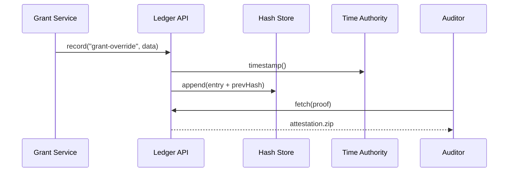
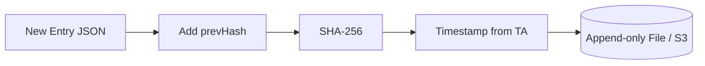

# Chapter 13: Auditing & Traceability Ledger
*(the “black-box flight recorder” of HMS-AGX)*  

[← Back to Chapter 12: Human-In-The-Loop Oversight (HITL)](12_human_in_the_loop_oversight__hitl__.md)  

---

## 1. Why Bother Keeping Every Foot-Print?

Picture the **Veterans’ Employment & Training Service (VETS)**.  
Congress asks during a GAO hearing:

> “Can you prove *who* over-rode the AI denial for Mr. Ramirez’s job-training grant, and *why*, within the last fiscal year?”

Without a tamper-proof log, staff could spend **weeks** digging through emails and server logs.  
With the **Auditing & Traceability Ledger** you run one command:

```bash
hms-ledger fetch --event grant-override --id RAMIREZ-2024
```

…and hand the auditor a signed PDF in **seconds**.  
The ledger is our *immutable journal* of **who did what, when, and why** across **every** HMS layer.

---

## 2. Key Concepts (Plain-English Cheatsheet)

| Concept            | Think of…                                             |
|--------------------|-------------------------------------------------------|
| Ledger Entry       | A line in a notary’s book                             |
| Cryptographic Hash | A wax seal proving the line was never altered         |
| Chain / Merkle     | Each entry’s seal contains the **previous** seal—break one and the whole chain screams |
| Time Authority     | The courthouse clock everyone trusts                  |
| Attestation Bundle | The PDF packet handed to auditors (data + signatures) |
| Verifier CLI       | The magnifying glass that checks each wax seal        |

---

## 3. First-Look: How a Single Action Becomes an Immutable Fact



1. The service calls **Ledger API**.  
2. API stamps the exact second from the **Time Authority**.  
3. Entry + previous hash → new hash (Merkle chain) stored immutably.  
4. Auditors later fetch an attestation bundle; any tampering breaks the hash chain.

---

## 4. Hands-On: Recording & Retrieving an Event

### 4.1  Record the Override (3 commands)

```bash
# 1) service overrides AI decision
hms-ledger put \
  --type grant-override \
  --id RAMIREZ-2024 \
  --who "ranger.jackson@vets.gov" \
  --why "VA policy 38-CFR-21 exception"

# 2) instant confirmation
✔ entry-index: 811238
✔ block-hash : 0x9d1c…ae45
```

### 4.2  Retrieve & Verify Later

```bash
hms-ledger fetch --id RAMIREZ-2024 --verify
# Ledger says: VALID ✓  (hash chain intact, timestamp 2024-06-15 14:22:08 UTC)
```

The **`--verify`** flag re-computes all hashes.  
No special skills needed—interns can run the command!

---

## 5. Using the Ledger in Application Code (Node ≤ 15 lines)

```js
import { ledger } from "@hms/sdk";

export async function overrideGrant(grantId, user, reason) {
  // …business logic that flips the grant status…

  await ledger.put({
    type: "grant-override",
    id: grantId,
    who: user.email,
    why: reason
  });
}
```

Beginner notes  
• One function call = one immutable entry.  
• No need to manage hashes—SDK does it.

---

## 6. Query Tips (Cheat-Sheet)

| Need | Command |
|------|---------|
| All overrides last 7 days | `hms-ledger query type=grant-override since=7d` |
| Everything **user** Jane touched | `hms-ledger query who=jane@vets.gov` |
| Export to PDF for GAO | `hms-ledger fetch --id RAMIREZ-2024 --pdf` |

---

## 7. Under the Hood (Just Enough to Impress Auditors)

### 7.1 What Happens Inside `ledger.put`



* No entry can be deleted—only appended.  
* Previous hash links every line; altering one breaks the chain.  
* Hourly snapshots are cross-signed by a **second** key and shipped to cold storage for disaster recovery.

### 7.2 Tiny Code Peek (Go ≤ 18 lines)

```go
// file: ledger/append.go
func Append(e Entry) error {
    e.Time = timeAuthority.NowUTC()
    e.Prev  = store.LastHash()
    blob, _ := json.Marshal(e)
    e.Hash  = sha256sum(blob + e.Prev)

    if err := store.Write(blob, e.Hash); err != nil {
        return err
    }
    return nil
}
```

Line-by-line  
1. Grab trusted time.  
2. Fetch previous hash.  
3. Compute new hash.  
4. Persist blob & hash atomically.

---

## 8. Integrations with Other HMS Layers

* Governance publishes a **signed policy hash** to the ledger on every new version → auditors see rule **and** enforcement record.  
* [Human-In-The-Loop Oversight (HITL)](12_human_in_the_loop_oversight__hitl__.md) logs every vote & amendment.  
* Metrics pipelines (next chapter) tag anomalies with ledger IDs so you can trace “why did we auto-scale?”

---

## 9. Common Pitfalls & Quick Fixes

| Symptom | Cause | Fix |
|---------|-------|-----|
| “Time drift > 5 sec” error | Server clock off | Enable NTP or use HMS time-proxy |
| Hash mismatch during verify | Someone edited raw DB | Good! Ledger caught it—restore from cold snapshot |
| Log feels too chatty | Filter with `--type`, or aggregate older than 90 days to compressed store |

---

## 10. FAQ

**Q: Can I delete personal data for GDPR “right to be forgotten”?**  
Entry *payloads* can be encrypted with a data-key that gets shredded; the header & hash stay for integrity.

**Q: How big can the ledger grow?**  
Bench-tested to 10 billion entries; shards auto-rotate every 100 GB.

**Q: Does it replace SIEM logs?**  
No—SIEMs are real-time alarms. The ledger is the *courtroom evidence*.

---

## 11. What You Learned

• The **Auditing & Traceability Ledger** is HMS-AGX’s tamper-proof memory.  
• Every service call, AI suggestion, and human override gets a cryptographic timestamp.  
• A single CLI or SDK call records or verifies events—no cryptography PhD required.  
• Hash chains + trusted time make evidence verifiable years later.

Next we’ll see how live **Metrics & Monitoring Telemetry** feed both the ledger *and* the AI agent.  
[Continue to Chapter 14: Metrics & Monitoring Telemetry](14_metrics___monitoring_telemetry_.md)

---

Generated by [AI Codebase Knowledge Builder](https://github.com/The-Pocket/Tutorial-Codebase-Knowledge)