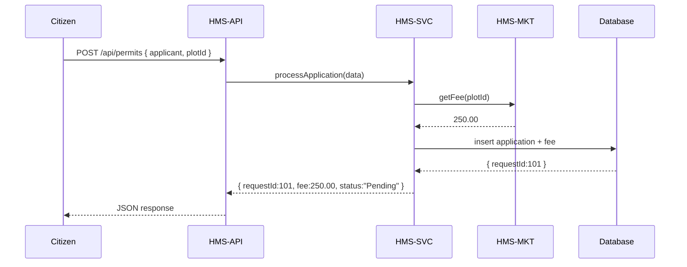

# Chapter 13: Backend Services (HMS-SVC / HMS-API / HMS-MKT)

In [Chapter 12: Core Infrastructure (HMS-SYS)](12_core_infrastructure__hms_sys__.md) we saw how security, logging, and config power every service. Now it’s time to build the real workhorses: the **Backend Services**—our programmable endpoints (**HMS-API**), the business logic layer (**HMS-SVC**), and the integration adapters (**HMS-MKT**). Think of these as the clerks and analysts behind the counter, validating inputs, fetching data, and returning approvals or information.

---

## 1. Why Backend Services?

Imagine a citizen applies for a building permit at the **Equal Employment Opportunity Commission (EEOC)**—they submit forms digitally and expect an instant fee quote and a request ID. Our Backend Services must:

1. Expose a clean HTTP API (HMS-API) to receive the request.  
2. Run business rules (HMS-SVC) like “Is the plot zoned correctly?”  
3. Fetch the current fee schedule from an external fee service (HMS-MKT).  
4. Save the application and return a confirmation.

Without these layers, our portals ([Chapter 1: Interface Layer](01_interface_layer_.md)) would have no one to talk to!

**Central Use Case**  
A citizen submits a request at `POST /api/permits`. They get back:
```json
{ "requestId": 101, "fee": 250.00, "status": "Pending" }
```
Behind the scenes, the API forwards to SVC logic, which calls MKT to fetch the latest fee, then saves everything in the database.

---

## 2. Key Concepts

1. **HMS-API**  
   The HTTP endpoints that accept and return JSON.  

2. **HMS-SVC**  
   Business logic: validation, computations, workflows.  

3. **HMS-MKT**  
   Integration adapters for external systems (fee schedules, GIS lookups, mailing services).

---

## 3. Using Backend Services

Below is a minimal Express route for permit applications in **HMS-API**:

```js
// src/api/permits.js
const express = require('express');
const { processApplication } = require('../services/permitService');
const router = express.Router();

router.post('/', async (req, res) => {
  const result = await processApplication(req.body);
  res.json(result);
});

module.exports = router;
```
This endpoint:
- Accepts JSON with form data (`req.body`).
- Calls into **HMS-SVC** (`permitService.processApplication`).
- Returns whatever the service returns (ID, fee, status).

---

## 4. Under the Hood: Sequence Diagram



---

## 5. Internal Implementation

### 5.1 Business Logic (HMS-SVC)

```js
// src/services/permitService.js
const { getFee } = require('../mkt/feeConnector');
const db = require('../sys/db');

async function processApplication({ applicant, plotId }) {
  // 1. Validate inputs (skipped for brevity)
  // 2. Fetch current fee
  const fee = await getFee(plotId);
  // 3. Save to DB
  const { rows } = await db.query(
    'INSERT INTO permits(applicant, plot_id, fee) VALUES($1,$2,$3) RETURNING id',
    [applicant, plotId, fee]
  );
  // 4. Return result
  return { requestId: rows[0].id, fee, status: 'Pending' };
}

module.exports = { processApplication };
```
Explanation:
- Validates and orchestrates the fee call and database insert.
- Returns a simple object for the API to send back.

### 5.2 External Fee Adapter (HMS-MKT)

```js
// src/mkt/feeConnector.js
const fetch = require('node-fetch');

async function getFee(plotId) {
  // Call an external fee schedule service
  const res = await fetch(`https://fees.gov/plot/${plotId}/rate`);
  const { rate } = await res.json();
  return rate;  // e.g. 250.00
}

module.exports = { getFee };
```
Explanation:
- Fetches the rate from an external API.
- Abstracted so services never call HTTP directly.

---

## 6. Why This Matters

- **Separation of Concerns:** APIs stay thin; business rules live in SVC; integration code lives in MKT.  
- **Testability:** You can mock `getFee()` or `processApplication()` in unit tests.  
- **Reusability:** Multiple APIs can share the same SVC logic or MKT adapters.  
- **Flexibility:** Swap out the fee service by editing `feeConnector.js` only.

---

## Conclusion

In this chapter, you built the three pillars of **Backend Services**:

- **HMS-API**: programmable endpoints for HTTP requests.  
- **HMS-SVC**: clerks processing business logic.  
- **HMS-MKT**: analysts calling external systems.

These layers power data retrieval, transactional flows, and integrations behind your portals.  

Next up: handling actual money flows and banking rails in [Chapter 14: Financial Systems (HMS-ACH)](14_financial_systems__hms_ach__.md).

---

Generated by [AI Codebase Knowledge Builder](https://github.com/The-Pocket/Tutorial-Codebase-Knowledge)