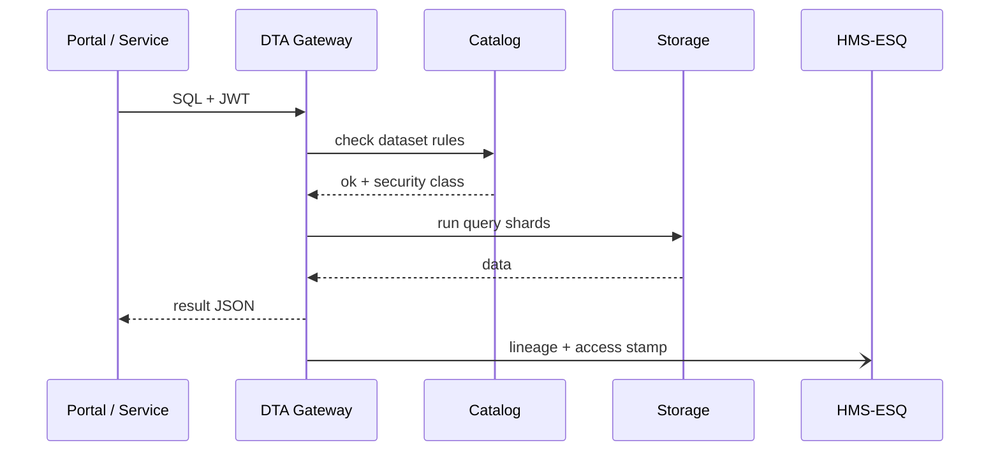

# Chapter 13: Central Data Repository (HMS-DTA)

*(continuation of [Monitoring & Telemetry Stack (HMS-OPS)](12_monitoring___telemetry_stack__hms_ops__.md))*  

---

## 1. Why Do We Need a “National Archives” for HMS-ACT?

### 60-Second Story — “Two Analysts, One Database”

1. **Maya** works at **OTEXA** and wants last month’s *textile-import* numbers.  
2. **Dr. Alvarez** is a VA physician who needs a *patient-readmission* chart.  
3. Both queries should be fast, secure, and **never** let textile data mix with PHI.

If every micro-service kept its *own* little database, we would end up with:

* ∞ data silos  
* Complicated cross-agency FOIA requests  
* A compliance nightmare (no single source of truth)

**HMS-DTA** is the **Central Data Repository**—the federal “Library of Congress” where:

* Every dataset is cataloged, versioned, and stamped with a **security classification**.  
* Data lineage and retention rules are enforced automatically.  
* Power users write SQL-ish *federated queries*; newcomers just pick a dropdown.

---

## 2. Key Concepts in Plain English

| Term | Friendly Explanation |
|------|----------------------|
| Dataset | A named table or file collection (e.g., `imports.textiles_2024_05`). |
| Catalog | The phone-book listing of every dataset and its rules. |
| Storage Zone | The physical shelf (hot, cold, archive). |
| Security Class | “Public,” “Confidential,” “PHI,” etc.—decides who can touch it. |
| Retention Policy | Auto-delete or archive after X years. |
| Lineage | A breadcrumb trail showing how a dataset was created. |
| View | A saved query that hides sensitive columns. |
| Federated Query | One statement that joins data from multiple services/ministries. |

Analogy:  
Think of HMS-DTA as a **giant filing cabinet**.  
The **Catalog** is the index card, the **Security Class** is the colored folder, and **Lineage** is the sticky note saying “Copied from box A on 2024-05-12.”

---

## 3. A First Taste – Pulling Data with 15 Lines of Code

Below Maya (OTEXA) runs a federated query that joins customs data with tariff codes.

```javascript
// otexa/runReport.js  (15 lines)
import { dta } from '@hms-dta/client';
import { getToken } from '@hms-auth/client';        // from Chapter 2

async function textileReport() {
  const token = await getToken({ actor: 'maya@otexa.gov' });

  const rows = await dta.query({
    sql: `
      SELECT c.country, SUM(c.volume_kg) AS kg, t.tariff_rate
      FROM imports.textiles_2024_05  AS c
      JOIN policy.current_tariffs     AS t  ON c.hscode = t.hscode
      GROUP BY c.country, t.tariff_rate
    `,
    token
  });

  console.table(rows.slice(0,5));
}

textileReport();
```

What happens?

1. **`dta.query`** checks Maya’s badge: *role = economist, clearance = public+confidential*.  
2. HMS-DTA optimizes the SQL, pulls the data from two storage zones, enforces row-level security, and returns a plain JSON array.  
3. Maya sees a tidy console table—no extra plumbing code.

---

## 4. Creating a Safe “View” for Healthcare Data (12 Lines)

Dr. Alvarez only needs *readmission counts*, **not** patient names.

```sql
-- VA/ddl/create_view.sql  (max 12 lines)
CREATE VIEW va.readmit_summary
SECURITY CLASS PHI      -- tag view as PHI even if columns hidden
AS
SELECT discharge_year,
       COUNT(*) AS readmits
FROM   va.raw_admissions     -- underlying table has PHI
GROUP  BY discharge_year;
```

Result:  
*Apps* can query `va.readmit_summary`, but raw PHI stays locked away.

---

## 5. What Really Happens Under the Hood? (5-Actor Walkthrough)



1. **Gateway** enforces auth & rate limits (like HMS-SVC in Chapter 10).  
2. **Catalog** validates Maya/Dr. Alvarez have clearance for *all* referenced datasets.  
3. **Storage** streams back only the allowed columns/rows.  
4. **HMS-ESQ** (Chapter 11) gets a signed lineage record for auditors.

---

## 6. Under-the-Hood Code Peeks

### 6.1 Registering a New Dataset (16 Lines)

```javascript
// scripts/registerDataset.js
import { catalog } from '@hms-dta/admin';
import schema from './schemas/textiles_2024_05.json';  // column defs

await catalog.add({
  id:            'imports.textiles_2024_05',
  schema,
  owner:         'otexa@commerce.gov',
  securityClass: 'confidential',
  retention:     '7y',                   // auto-archive after 7 years
  source:        'cbp.s3://imports/2024/05/*.csv'
});

console.log('📚 Dataset registered!');
```

Explanation  
• One call writes a catalog row **and** starts an automated *ingest job* that lands the CSV files into the proper Storage Zone.

---

### 6.2 Tiny Policy Check Before Query (18 Lines)

```javascript
// gateway/authorize.js
import { getRules } from '@hms-dta/catalog';

export async function authorize(sql, user) {
  const datasets = parseDatasets(sql);          // ['imports.textiles_2024_05', ...]
  for (const ds of datasets) {
    const rule = await getRules(ds);
    if (!user.roles.includes(rule.securityClass))
      throw `AccessDenied: need ${rule.securityClass} clearance`;
  }
}
```

Simple loop ensures **every dataset** in the query is allowed.

---

### 6.3 Auto-Retention Cron (12 Lines)

```javascript
// jobs/retention.js
import { catalog } from '@hms-dta/admin';
import { storage } from '@hms-dta/core';

setInterval(async () => {
  const expired = await catalog.listExpired();   // datasets past retention
  for (const ds of expired)
    await storage.archive(ds);                   // move to cold tier + update catalog
}, 24 * 60 * 60 * 1000);                         // run once a day
```

No dev ever forgets to delete old data—DTA does it for you.

---

## 7. Exploring Lineage – One-Liner

```javascript
const graph = await dta.lineage('imports.textiles_2024_05');
console.log(graph);
```

Outputs something like:

```
imports.textiles_2024_05  ←  cbp.import_feed (May 2 CSV)
                         ↖︎  manual_patch_2024-05-15.csv
```

Great for FOIA officers and internal auditors.

---

## 8. Where HMS-DTA Fits with Other Layers

| Layer | Interaction | Example |
|-------|-------------|---------|
| [HMS-SVC & HMS-API](10_backend_service_apis__hms_svc___hms_api__.md) | Services can read/write via DTA SDK | Finance writes paid-claim records |
| [HMS-ACT](09_hms_act_orchestration_engine_.md) | Steps may run DTA queries | `svc:getSensor` uses sensor history |
| [Governance Layer](06_governance_layer__hms_sys___hms_gov__.md) | Toggles retention or classification | Turn `imports.*` from “public” → “confidential” |
| [Security & Compliance (HMS-ESQ)](11_security___compliance_engine__hms_esq__.md) | Receives lineage stamps | Proves no PHI left the PHI zone |
| [Monitoring Stack (HMS-OPS)](12_monitoring___telemetry_stack__hms_ops__.md) | Emits query latency metrics | `dta.query_ms` |

---

## 9. Directory Peek

```
hms-dta/
 ├─ client/        // dta.query(), dta.lineage()
 ├─ gateway/       // authorize.js, router
 ├─ catalog/       // JSON/YAML metadata
 ├─ storage/       // hot/, cold/, archive/ drivers
 ├─ admin/         // scripts like registerDataset.js
 └─ README.md
```

Everything is **plain text** (YAML, JSON, SQL) so normal Git reviews work.

---

## 10. Recap

You learned:

1. HMS-DTA is the *one-stop library* for every dataset in HMS-ACT.  
2. Key terms: Dataset, Catalog, Security Class, View, Lineage, Retention.  
3. How to query, register, and protect data in ≤ 20-line snippets.  
4. Internal flow: Gateway → Catalog → Storage → ESQ stamp.  
5. How DTA glues into the orchestration, governance, and security layers.

Next up we’ll see how HMS-ACT exchanges data with **external** systems—think Census Bureau, state DMV tables, or EU customs feeds:  
[External System Sync Connector](14_external_system_sync_connector_.md)

---

---

Generated by [AI Codebase Knowledge Builder](https://github.com/The-Pocket/Tutorial-Codebase-Knowledge)