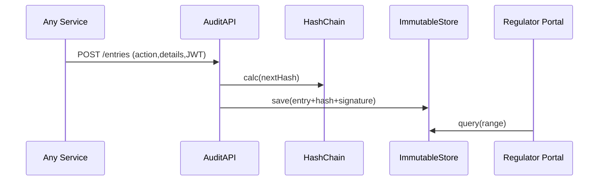

# Chapter 13: Compliance & Audit Trail
[← Back to Chapter&nbsp;12: Metrics & Observability Pipeline](12_metrics___observability_pipeline_.md)

---

> “Picture a 200-year-old courthouse ledger:  
> every filing, signature, and seal is bound by twine so no page vanishes.”  
>  
> The **Compliance & Audit Trail** layer gives HMS the same **tamper-proof memory**—only digital.

---

## 1. Why do we need a ledger?

Mini-story: *A Surprise Freedom-of-Information (FOIA) Request*  
The Federal Maritime Commission (FMC) approves an AI-drafted rule that changes port-fee calculations.  
Six months later a journalist asks:

1. **Who** authored the change?  
2. **When** was it approved?  
3. **Did anyone override safeguards?  

Without a forensic trail we scramble through chat logs and email threads.  
With Compliance & Audit Trail we hand over a signed PDF in minutes—**trustworthy, complete, court-ready**.

---

## 2. Key Concepts (ledger analogies)

| Ledger Term | Clerk’s-office analogy | Beginner meaning |
|-------------|-----------------------|------------------|
| Audit Entry | Ink line in a bound book | One JSON record of *what happened* (`rule paused`) |
| Hash Chain  | Page number + wax seal | Each entry’s checksum links to the previous, making edits obvious |
| Digital Signature | Clerk’s stamp | Cryptographically proves who wrote the line |
| Capture Adapter | Carbon paper | Tiny helper that copies events into the ledger |
| Regulator Portal | Reading room | UI where auditors & FOIA officers browse / export entries |

---

## 3. 90-second Quick-Start

### 3.1 Log an action from any service (≤ 15 lines)

```ts
// svc-payments/audit.ts
import axios from 'axios'

export async function audit(action: string, details = {}) {
  await axios.post('/audit/entries', {
    action,                // e.g., "payment.refund"
    details,               // { id:123, amount:15 }
  })                       // JWT is auto-attached by Gateway
}
```

Explanation  
1. **One** POST call—no hashing or signing in user code.  
2. Gateway forwards to the Audit API which adds timestamp, user ID, hash, and signature.

### 3.2 Retrieve a FOIA bundle (≤ 10 lines)

```bash
curl -H "Authorization: Bearer $TOKEN_FOIA" \
     'https://api.hms.gov/audit/entries?from=2024-01-01&to=2024-06-30' \
     -o fmc_port_fees_ledger.pdf
```

Returns an auto-generated PDF with every relevant entry + hash-chain proof.

---

## 4. What happens under the hood?



Five easy steps—services only know the **first arrow**.

---

## 5. Inside the Audit Service (super-minimal code)

### 5.1 API endpoint (18 lines)

```ts
// audit/routes/addEntry.ts
import crypto from 'crypto'
import { db } from '../store.js'

export async function addEntry(req, res) {
  const prev = await db.latest()
  const body = {
    ts:       Date.now(),
    user:     req.user.id,          // injected by Gateway
    action:   req.body.action,
    details:  req.body.details,
    prevHash: prev?.hash || '',
  }
  body.hash = crypto
    .createHash('sha256')
    .update(JSON.stringify(body))
    .digest('hex')

  body.sig = sign(body.hash)        // server-side private key
  await db.insert(body)
  res.status(201).end()
}
```

Breakdown  
1. `prevHash` links to the prior entry.  
2. `hash` seals the current line.  
3. `sig` proves the server (not a hacker) wrote it.  
4. Insert → done.  

*(`sign()` is a 3-line helper using RSA; skipped for brevity.)*

### 5.2 Simple verification script (≤ 15 lines)

```ts
// tools/verifyLedger.ts
import { db } from './store.js'
import crypto from 'crypto'

export async function verify() {
  let prevHash = ''
  for (const e of await db.all()) {
    const calc = crypto.createHash('sha256')
      .update(JSON.stringify({ ...e, hash: undefined, sig: undefined }))
      .digest('hex')
    if (calc !== e.hash || e.prevHash !== prevHash) throw 'Tamper!'
    prevHash = e.hash
  }
  console.log('Ledger intact ✅')
}
```

Run nightly; alerts if any hash chain breaks.

---

## 6. Auto-capturing system events

Manual calls work, but why not **capture everything automatically**?

### 6.1 Event Bus tap (≤ 12 lines)

```ts
// audit/adapter/bus.ts
import { subscribe } from 'hms-bus'
import { addEntryInternal } from '../core.js'

subscribe('**', (topic, data) =>      // ** = wildcard
  addEntryInternal({
    action: `event.${topic}`,
    details: data
  })
)
```

Any publish on the [Event Bus / Service Mesh](10_event_bus___service_mesh_.md) is now echoed to the ledger.

---

## 7. Browsing the ledger – Regulator Portal

```
┌─────────────────────────────────────────────┐
│  AUDIT LEDGER (Search)                      │
├──────────────┬────────────┬────────────────┤
│ Timestamp    │ Action     │ User           │
├──────────────┼────────────┼────────────────┤
│ 2024-05-02   │ policy.pause│ hitl_42       │
│ 2024-05-02   │ event.benefit.approved│ svc_benefits │
└──────────────┴────────────┴────────────────┘
[Export PDF]  [Verify Hash Chain]
```

Built as a tiny **Micro-Frontend kiosk**, it reuses IAM roles:
* `auditor.read` → can search & export.  
* `auditor.verify` → can run chain verification on demand.

---

## 8. Best-practice cheat-sheet

| Do | Why |
|----|-----|
| Record **who, when, what, why** | Minimal data for legal sufficiency |
| Hash first, sign second | Prevent hash-replacement attacks |
| Store off-site replicas (S3, Glacier) | Survive data-center failure |
| Never mutate rows | Use *append-only* DB engines (e.g., PostgreSQL `INSERT ONLY`) |
| Link to Metrics anomalies | Easier root-cause during audits |

---

## 9. Hands-On Exercise (5 min)

```bash
# 1. Start demo stack
docker compose up audit-svc gateway svc-payments

# 2. Trigger a refund (svc-payments auto-audits)
curl -H "Authorization: Bearer $TKN" \
     -d '{"id":123,"amount":15}' \
     http://localhost:9000/api/v1/payments/refund

# 3. Query ledger
curl http://localhost:8000/audit/entries?limit=5 | jq .

# 4. Verify integrity
docker exec audit-svc node tools/verifyLedger.js
```

You should see “Ledger intact ✅”.

---

## 10. Common Questions

| Q | A |
|---|---|
| **Can staff delete personal data (GDPR)?** | Audit entries are anonymised IDs; PII lives elsewhere. Ledger stays immutable. |
| **Does every micro-service need the SDK?** | No. Events captured via the bus tap cover 95 % of actions. |
| **Is blockchain required?** | Not necessarily—hash chain + off-site replica gives similar tamper resistance with simpler ops. |
| **How big will the ledger grow?** | ≈ 3 KB per 100 entries. Compress & archive yearly; keep recent 12 months “hot”. |

---

## 11. What you learned

✓ Why a tamper-proof ledger is essential for FOIA, IG, and Congressional audits.  
✓ Key concepts: hash chain, signatures, capture adapters, regulator portal.  
✓ Logged an action with **one** POST call and verified the chain with **15 lines**.  
✓ Saw how automatic bus tapping provides near-total coverage.

Next we ensure that **what** we log respects citizens’ privacy rules:  
[Chapter 14: Data Governance & Privacy Guardrails](14_data_governance___privacy_guardrails_.md)

---

Generated by [AI Codebase Knowledge Builder](https://github.com/The-Pocket/Tutorial-Codebase-Knowledge)