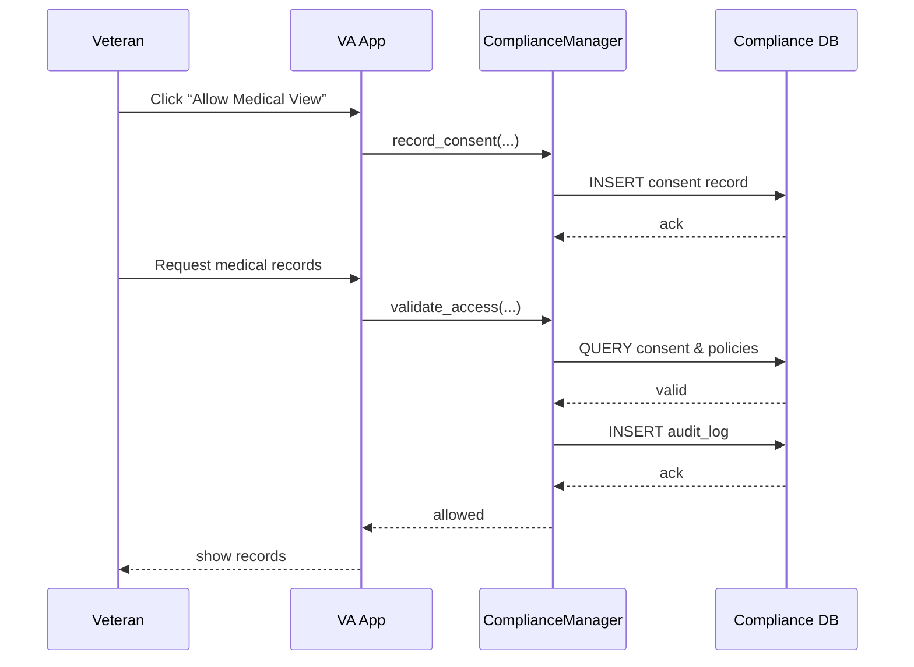

# Chapter 13: Compliance & Regulatory Framework

In [Chapter 12: AI Governance Layer](12_ai_governance_layer_.md), we learned how to set policy rules around AI models. Now it’s time for a system-wide “legal team” that makes sure every feature—from veteran medical data to grant applications—follows real laws like GDPR, HIPAA, or federal grant regulations. Welcome to the **Compliance & Regulatory Framework**!

---

## 1. Motivation: Why Compliance & Regulatory Framework Matters

Imagine the Department of Veterans Affairs (VA) is rolling out a new portal where veterans can view their medical records and personal data. Laws like **HIPAA** (for health privacy) and **GDPR** (for personal data rights) require:

1. **User Consent** before sharing data.  
2. **Audit Logs** every time data is accessed or modified.  
3. **Retention Policies** on how long to keep records.  

Without a built-in compliance layer, each team would have to re-implement these checks, leading to gaps or errors. The **Compliance & Regulatory Framework** acts like a virtual legal department embedded in code—automatically validating consent, enforcing retention, and maintaining audit trails.

---

## 2. Key Concepts

1. **Consent Management**  
   Track and store user permissions (e.g., a veteran’s consent to share records with researchers).

2. **Policy Enforcement**  
   Apply rules (HIPAA, GDPR, OMB grant rules) before any data operation.

3. **Audit Logging**  
   Record every read, write, or delete operation for later review or legal audit.

4. **Retention & Erasure**  
   Automatically delete or archive data according to regulation timelines.

5. **Jurisdiction Mapping**  
   Different policies apply in different regions (e.g., EU vs. US federal).

---

## 3. Using Compliance & Regulatory Framework

Here’s how a feature might ask for consent, validate access, and record an audit:

```python
# file: app/features/vet_data.py
from hms_compliance.manager import ComplianceManager

# 1. Instantiate the compliance helper
cm = ComplianceManager()

# 2. Record veteran’s consent to share medical data
cm.record_consent(
  user_id="vet123",
  consent_type="medical_view",
  jurisdiction="HIPAA"
)

# 3. When viewing records, validate policy and log the event
if cm.validate_access(user_id="vet123", action="view_medical"):
    records = db.get("medical_records", user="vet123")
    # The compliance layer already recorded an audit log
    display(records)
```

Explanation:  
- `record_consent` saves the veteran’s permission.  
- `validate_access` checks that consent exists and policy allows the action, then writes an audit log.  

---

## 4. What Happens Step-by-Step?



1. The veteran grants consent.  
2. `ComplianceManager` saves it.  
3. On data access, it checks policies and consent.  
4. It records an audit entry before returning data.

---

## 5. Under the Hood: Internal Implementation

### 5.1 File: `hms_compliance/manager.py`

```python
from hms_sys.db import HMSDatabase
from hms_sys.bus import HMSBus

class ComplianceManager:
    def __init__(self):
        self.db = HMSDatabase.connect("compliance_db")
        self.bus = HMSBus.connect()

    def record_consent(self, user_id, consent_type, jurisdiction):
        # Save a consent record
        rec = {
          "user": user_id,
          "type": consent_type,
          "jurisdiction": jurisdiction
        }
        self.db.save("consents", rec)
        self.bus.publish("compliance.consent_recorded", rec)

    def validate_access(self, user_id, action):
        # Check consent and jurisdiction policies
        consent = self.db.query("consents", {"user":user_id, "type":action})
        if not consent:
            raise Exception("Access denied: no consent")
        # Record audit log
        audit = {"user":user_id, "action":action}
        self.db.save("audit_logs", audit)
        self.bus.publish("compliance.audit_logged", audit)
        return True
```

Explanation:  
- We connect to a dedicated `compliance_db`.  
- On each method, we both write to the DB and publish an event so monitoring tools can watch all compliance activity.

### 5.2 Data Schemas (Simplified)

```sql
-- Table: consents
CREATE TABLE consents (
  id SERIAL,
  user TEXT,
  type TEXT,
  jurisdiction TEXT,
  timestamp TIMESTAMP DEFAULT NOW()
);

-- Table: audit_logs
CREATE TABLE audit_logs (
  id SERIAL,
  user TEXT,
  action TEXT,
  timestamp TIMESTAMP DEFAULT NOW()
);
```

*Explanation:* Simple tables to hold consent records and audit entries.

---

## 6. Conclusion

In this chapter you learned how the **Compliance & Regulatory Framework**:

- Manages **user consent** across multiple laws.  
- Enforces **policy checks** before data operations.  
- Maintains **audit logs** for every sensitive action.  
- Handles **jurisdictional rules** and **retention policies** centrally.  

With this in place, your system behaves like an embedded government legal office—automatic, consistent, and audit-ready.  

Next up, we’ll build on these rules to let policy teams define and version regulations in our [Policy Management Module](14_policy_management_module_.md).

---

Generated by [AI Codebase Knowledge Builder](https://github.com/The-Pocket/Tutorial-Codebase-Knowledge)