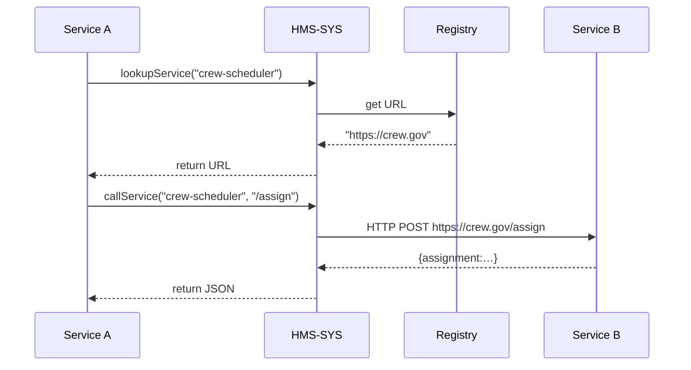

# Chapter 13: Core Infrastructure (HMS-SYS)

Now that we’ve built our business logic in [Backend Services (HMS-SVC)](12_backend_services__hms_svc__.md), it’s time to look at the **Core Infrastructure (HMS-SYS)**—the concrete and steel beams holding the entire HMS skyscraper together. This is the secure data center, network backbone, and shared services that let every module—from AI agents to front-end widgets—talk reliably to one another.

---

## 1. Motivation & Central Use Case

Imagine the U.S. Department of Transportation runs dozens of services:
- A micro-frontend showing roadwork updates  
- An AI agent predicting traffic patterns  
- A backend scheduling crews  

If each service hard-codes URLs, logs to its own file, and uses its own security checks, you face a mess of broken links, scattered logs, and security holes. Instead, **HMS-SYS** provides:

1. A **Service Registry** so “Scheduling” finds “Logging” without copying URLs.  
2. A **Security Layer** that enforces JWTs or API keys everywhere.  
3. A **Logging & Monitoring System** to collect traces in one place.  
4. A **Network Client** that reads configuration and retries failures.

With this layer, adding a new “Transit Subsidy” service is as easy as registering it once—and every other module just discovers and calls it securely.

---

## 2. Key Concepts

1. **Service Discovery**  
   A registry mapping service names (e.g. “crew-scheduler”) to network addresses.

2. **Security**  
   Shared middleware or helpers that validate tokens, enforce TLS, and inject user context.

3. **Logging & Monitoring**  
   Centralized functions for structured logs, metrics, and health checks.

4. **Network Communication**  
   A common HTTP/gRPC client with built-in discovery, retries, timeouts.

5. **Configuration Management**  
   Loading environment-specific settings (endpoints, secrets) in one place.

6. **Resilience**  
   Circuit breakers, bulkheads, and retry policies to prevent cascading failures.

---

## 3. Hands-On: Using HMS-SYS Primitives

Below is a minimal example showing Service A calling Service B using the Core Infrastructure.

### 3.1 Service Registry

File: infra/registry.js  
```js
const services = {};
export function registerService(name, url) {
  services[name] = url;
}
export function lookupService(name) {
  return services[name];
}
```
> registerService("crew-scheduler", "https://crew.example.gov") lets others discover that URL.

### 3.2 Security Helper

File: infra/security.js  
```js
export function verifyToken(req) {
  const token = req.headers.authorization;
  if (!token || !isValidJWT(token)) throw new Error("Unauthorized");
  return decodeJWT(token); // returns user info
}
```
> Every API can call `verifyToken(req)` to guard its routes.

### 3.3 Structured Logger

File: infra/logger.js  
```js
export function log(context, message) {
  console.log(JSON.stringify({ ts: Date.now(), ...context, message }));
}
```
> Pass `{service: "A", traceId}` so logs from all modules look uniform.

### 3.4 HTTP Client with Discovery

File: infra/httpClient.js  
```js
import { lookupService } from './registry.js';
import { log } from './logger.js';

export async function callService(name, path, options) {
  const base = lookupService(name);
  const url = `${base}${path}`;
  log({ service: name }, `Calling ${url}`);
  // simple fetch with retry
  return fetch(url, options).then(r => r.json());
}
```
> Instead of hard-coding `https://crew.example.gov`, we use `callService("crew-scheduler", "/assign")`.

### 3.5 Service A Example

File: services/serviceA.js  
```js
import { verifyToken } from '../infra/security.js';
import { callService }  from '../infra/httpClient.js';
import { log }          from '../infra/logger.js';

export async function handler(req, res) {
  const user = verifyToken(req);
  const payload = { reportId: req.body.reportId, user };
  log({ service:"A", user: user.id }, "Forwarding to scheduler");
  const reply = await callService("crew-scheduler", "/assign", {
    method: "POST",
    body: JSON.stringify(payload)
  });
  res.json(reply);
}
```
> Service A verifies security, logs context, then calls the scheduler by name.

---

## 4. What Happens Under the Hood?



1. **Service A** asks the **Registry** for “crew-scheduler.”  
2. It logs the call, does an HTTP POST via the **Network Client**.  
3. **Service B** gets the request and replies.  
4. The response flows back through HMS-SYS layers.

---

## 5. Internal Implementation Walkthrough

### 5.1 Non-Code Steps

1. On startup, each service calls `registerService(name, url)`.  
2. Incoming request hits security middleware: `verifyToken()`.  
3. The handler logs context with `log()`.  
4. Outgoing calls use `callService()`, which does discovery, logging, and retries.  
5. All services share the same libraries under `infra/`.

### 5.2 Core Files & Structure

```
/infra
  registry.js        # service discovery
  security.js        # auth helpers
  logger.js          # structured logging
  httpClient.js      # discovery + network calls
  config.js          # load env settings
  resilience.js      # retry, circuit breaker
```

- **registry.js** keeps a simple in­memory map.  
- **security.js** wraps JWT or API-key checks.  
- **logger.js** ensures every log has a timestamp, traceId, and service name.  
- **httpClient.js** ties discovery, logging, and fetch together.  
- **resilience.js** can wrap `callService()` with retries and timeouts.

---

## 6. Summary

In this chapter you learned how **Core Infrastructure (HMS-SYS)**:

- Provides **Service Discovery** so modules find each other by name  
- Enforces **Security** checks with shared helpers  
- Captures **Structured Logging** and metrics centrally  
- Offers a unified **Network Client** for HTTP calls, with retries and timeouts  
- Loads **Configuration** and handles **Resilience** (circuit breakers, retries)

With HMS-SYS in place, every new service you build plugs into a robust, secure, and observable foundation—just like steel beams in a skyscraper.

Congratulations! You’ve reached the base of our HMS platform. Feel free to explore the code and build your own services on this solid ground.

---

Generated by [AI Codebase Knowledge Builder](https://github.com/The-Pocket/Tutorial-Codebase-Knowledge)