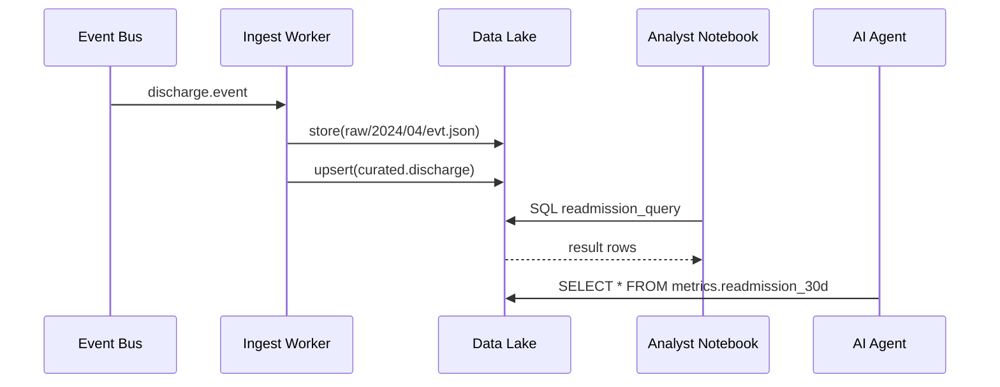

# Chapter 13: Data Lake & Analytics Hub  
*(File: 13_data_lake___analytics_hub_.md)*  

[← Back to Event-Driven Microservices Architecture](12_event_driven_microservices_architecture_.md)

---

## 1 · Why Do We Need a “Data Lake & Analytics Hub”? — A 60-Second Story  

Evergreen Veterans Hospital rolled out a new **“Fast-Track Discharge”** rule last month (remember the [Policy & Process Engine](10_policy___process_engine_.md)).  
Great—but leadership now asks two questions:

1. **Did the rule cut 30-day readmissions?**  
2. **Did anyone game the system by discharging patients too early?**

The answers live in *many* places:

* EHR sensor feeds (bed-exit alarms).  
* Discharge forms submitted through the Portal.  
* Audit logs from [Governance Layer](01_governance_layer__hms_gov__.md).  
* Events fired on the [Event Bus](12_event_driven_microservices_architecture_.md).

The **Data Lake & Analytics Hub** is the one “water-reservoir” where **all** those streams converge, stay governed, and become query-able—so analysts (human *and* AI) can answer tough questions in minutes.

---

## 2 · Key Concepts in Plain English  

| Term | What it really means | Friendly Analogy |
|------|----------------------|------------------|
| Raw Zone | Untouched files as they arrive (`.json`, `.csv`) | Drop-box at City Hall |
| Curated Zone | Cleaned, typed tables (Parquet, Delta) | Library’s reference section |
| Metadata Tag | Labels like `PHI`, `PII`, `PUBLIC` | Warning stickers on folders |
| Lakehouse Query | SQL that spans both raw + curated zones | Asking the librarian, “Find all docs on X” |
| Metric View | Pre-aggregated table (daily readmission %) | Dashboard snapshot |
| Notebook | Interactive workpad (Python/SQL) | Scratch pad on librarian’s desk |
| Governance Hook | Check that the user may see the data | Security guard outside archive |

---

## 3 · 5-Step Journey From Event ➜ Insight  



1. **BUS**: Event comes from last chapter.  
2. **ING**: Tiny worker saves the file + updates a curated table.  
3. **LAKE**: Governs storage, tags `PHI`.  
4. **ANA**: Human runs a SQL notebook.  
5. **AI**: [AI Representative Agent](07_ai_representative_agent__hms_a2a__.md) checks the metric view to judge success.

---

## 4 · Hands-On Quick-Start (End-to-End in 20 Lines)  

### 4.1 Ingest One Discharge Event  

```python
# file: ingest_worker.py
import json, pathlib, pandas as pd
RAW_DIR = pathlib.Path("lake/raw/")
CUR_DIR = pathlib.Path("lake/curated/")

def ingest(evt_json:str):
    evt = json.loads(evt_json)              # arrives from Bus
    RAW_DIR.mkdir(parents=True, exist_ok=True)
    RAW_DIR.joinpath("evt.json").write_text(evt_json)

    # Upsert curated table
    df = pd.DataFrame([evt])
    path = CUR_DIR / "discharge.parquet"
    df.to_parquet(path, append=True)        # pandas <20 lines rule!
```

Run once:

```python
ingest('{"patient":"PAT-9","date":"2024-04-01","readmit":false}')
```

Explanation • Saves **raw** JSON and **curated** Parquet in one go.

---

### 4.2 Query Readmission Rate (Notebook Style)

```python
# file: notebook.py
import duckdb
con = duckdb.connect()

result = con.execute("""
  SELECT 
    date,
    1 - avg(readmit)::float AS discharge_success_rate
  FROM 'lake/curated/discharge.parquet'
  GROUP BY date
""").df()

print(result.head())
```

Output (example):

```
        date  discharge_success_rate
0  2024-04-01                   0.92
```

*You just produced a KPI!* Save the result as `metrics.readmission_30d`.

---

### 4.3 Feed the Metric to the AI Agent  

```python
# file: a2a_check.py
from hms_a2a import ask_agent

summary = ask_agent(
  question="Did Fast-Track reduce readmissions?",
  knowledge_packs=["metrics.readmission_30d"]
)
print(summary["summary"])
```

The AI now reasons over the KPI you generated.

---

## 5 · What Happens Under the Hood?  

1. **Ingestion Worker**  
   * Reads each event from the Bus.  
   * Adds **governance tags** (`PHI`) via `hms_gov.tag()`.  
   * Saves raw + curated simultaneously.

2. **Table Auto-Catalog**  
   * A cron job scans `lake/curated/` and registers any new Parquet file as a **SQL table**.  
   * Table metadata stored in `catalog.sqlite`.

3. **Query Engine**  
   * Wraps DuckDB; applies a **row-level security hook** that calls `check_permission()` from [RBAC](04_role_based_access_control__rbac__.md).

4. **Metric Builder**  
   * Lightweight scheduler runs SQL, materializes `metrics.*` tables every night.  
   * Outputs are **append-only** to keep audit history.

---

## 6 · Tiny Internal Modules (All <20 Lines)

### 6.1 Governance Tag Helper (`hms_lake/gov.py`)

```python
from hms_gov import check_permission
TAGS = {}                       # file_path ➜ ["PHI"]

def tag(file_path, labels):
    check_permission(role=current_role(),
                     action="tag", resource="lake")
    TAGS[file_path] = labels
```

Ensures only allowed roles label sensitive data.

---

### 6.2 Auto-Catalog Cron (`cataloger.py`)

```python
import duckdb, pathlib, time
con = duckdb.connect("catalog.sqlite")

def crawl():
    for p in pathlib.Path("lake/curated").glob("*.parquet"):
        tbl = p.stem                     # "discharge"
        con.execute(f"CREATE TABLE IF NOT EXISTS {tbl} AS SELECT * FROM '{p}'")

while True:
    crawl()
    time.sleep(300)                      # every 5 min
```

Registers each Parquet file as a table.

---

### 6.3 Row-Level Security Hook (`secure_duck.py`)

```python
from hms_gov import check_permission
import duckdb

class SecureConn(duckdb.DuckDBPyConnection):
    def execute(self, sql, *args, **kw):
        check_permission(role=current_role(),
                         action="query", resource="lake")
        return super().execute(sql, *args, **kw)
```

Drop-in replacement for DuckDB with governance check.

---

## 7 · Where Do Other HMS-EHR Layers Plug In?

| Concern | Layer Involved | Chapter |
|---------|----------------|---------|
| Who may *see* PHI tables? | Governance + RBAC | [Governance Layer](01_governance_layer__hms_gov__.md), [RBAC](04_role_based_access_control__rbac__.md) |
| Encryption at rest | Security & Compliance | [Security & Compliance Framework](03_security___compliance_framework_.md) |
| Event ingestion | Event Bus ➜ Ingest Worker | [Event-Driven Microservices Architecture](12_event_driven_microservices_architecture_.md) |
| KPI consumption by AI | AI Agent | [AI Representative Agent](07_ai_representative_agent__hms_a2a__.md) |
| Monitoring failed ingests | Observability Layer | [Observability & Continuous Monitoring](14_observability___continuous_monitoring_.md) |

---

## 8 · Common Pitfalls & Quick Fixes  

| Pitfall | Symptom | Quick Fix |
|---------|---------|-----------|
| Curated table missing | SQL throws “table not found” | Run `cataloger.py` or wait 5 min |
| Unauthorized query | `PermissionError` raised | Ensure your role includes `DataAnalyst` in RBAC |
| Lake growing too fast | Storage bill spikes | Archive raw zone older than 1 year to S3 Glacier |
| AI sees stale metrics | Bad recommendation | Schedule metric view rebuild nightly or on ingest |

---

## 9 · Try It Yourself  

1. `git clone` and `cd examples/lake/`.  
2. Run `python ingest_worker.py` with a few sample events.  
3. Start `python cataloger.py` in another terminal.  
4. Open `notebook.py`, execute, and confirm KPI prints.  
5. Finally, run `a2a_check.py`—watch AI summary reference your fresh KPI.  

---

## 10 · What You Learned  

✓ Why a **governed data lake** is the single source of truth.  
✓ The journey from **raw event ➜ curated table ➜ metric view ➜ AI insight**.  
✓ How tiny Python snippets (<20 lines) implement ingestion, cataloging, security, and querying.  
✓ How Governance, Security, RBAC, and AI layers all connect to the lake.

Next we’ll make sure all of this stays healthy 24 × 7 with dashboards, alerts, and logs in **Observability & Continuous Monitoring**.

[Continue to Observability & Continuous Monitoring](14_observability___continuous_monitoring_.md)

---

Generated by [AI Codebase Knowledge Builder](https://github.com/The-Pocket/Tutorial-Codebase-Knowledge)