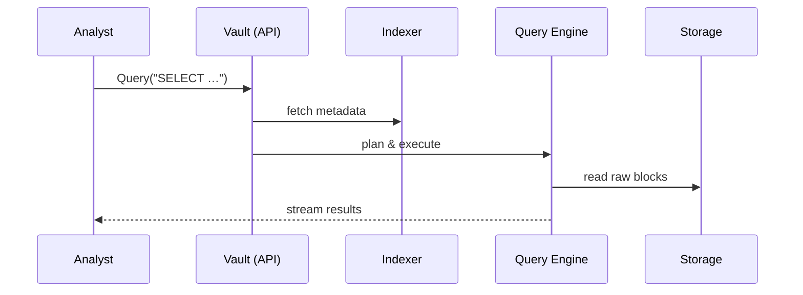

# Chapter 13: Data Repository & Analytics (HMS-DTA)

*[Jump back to the previous chapter: Universal Health Care Integration (HMS-UHC & HMS-MED)](12_universal_health_care_integration__hms_uhc___hms_med__.md)*  

---

## 1. Why Do We Need a “Data Vault”?

Imagine the **U.S. Department of State** wants to slash passport wait-times before the upcoming summer travel rush.  
They suspect a paperwork pile-up but **don’t know where**.  

Today, bits of evidence live in 15 places:

* PDF forms uploaded by citizens (3 different web portals)  
* Call-center transcripts stored in a telecom database  
* Time-stamps from TSA background-check sensors  
* Case-worker comments in a SharePoint site  

Without a single, well-indexed vault, analysts spend weeks begging every team for CSV exports—then more weeks cleaning them.

**HMS-DTA** fixes this by acting as the **National Archives + Search Engine + Data-Science Lab**—all in one place:

```
Any Source ▶ HMS-DTA (store + version + index) ▶ Query ▶ Dashboards / AI Agents
```

Result: an analyst (or AI agent) can ask **one simple question**:

> “Where exactly are applications getting stuck?”

…and get an answer **today**, not next quarter.

---

## 2. Key Concepts (Plain-English Glossary)

| HMS-DTA Term      | Everyday Analogy                       | Why It Matters                         |
|-------------------|----------------------------------------|----------------------------------------|
| Vault             | Locked filing cabinet                  | Raw files stored immutably & versioned |
| Indexer           | Library card catalog                   | Lets you find one page in a million    |
| Snapshot          | Time-machine photo                     | Rewind data to “how it looked last week” |
| Query Engine      | Google search bar                      | SQL-like language across all formats   |
| Pipeline          | Conveyor belt in a factory             | Cleans & joins data automatically      |
| AI Miner          | Detective team                         | Runs models that highlight bottlenecks |

Keep these six in mind; they cover 90 % of HMS-DTA life.

---

## 3. 5-Minute Tour: Spotting the Passport Bottleneck

Goal: **Find which processing step eats 90 % of total time**.

Below is a tiny script (<20 lines) using the imaginary `hms_dta` SDK.

```python
# File: passport_analysis.py
from hms_dta import Vault, Query, Pipeline, Insight

# 1️⃣  Connect to the central vault
vault = Vault.connect("state_dept")

# 2️⃣  Load yesterday's raw logs (auto-indexed)
logs = vault.open("passport_app_logs/*2024-06-01*")

# 3️⃣  Clean & join with staff roster  (pipeline step)
clean = Pipeline.new("passport_clean")\
    .read(logs)\
    .join("hr/staff_roster.csv", on="staff_id")\
    .run()

# 4️⃣  Ask the question
q = Query("""
    SELECT step, AVG(duration_minutes) AS avg_min
    FROM clean
    GROUP BY step
    ORDER BY avg_min DESC
    LIMIT 3
""")
result = q.execute()

print(result.top_row())   # ➜ {'step': 'DocumentVerification', 'avg_min': 1420}
```

What happened?

1. **Vault.connect** gave us a single “drive” where all raw data lives.  
2. **Pipeline.new** created a reusable recipe that cleans + joins in seconds.  
3. **Query.execute** ran one SQL-ish statement across heterogeneous files.  
4. We immediately saw **Document Verification** is the culprit (~24 h).

---

## 4. Zoom-In on the Pieces

### 4.1 Vault (Storage)

* Immutable, append-only buckets.  
* Every write gets a **version ID** (e.g., `v2024-06-01-T13:05`).  
* Supports blobs (PDF), structured rows (CSV/Parquet), and streams (sensor JSON).  

```python
file_id = vault.put("forms/2024/06/app_123.pdf", data=pdf_bytes)
print(file_id)     # v20240601T130501Z
```

### 4.2 Indexer

* Auto-extracts text, metadata (“who uploaded?”, “file type?”), and lineage.  
* You can search within **any** field:

```python
hits = vault.search("fileType:pdf AND citizenId:987654321")
```

### 4.3 Query Engine

* Looks & feels like PostgreSQL but spans every bucket.  
* Small datasets run in-process; large ones spin temporary Spark clusters—handled for you.

### 4.4 Pipelines

* YAML or SDK.  
* Each step is idempotent; outputs are also versioned.

```yaml
# pipelines/passport_clean.yml
read: passport_app_logs/*
filter: "status != 'DRAFT'"
join:
  path: hr/staff_roster.csv
  on: staff_id
```

### 4.5 AI Miners

* Pre-packaged notebooks that search for anomalies, trends, correlations.  
* Can be scheduled or triggered by events (e.g., nightly after [HMS-ACH](11_finance___clearinghouse_services__hms_ach__.md) settles).

---

## 5. Under the Hood (Step-by-Step Walkthrough)

1. `vault.put()` stores the blob in **Object Storage** (S3-like).  
2. **Indexer** reads the blob, extracts metadata, updates the **Catalog DB**.  
3. When a **Query** arrives, Planner decides:  
   • If small → run **embedded engine**.  
   • If large → dispatch to **Spark Pool**.  
4. Results stream back, cached for repeated queries.  
5. Any **Pipeline** or **AI Miner** publishes its outputs as *new versions*—never overwriting raw data.

### Sequence Diagram



Only five actors—simple to audit.

---

## 6. Peek at the Codebase (Tiny Snippets)

### 6.1  Vault.put (file: `hms_dta/vault.py` – 15 lines)

```python
def put(path: str, data: bytes):
    version = _now_version()             # e.g., v20240601T130501Z
    full    = f"{path}::{version}"
    storage.write(full, data)            # ① store
    meta = {"size": len(data), "uploader": _user()}
    catalog.insert(full, meta)           # ② index row
    events.emit("dta.file.created", {"id": full})   # ③ notify
    return version
```

Explanation:

1. **Store** the blob (immutable).  
2. **Catalog** it for search.  
3. **Emit** an event so [HMS-ACT](07_agent_orchestration___workflow__hms_act__.md) or agents can react.

### 6.2  Query.execute (file: `hms_dta/query.py` – 18 lines)

```python
def execute(self):
    plan = planner.build(self.sql)         # parse SQL
    if plan.estimated_size_mb < 500:
        rows = embedded.run(plan)          # small, run local
    else:
        job_id = spark.submit(plan)        # large, cluster
        rows = spark.wait(job_id)
    return Result(rows)
```

*Beginners can read this:*  
• Decide local vs. cluster in **3 lines**.  
• Return a simple `Result` object—no Spark jargon for the caller.

---

## 7. FAQs & Pitfalls

| Question | Quick Answer |
|----------|--------------|
| “Can I mutate or delete data?” | Only **append** is allowed; to ‘delete’, write a *tombstone version*. |
| “Does DTA replace my agency’s PostgreSQL?” | No—think of it as *central, read-mostly* analytics storage. Operational DBs still live in [HMS-SVC](10_core_backend_services__hms_svc__.md). |
| “Is data encrypted?” | Yes—AES-256 at rest; field-level encryption for PII tags. |
| “Can a contractor search everything?” | Only if [Security & Privacy Guardrails](15_security___privacy_guardrails__cross_cutting__.md) grant scoped tokens. |

---

## 8. Try It Yourself

1. Clone `examples/dta_quickstart.ipynb`.  
2. `vault.put()` three mock PDF forms.  
3. Build a **Pipeline** that extracts citizen age from the PDFs (hint: regex).  
4. Run a **Query** grouping by age bands; plot in the notebook.  
5. Schedule the pipeline nightly via `vault.schedule("23:00")`.

---

## 9. What You Learned

* HMS-DTA is your **single source of truth** for every file, sensor reading, and chat log.  
* Versioned storage + automatic indexing means analysts stop hunting for data.  
* Queries, pipelines, and AI miners turn raw logs into policy insights—fast.  

Up next, see how all these moving parts stay healthy in production in  
[Operations, Monitoring & DevOps (HMS-OPS)](14_operations__monitoring___devops__hms_ops__.md).

---

Generated by [AI Codebase Knowledge Builder](https://github.com/The-Pocket/Tutorial-Codebase-Knowledge)