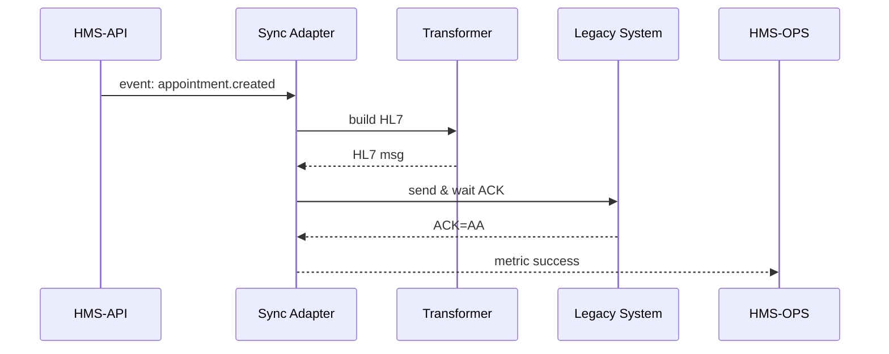

# Chapter 13: External System Sync Adapter  

*(Just landed here from [Metrics & Monitoring (HMS-OPS)](12_metrics___monitoring__hms_ops__.md)?  
Great—now that we can *see* every heartbeat, let’s learn how to *speak* to decades-old systems that still keep many agencies running.)*  

---

## 1. Motivation – “Talk Fluent 1980s in 2020s Apps”

### Real-World Story  
The **Department of Veterans Affairs (VA)** publishes a new **Program** called “Rapid PTSD Screening.”  
Inside the Program a **Protocol** says:  

1. Collect a short mental-health form.  
2. If the score is high, schedule a same-day appointment.  

Sounds simple—until you remember VA clinics still store appointments on a **VistA mainframe** that only understands **HL7 v2** messages.  
If we ignore that mainframe:

* Same-day appointments never appear for the nurse.  
* The veteran waits, complaints flood in, Congress calls.  

**External System Sync Adapter** is the translator that:

1. **Listens** to every Program/Protocol change.  
2. **Transforms** the update into HL7, X12/EDI, or SOAP.  
3. **Delivers** it to the legacy box and waits for an ACK.  

> Analogy: A multilingual court interpreter standing between a modern lawyer (JSON) and an old judge (COBOL).

---

## 2. Key Concepts (Beginner Cheat-Sheet)

| Term | Plain-English Meaning |
|------|----------------------|
| **Source Event** | “Something changed” inside HMS (e.g., new appointment). |
| **Mapping Rule** | A recipe: “`appointment.date` ⇒ `MSH-7` in HL7”. |
| **Transport Connector** | How we *send* (TCP, SFTP, SOAP/HTTP). |
| **Acknowledgment (ACK)** | Legacy system’s “got it” reply. |
| **Retry Queue** | Parking lot for messages that failed; retried later. |

Keep these five in mind—the rest is just plumbing.

---

## 3. Quick Tour – Scheduling a Same-Day Appointment

### 3.1 Triggering Event (Inside HMS)

```php
// AppointmentService.php  (simplified)
$appt = Appointment::create([
    'veteran_id' => 88,
    'date'       => '2024-09-01 14:00'
]);
SyncAdapter::dispatch('appointment.created', $appt->toArray());
```

**Explanation**  
1. When HMS-API stores a new appointment it fires **`appointment.created`**.  
2. `SyncAdapter::dispatch()` puts the payload on an internal queue.  

---

### 3.2 Adapter Mapping Rule (YAML, 10 lines)

```yaml
# mappings/appointment_to_hl7.yaml
event: appointment.created
format: HL7v2
segments:
  MSH.9: 'SIU^S12'
  PID.3: veteran_id
  SCH.11: date               # appointment time
  SCH.7:  location_code
```

Beginner-friendly: left side = HL7 field, right side = JSON key.

---

### 3.3 Minimal Worker That Sends HL7 (Python, 18 lines)

```python
# workers/hl7_sender.py
import hl7, socket, json, queue
from mappings import load_map          # helper

def run():
    while True:
        evt, payload = queue.get()     # 1) pull event
        rule = load_map(evt)           # 2) pick mapping
        msg = hl7.Message()
        for hl7_path, key in rule["segments"].items():
            msg.set(hl7_path, str(payload[key]))
        send_hl7(msg.to_er7())         # 3) transport
        ack = recv_ack()
        if ack != 'AA':
            queue.retry(evt, payload)  # 4) put in retry

def send_hl7(raw):
    s = socket.create_connection(('vista.va.gov', 5000))
    s.sendall(raw.encode() + b'\x0b\x1c')   # MLLP envelope
```

Line-by-line  
1-3. Grab an event and its JSON.  
4-6. Build HL7 message from mapping.  
7-8. Send over TCP using **MLLP** framing.  
9-11. Wait for `AA` (Application Accept).  
12-13. If not accepted, push to **Retry Queue**.

*(Real code uses TLS, logging, etc., but this fits on a slide.)*

---

## 4. What Actually Happens? (Step-by-Step)



Five actors, one round-trip, easy to trace.

---

## 5. Internal File Map

```
sync_adapter/
├─ queue/                # RabbitMQ or SQS helpers
├─ workers/
│   ├─ hl7_sender.py
│   └─ edi_sender.py     # same idea for X12
├─ mappings/
│   └─ appointment_to_hl7.yaml
└─ transport/
    └─ soap_client.py    # for SOAP connectors
```

A new developer only edits `mappings/` for most tasks—no Python needed.

---

## 6. Registering a New Connector (SOAP Example, 14 lines)

```python
# transport/soap_client.py
import requests

def send(payload, endpoint, action):
    hdrs = {'Content-Type':'text/xml',
            'SOAPAction': action}
    res = requests.post(endpoint, data=payload, headers=hdrs, timeout=10)
    return res.status_code == 200
```

Add a mapping file that sets `format: SOAP` and points to this client—done.

---

## 7. Best-Practice Checklist

1. **Version Your Mappings** – `v1`, `v2`; legacy teams hate surprises.  
2. **Log Every Raw Message** – save outgoing & ACK in HMS-DTA for audits.  
3. **Use Retry with Back-off** – start at 1 min, cap at 1 hr.  
4. **Emit Metrics** – success/failure counts to [HMS-OPS](12_metrics___monitoring__hms_ops__.md).  
5. **Idempotency Key** – include `event_id` so the mainframe ignores duplicates.

---

## 8. Recap & What’s Next

You now know how the **External System Sync Adapter**:

1. Listens to HMS events.  
2. Applies a simple YAML mapping.  
3. Sends HL7/EDI/SOAP to decades-old partners.  
4. Retries & logs everything for compliance.

Ready to *share* these adapters and mappings with other agencies so no one reinvents the wheel?  
Jump to [Marketplace & Capability Registry (HMS-MKT)](14_marketplace___capability_registry__hms_mkt__.md)!

---

---

Generated by [AI Codebase Knowledge Builder](https://github.com/The-Pocket/Tutorial-Codebase-Knowledge)