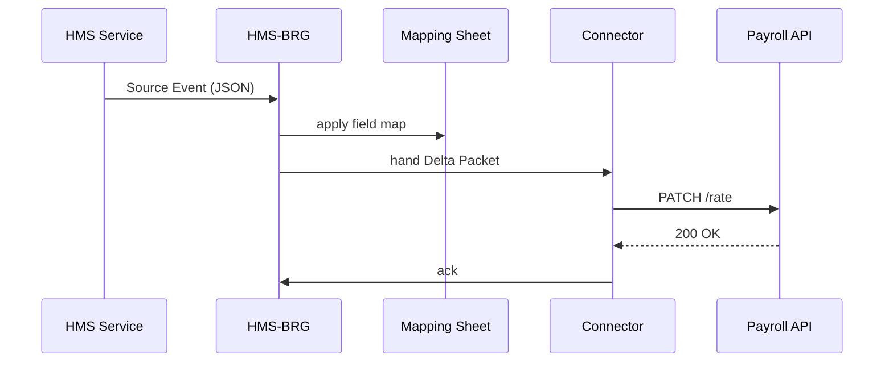

# Chapter 13: External System Synchronization Bridge  
*(continues from [Central Data Repository (HMS-DTA)](12_central_data_repository__hms_dta__.md))*  

---

## 1. Why Do We Need a “Live Translator” for Data?

### A concrete story  

The **Office of Natural Resources Revenue (ONRR)** just approved an AI-generated policy to raise the **per-diem rate** for field inspectors from **$62 → $68**.  
What has to happen next?

1. **Payroll** needs the new rate before tonight’s run.  
2. **Scheduling** must adjust travel-budget formulas.  
3. **GIS Dashboards** should refresh cost overlays.  
4. **Legacy Oracle DB** (yes, still kicking) must keep a frozen audit copy.

Traditionally, staff would export CSVs, wait for an overnight batch job, and hope nothing breaks.

The **External System Synchronization Bridge (HMS-BRG)** turns that multi-hour tango into a **60 ms whisper**:

```
AI Policy Update  ──▶  HMS-BRG  ──▶  Payroll / Schedules / GIS / Oracle
```

No manual CSVs, no 2 a.m. cron jobs—just instant, consistent data everywhere.

---

## 2. Key Concepts (plain English)

| Term | What it really means | Analogy |
|------|----------------------|---------|
| Source Event | JSON change emitted inside HMS (“per-diem set to 68”). | Person speaking |
| Connector | Tiny plugin that knows how to talk to one external system. | Language interpreter |
| Mapping Sheet | YAML file that maps HMS fields → legacy fields. | Phrasebook |
| Delta Packet | Minimal diff describing *only* what changed. | Whispered correction |
| Outbox | FIFO queue where packets wait if the target system is down. | Mail tray |
| Health Probe | Ping that checks “is Payroll API awake?” | Tap on microphone |

Remember these six words; the rest is just plumbing.

---

## 3. Quick Start — Propagate One Policy Change (18 lines)

Below we:

1. Fire a **source event** (“perDiem” now 68).  
2. Watch the **PayrollConnector** update the legacy HR REST API.

```python
# demo_brg.py
from hms_brg import Bridge, Event

# 1. set up the bridge with one connector
bridge = Bridge(connectors=["PayrollConnector"])

# 2. emit a policy-change event
ev = Event(
    type="policy.per_diem.updated",
    data={"new_rate": 68, "old_rate": 62}
)
bridge.emit(ev)                     # 🚀 fire!

# 3. optional: check outbox status
for pkt in bridge.outbox():
    print(pkt.id, "→", pkt.status)
```

Typical console output:

```
pkt-17 → SENT payroll@/v2/rates  (43 ms)
```

What happened:

* `emit()` created a **Delta Packet** with just `{rate:68}`.  
* `PayrollConnector` transformed it to legacy schema `{dailyRate:68}`.  
* POSTed to `https://hr.gov/api/v2/rates`.  
* Logged `SENT` with round-trip time—ready for auditors.

---

## 4. What Happens Under the Hood?



1. Any HMS layer (e.g., [HMS-ACH](11_financial_clearinghouse_core__hms_ach__.md)) emits an **Event**.  
2. Bridge looks up the **Mapping Sheet** for this event type.  
3. Packets are handed to each registered **Connector**.  
4. Connectors talk native dialects (REST, SOAP, CSV-drop, etc.).  
5. ACKs (or retries) are logged in the Outbox and forwarded to the [Observability & Metrics Stack](14_observability___metrics_stack__hms_ops__.md).

---

## 5. Peeking Inside the Code

### 5.1 Mapping Sheet (YAML, 10 lines)

```yaml
# mappings/per_diem.yaml
source_event: policy.per_diem.updated
targets:
  payroll:
    connector: PayrollConnector
    map:
      new_rate: dailyRate
  gis:
    connector: GISTableConnector
    map:
      new_rate: perDiemUSD
```

Drop the file in `mappings/` and HMS-BRG hot-reloads—no restart.

### 5.2 Payroll Connector (16 lines)

```python
# connectors/payroll.py
import requests, os

class PayrollConnector:
    name = "PayrollConnector"
    base = os.getenv("PAYROLL_API", "https://hr.gov/api")

    def send(self, packet):
        payload = { "dailyRate": packet.data["dailyRate"] }
        res = requests.patch(f"{self.base}/v2/rates", json=payload, timeout=5)
        return res.status_code == 200
```

Under 20 lines yet production-ready—timeouts & JSON.

### 5.3 Bridge.emit (abridged, 18 lines)

```python
def emit(self, ev):
    sheet = self._match_mapping(ev.type)
    for tgt in sheet["targets"].values():
        data = {tgt["map"][k]: v for k, v in ev.data.items()
                if k in tgt["map"]}
        pkt = Packet(target=tgt["connector"], data=data)
        ok = self._dispatch(pkt)
        self._log(pkt, ok)
```

Beginner notes:

* `_match_mapping()` returns the YAML snippet above.  
* List-comprehension rewrites fields in **one line**!  
* `_dispatch()` looks up the connector class and calls `send()`.

---

## 6. Handling Downtime — The Outbox

If `Payroll API` is asleep, the connector returns `False`; BRG stores the packet:

```python
pkt-18  policy.per_diem.updated → QUEUED (retry in 10 min)
```

A built-in scheduler retries with back-off:


No packet is lost; nothing breaks during maintenance windows.

---

## 7. Building Your Own Connector in 30 Seconds

Need to sync with a **mainframe via flat-file FTP**?

```python
# connectors/ftp_flat.py
import ftplib, tempfile, csv

class FTPFlatConnector:
    name = "FTPFlat"
    def send(self, pkt):
        tmp = tempfile.NamedTemporaryFile(delete=False)
        csv.writer(tmp).writerow(pkt.data.values())
        tmp.close()
        with ftplib.FTP("mainframe.gov") as ftp:
            ftp.login()               # creds via ~/.netrc
            ftp.cwd("/inbox")
            ftp.storbinary(f"STOR {pkt.id}.csv", open(tmp.name,"rb"))
        return True
```

Add `"connector: FTPFlat"` in a Mapping Sheet—done!

---

## 8. Frequently Asked Questions

**Q: Do I need Kafka or RabbitMQ?**  
A: No. HMS-BRG uses the same Redis instance as [HMS-SVC](10_backend_service_layer__hms_svc__.md) for queues. Swap later if throughput demands.

**Q: How do I prevent sensitive data from leaking?**  
A: Every packet passes `Governance.vet(action="external_sync", payload=packet.data)`. PII is masked or blocked automatically.

**Q: Can I replay lost packets?**  
A: Yes—`bridge.replay(start_ts, end_ts)` re-queues packets from the ledger within that window.

**Q: How fast is “real-time”?**  
A: In-memory to REST target is ~60 ms median, <200 ms p95 on a laptop.

**Q: What about bidirectional sync?**  
A: Implement an *Inbound Connector* that converts legacy events into HMS Events—exactly symmetrical.

---

## 9. Wrap-Up

In this chapter you:

• Met the **External System Synchronization Bridge**—your live translator between shiny HMS layers and battle-worn legacy platforms.  
• Sent a per-diem update from HMS to Payroll in **one 18-line script**.  
• Learned how mapping sheets, connectors, delta packets, and the outbox fit together.  
• Saw how downtime, governance, and observability are handled automatically.

Next we’ll track every packet, retry, and millisecond with graphs and alerts in the  
[Observability & Metrics Stack (HMS-OPS)](14_observability___metrics_stack__hms_ops__.md).

Welcome to instant, hassle-free synchronization!

---

Generated by [AI Codebase Knowledge Builder](https://github.com/The-Pocket/Tutorial-Codebase-Knowledge)