# Chapter 13: External System Synchronization  
*(Bilingual “interpreters” for your legacy neighbors)*  

[↠Back to Chapter 12: Management Layer (HMS-SVC & Friends)](12_management_layer__hms_svc___friends__.md)

---

## 1. Why Bother?  

Meet **Tamika**, a finance officer at the **Federal Bureau of Prisons (BOP)**.  
Yesterday the policy team raised inmate-training budgets through the [PPM-API](11_process___policy_management_api_.md).  
Inside HMS-NFO everything updated instantly—BUT Tamika’s *external* accounting system “**FedLedger 2.3**” (built 1998) still shows the old numbers.  
If she manually re-types every change:

* Hours are lost  
* Typos creep in  
* Auditors find mismatches  

**External System Synchronization (ESS)** removes that pain.  
Think of it as a **UN interpreter booth**: HMS speaks modern JSON; FedLedger mumbles fixed-width text files over SFTP. The Sync layer listens, translates, and keeps both sides in lock-step—no human re-keying required.

---

## 2. Key Concepts (Plain English)

| Term | What It Really Means | Everyday Analogy |
|------|----------------------|------------------|
| Sync Adapter | Little program that connects to ONE legacy app. | Translator assigned to one diplomat. |
| Mapping Table | Rules that turn HMS events into legacy fields. | Phrasebook (“Hello” → “Hola”). |
| Push vs. Pull | Whether we send updates immediately (push) or poll for changes (pull). | Text notification vs. checking email. |
| Conflict Resolver | Logic for “What if both sides changed the same value?” | Two editors merging Google Docs. |
| Health Monitor | Ping that shouts if the adapter dies. | Heartbeat monitor on a patient. |

---

## 3. The Budget-Update Use-Case in 3 Tiny Steps

### 3.1 Listen for the Event (≤ 12 lines)

```ts
// adapters/fedLedger/listen.ts
import bus from "@hms-nfo/event-bus";
import { translateAndSend } from "./sender";

bus.on("budget.updated", (evt) => {
  if (evt.agency !== "BOP") return;          // filter only BOP events
  translateAndSend(evt);                     // step 2
});
```

*Explanation*  
The adapter hears every `budget.updated` event from HMS but forwards only the Bureau of Prisons records.

---

### 3.2 Translate → Legacy Format (≤ 18 lines)

```ts
// adapters/fedLedger/translate.ts
export function toFixedWidth(evt) {
  // Mapping table
  const cols = [
    evt.agency.padEnd(6),          // "BOP   "
    evt.account.padEnd(10),        // "TRAINING "
    String(evt.newValue).padStart(12, "0"), // "000001250000"
    evt.effective.slice(0,10)      // "2023-11-15"
  ];
  return cols.join("");            // single 38-char line
}
```

*Explanation*  
FedLedger expects a **38-character** line: agency (6) + account (10) + amount (12) + date (10).

---

### 3.3 Ship It & Log Success (≤ 16 lines)

```ts
// adapters/fedLedger/sender.ts
import { toFixedWidth } from "./translate";
import sftp from "./sftpClient";             // tiny wrapper
import { record } from "@hms-nfo/catm";      // audit trail

export async function translateAndSend(evt){
  const line = toFixedWidth(evt);
  await sftp.append("/inbox/budget.txt", line + "\n");
  record("fedledger_adapter", "sync_push", { id: evt.id });  // Chapter 8
}
```

*Explanation*  
1. Converts JSON → fixed-width line  
2. Appends to `budget.txt` on the legacy server  
3. Writes an audit event—Tamika (or GAO) can prove it happened

---

## 4. How It All Flows

```mermaid
sequenceDiagram
    participant GOV as HMS-GOV
    participant BUS as Event Bus
    participant ADP as FedLedger Adapter
    participant FL  as FedLedger SFTP

    GOV-->>BUS: policy ➜ budget.updated
    BUS-->>ADP: {agency:"BOP", newValue:…}
    ADP->>FL: append fixed-width line
    ADP-->>BUS: adapter.sync_done
```



---

## 5. Under the Hood (No Heavy Code)

1. **Event Listener** subscribes to `policy.*` or `service.*` topics.  
2. **Filter** chooses only messages relevant to its legacy system.  
3. **Translator** converts JSON → CSV, XML, fixed-width, SOAP, etc.  
4. **Transport** pushes (REST, SFTP) or polls the external API.  
5. **Status Event** (`adapter.sync_done` or `adapter.sync_error`) is published so dashboards & alerts stay green.

---

### 5.1 Folder Peek

```
sync-layer/
  fedLedger/
    listen.ts          (event filter)
    translate.ts       (mapping rules)
    sender.ts          (transport + audit)
    sftpClient.ts
    health.ts          (heartbeats)
  gisPro/
    ...
```

Each legacy app gets its own **pocket folder**—easy for interns to navigate.

---

### 5.2 Health Monitor Stub (≤ 12 lines)

```ts
// fedLedger/health.ts
import { schedule } from "@hms-nfo/scheduler";
import sftp from "./sftpClient";
schedule.every("5m", async () => {
  try {
    await sftp.ls("/inbox");                // simple ping
    bus.emit("adapter.fedledger.ok");
  } catch {
    bus.emit("adapter.fedledger.down");     // triggers PagerDuty
  }
});
```

---

## 6. Hands-On Mini Lab (≈ 5 min)

1. `git clone hms-sync-demo && npm start`  
2. Emit a test event:

```bash
node scripts/publish.js budget.updated \
  '{"id":"e123","agency":"BOP","account":"TRAINING","newValue":1250000,"effective":"2023-11-15"}'
```

3. Open `legacy/budget.txt`—you’ll see a new 38-char line.  
4. Check `ledger.jsonl` (Chapter 8) for a matching `sync_push` entry. 🎉

---

## 7. Common Pitfalls & Quick Fixes

| Gotcha | Symptom | Quick Fix |
|--------|---------|-----------|
| Field overflow | Fixed-width line misaligned | `.padStart()` / `.slice()` to strict lengths |
| Duplicate pushes | Same line appears twice | Store `lastSyncedId`; skip if event.id seen |
| Silent failures | SFTP down, no alert | Use `health.ts` heartbeat + **adapter.sync_error** events |

---

## 8. How ESS Talks to Other Layers

* **Incoming Events** come from the Management Layer (Chapter 12) after rules are applied.  
* **Audit Logs** use the same `record()` helper described in [Compliance & Audit Trail Module](08_compliance___audit_trail_module_.md).  
* **RBAC** (Chapter 3) protects adapter configs—only Ops can change credentials.  
* **Health Events** feed the operations dashboard in the upcoming [Multi-Layered Microservice Architecture](14_multi_layered_microservice_architecture_.md).

---

## 9. What You Learned  

You now have a mental model—and some starter code—for **keeping decades-old systems in perfect sync with HMS-NFO**:

1. Listen for modern events  
2. Translate via simple mapping rules  
3. Push or pull data using whatever protocol the legacy cousin speaks  
4. Log every action for auditors and alerts  

With ESS in place, Tamika’s FedLedger stays up-to-date, and humans stay out of the copy-paste business.

[→ Continue to Chapter 14: Multi-Layered Microservice Architecture](14_multi_layered_microservice_architecture_.md)

---

Generated by [AI Codebase Knowledge Builder](https://github.com/The-Pocket/Tutorial-Codebase-Knowledge)