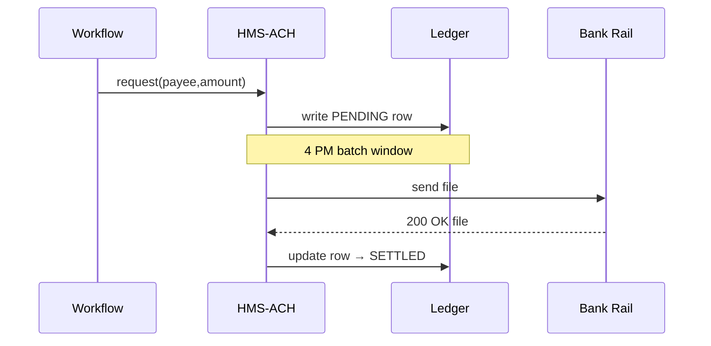

# Chapter 13: Financial Clearinghouse (HMS-ACH)

*A friendly sequel to [External System Synchronizer](12_external_system_synchronizer_.md)*  

---

## 1. Why Do We Need HMS-ACH?

Imagine a **FEMA** case manager just approved a \$7 500 disaster-relief payment for citizen *Maria Lopez*.

1. The approval lives inside a workflow run by [HMS-ACT](05_workflow_orchestrator__hms_act__.md).  
2. Her bank account sits at a credit union outside the government firewall.  
3. Federal law says every cent must be logged, validated, and settled through the **U.S. ACH network** (the rails the Federal Reserve uses).

If even one step is missed:

* Maria’s funds arrive late (or never).  
* Auditors flag FEMA for improper payments.  
* Treasury violates anti-money-laundering (AML) regulations.

**HMS-ACH is the platform’s “mini-Federal Reserve.”**  
It:

1. **Validates** every amount and recipient.  
2. **Logs** an immutable ledger entry.  
3. **Batches** transactions and sends them over external banking rails.  
4. **Reconciles** bank confirmations back into the system.

One service, four chores, zero sleepless accountants.

---

## 2. Key Ideas in Plain English

| ACH Term | Friendly Analogy | FEMA Example |
|----------|------------------|--------------|
| Transaction | A personal check | “Pay \$7 500 to Maria” |
| Batch Window | Mail pick-up at 5 PM | All today’s payments bundled 16:45–17:00 |
| Ledger | Cash register tape | Row per debit/credit |
| Settlement | “Money actually moved” stamp | Bank confirms file #812 processed 02:04 AM |
| Reconciliation | Balancing your checkbook | ACH amount = Ledger amount? Yes → OK |

Keep these five words—you will see them everywhere in HMS-ACH.

---

## 3. A 3-Step Walk-Through (End-to-End)

### 3.1 Workflow Requests a Payment (one-liner)

```js
// 1️⃣ Inside a HMS-ACT step (≤ 10 lines)
await tools.ach.request({
  payee:  { name:'Maria Lopez', bank:'111000025', acct:'987654321' },
  amount: 7500,
  ref:    'FEMA_CLAIM_4451'
})
```

Explanation  
The workflow calls **`tools.ach.request()`** and moves on. No banking code here!

---

### 3.2 HMS-ACH Validates & Queues

```js
// 2️⃣ validators/amount.js  (≤ 15 lines)
export function check({ amount }) {
  if (amount <= 0) throw Error('Amount must be > 0')
  if (amount > 10000) throw Error('Limit exceeded; human review')
}
```

Validation rules are tiny functions—easy to audit or change.

---

### 3.3 Nightly Batch Pushes to Bank

```js
// 3️⃣ batch/send.js (≤ 18 lines)
import { listQueued } from './ledger.js'
import { postFile }   from './bankApi.js'

export async function runBatch(){
  const txs = await listQueued()
  if (!txs.length) return

  const achFile = txs.map(t =>
    `${t.bank},${t.acct},${t.amount},${t.id}`).join('\n')

  const bankRef = await postFile(achFile)   // HTTPS to banking rail
  await markSent(txs, bankRef)
}
```

Every night the scheduler runs `runBatch()`.  
• Builds a CSV-like file (< 10 lines per record).  
• Sends it to Treasury’s gateway.  
• Marks each transaction as **SENT** with the bank reference number.

---

## 4. What Happens Under the Hood?



Only four actors—easy to trace from request to settled.

---

## 5. Using HMS-ACH in Your Code (≤ 20 Lines Total)

### 5.1 Request Helper

```js
// sdk/ach.client.js
export async function pay(payee, amount, ref){
  return fetch('/api/ach', {
    method:'POST',
    body: JSON.stringify({ payee, amount, ref })
  }).then(r=>r.json())          // -> { id:'tx_9a2b', status:'PENDING' }
}
```

### 5.2 Quick Example

```js
const tx = await pay(
  { name:'Maria Lopez', bank:'111000025', acct:'987654321' },
  7500,
  'FEMA_CLAIM_4451'
)
console.log(tx) // { id:'tx_9a2b', status:'PENDING' }
```

You just created a ledger entry **without** touching ACH file formats!

---

## 6. Peek Inside HMS-ACH (Mini Implementation)

### 6.1 API Route (Express-style, 14 lines)

```js
// routes/ach.js
router.post('/', async (req,res)=>{
  const tx = { ...req.body, ts:Date.now(), status:'PENDING' }
  validate(tx)                          // runs amount, OFAC, etc.
  await db.ledger.insert(tx)
  res.status(201).json(tx)
})
```

### 6.2 Ledger Table (very small)

| id (PK) | payee | amount | status | bankRef | ts |
|---------|-------|--------|--------|---------|----|
| tx_9a2b | …     | 7500   | PENDING| null    | …  |

One row per money movement—nothing mysterious.

### 6.3 Settlement Listener (≤ 16 lines)

```js
// listeners/settlement.js
import { update } from './ledger.js'

export async function onBankCallback(payload){
  const { bankRef, results } = payload   // array of {id,status}
  for (const r of results){
    await update(r.id, { status:r.status, bankRef })
  }
}
```

Treasury posts a tiny JSON file when the bank finishes processing.  
This listener reconciles each ID.

---

## 7. Guard-Rails & Compliance Hooks

| Risk | Where Enforced | Related Chapter |
|------|----------------|-----------------|
| Sanctions/OFAC match | `validators/ofac.js` calls Treasury API | [HMS-ESQ](04_compliance___legal_reasoning__hms_esq__.md) |
| Over \$10 000 requires human sign-off | Validation throws → routed to [HITL](08_human_in_the_loop__hitl__control_.md) |
| Double payment | Unique `ref` + DB constraint | [HMS-OPS](17_observability___operations__hms_ops__.md) |
| Audit trail | Every row copied to [HMS-DTA](10_data_lake___repository__hms_dta__.md) nightly |

---

## 8. Where HMS-ACH Talks to Other Layers

| Layer | Interaction |
|-------|-------------|
| [HMS-ACT](05_workflow_orchestrator__hms_act__.md) | Calls `tools.ach.request()` during workflows |
| [HMS-SVC](09_core_service_mesh__hms_svc__.md) | Exposes `/api/ach` securely via sidecar |
| [HMS-A2A](11_inter_agency_exchange__hms_a2a__.md) | Sends settlement reports to Treasury Inspectors |
| [ESS](12_external_system_synchronizer_.md) | Publishes `finance.settled` events to state systems |

Everything **fits together**—a payment touches at least four layers, yet you write < 20 lines.

---

## 9. Frequently Asked Questions

**Q: How big can a nightly batch be?**  
Default limit is 10 000 records. Split large days into multiple files—`runBatch()` takes a `max=…` flag.

**Q: Can HMS-ACH do instant RTP (real-time payments)?**  
Yes—set `mode:'RTP'` in the request; RTP bypasses the batch window and uses a different rail adapter.

**Q: What about refunds?**  
Send a negative amount or use `type:'REVERSAL'`; the validator ensures a prior matching credit exists.

**Q: Does HMS-ACH store bank account numbers in plain text?**  
No—accounts are encrypted at rest and masked (`****4321`) in all logs.

---

## 10. What You Learned

• **HMS-ACH** validates, logs, batches, and settles every dollar that leaves or enters the platform.  
• A workflow makes a **one-line** request; the clearinghouse handles the rest.  
• Under the hood: a ledger table, nightly batch file, and a settlement callback.  
• Compliance hooks prevent fraud, sanctions violations, and double payments.  

Up next, see how these reliable money rails enable a public **Marketplace** where vendors, grants, and citizens meet:  
[Marketplace Layer (HMS-MKT)](14_marketplace_layer__hms_mkt__.md)

---

Generated by [AI Codebase Knowledge Builder](https://github.com/The-Pocket/Tutorial-Codebase-Knowledge)