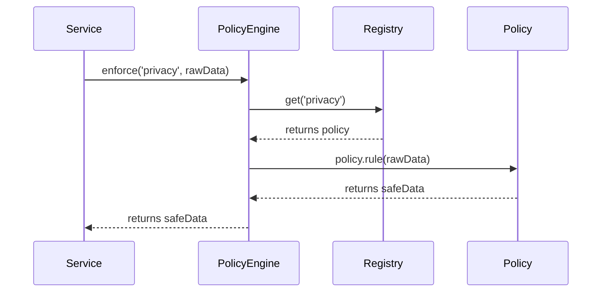

# Chapter 13: Governance Layer

In [Chapter 12: External System Synchronization](12_external_system_synchronization_.md) we learned how to keep HMS-ACT in sync with outside systems. Now it’s time to add the “city council” that sets the **rules and guidelines** for everything: the **Governance Layer**.

---

## Why a Governance Layer?

Imagine a federal health system that must:
- Keep patient records **private**.
- Allow analysts to run population-level **analytics**.
- Ensure every service follows **transparency**, **safety**, and **ethics** policies.

Without a central council, one service might leak PII while another ignores audit logs. The Governance Layer defines **policies**—like a city council passing ordinances—and enforces them across all components.

---

## Key Concepts

1. **Policy**  
   A named rule (e.g., `privacy`, `transparency`) that describes what’s allowed or forbidden.

2. **Policy Registry**  
   A central place where all policies are **registered** and can be looked up by name.

3. **Policy Engine**  
   The component that **enforces** a given policy on some data or action.

4. **Enforcement Point**  
   Places in code (APIs, analytics jobs, workflows) where you **invoke** the Policy Engine.

5. **Governance API/Middleware**  
   Helper functions or HTTP middleware to simplify policy enforcement.

---

## Using the Governance Layer

Let’s walk through a simple use case: **anonymizing patient data** before running analytics.

### 1. Define a Policy

```javascript
// File: src/governance/policies/privacyPolicy.js
module.exports = {
  name: 'privacy',
  description: 'Remove PII before analytics',
  rule: (data) => {
    // Minimal example: strip `name` and `ssn`
    return data.map(record => ({
      age: record.age,
      diagnosis: record.diagnosis
    }));
  }
};
```
Here, our `privacy` policy knows how to scrub personal fields out of patient records.

### 2. Register the Policy

```javascript
// File: src/governance/PolicyRegistry.js
const policies = new Map();

function register(policy) {
  policies.set(policy.name, policy);
}

function get(policyName) {
  return policies.get(policyName);
}

// At startup:
const privacyPolicy = require('./policies/privacyPolicy');
register(privacyPolicy);

module.exports = { register, get };
```
We store each policy by its `name` so the Policy Engine can find it later.

### 3. Enforce Policy in Code

```javascript
// File: src/analytics/healthAnalytics.js
const { get } = require('../governance/PolicyRegistry');

async function runAnalytics(rawData) {
  const privacy = get('privacy');              // look up policy
  const safeData = privacy.rule(rawData);      // apply scrub rule
  // ... now do analytics on safeData ...
}
```
Before analytics, we fetch and apply the `privacy` policy to keep PII out of reports.

---

## What Happens Under the Hood?



1. **Service** calls `enforce('privacy', rawData)`.  
2. **PolicyEngine** looks up `privacy` in the **Registry**.  
3. It applies the policy’s `rule()` to the data.  
4. The sanitized data goes back to the service.

---

## Inside the Implementation

### Policy Engine

```javascript
// File: src/governance/PolicyEngine.js
const { get } = require('./PolicyRegistry');

class PolicyEngine {
  enforce(name, payload) {
    const policy = get(name);
    if (!policy) throw new Error(`Policy ${name} not found`);
    return policy.rule(payload);
  }
}

module.exports = new PolicyEngine();
```
The engine wraps registry lookup and executes a policy’s `rule`.

### Middleware for HTTP Routes

```javascript
// File: src/governance/middleware.js
const engine = require('./PolicyEngine');

function enforcePolicy(policyName) {
  return (req, res, next) => {
    try {
      req.body = engine.enforce(policyName, req.body);
      next();
    } catch (err) {
      res.status(403).send(`Policy violation: ${err.message}`);
    }
  };
}

module.exports = { enforcePolicy };
```
Use `enforcePolicy('privacy')` on any Express route to auto-scrub incoming data.

### Applying Middleware

```javascript
// File: src/api/patientData.js
const express = require('express');
const { enforcePolicy } = require('../governance/middleware');
const router = express.Router();

// This endpoint runs analytics. We enforce privacy before any processing.
router.post(
  '/analytics',
  enforcePolicy('privacy'),
  (req, res) => {
    // req.body is already sanitized
    res.send('Data accepted for analytics');
  }
);

module.exports = router;
```
Now every `/analytics` call automatically obeys our `privacy` policy.

---

## Conclusion

In this chapter you learned how the **Governance Layer** acts like a city council:

- **Defines** policies (transparency, safety, ethics).  
- **Registers** them in a central **Registry**.  
- **Enforces** them via the **Policy Engine** at key points.  
- Provides middleware to apply rules in HTTP routes.

With this in place, every part of HMS-ACT must follow your council’s ordinances.  

Next up: we’ll look at how to govern our AI agents specifically in the [AI Governance Model](14_ai_governance_model_.md).

---

Generated by [AI Codebase Knowledge Builder](https://github.com/The-Pocket/Tutorial-Codebase-Knowledge)