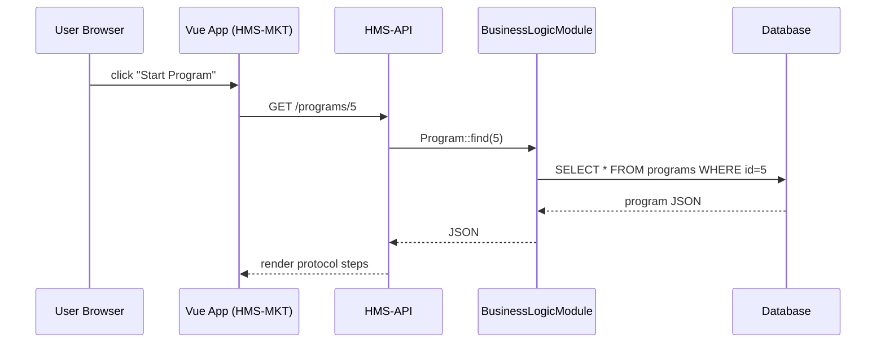

# Chapter 13: HMS-MKT (Public Portal)

In [Chapter 12: Legislative Process Workflow](12_legislative_process_workflow_.md) we saw how laws flow through ten formal steps. Now we’ll build the **HMS-MKT** public portal—a Vue.js app where citizens can browse, start, and share government programs just like visiting an online service counter.

---

## 1. Motivation: Why a Public Portal?

Imagine you want to apply for a housing assistance benefit. Instead of driving to an office and waiting in line, you:

1. Visit **hms-mkt.ai-gov.co**.  
2. Find “Emergency Housing Subsidy” in a marketplace.  
3. Click “Start Application.”  
4. Fill out a step-by-step form (the protocol).  
5. Get help from a virtual agent if you get stuck.  
6. Share a program link with a friend or enroll in a private initiative.

**HMS-MKT** makes all this possible with one friendly web app.

---

## 2. Key Concepts

1. **Vue.js SPA**  
   A single-page app that loads once and dynamically renders pages (like home, programs, help).

2. **Protocol Builder**  
   Renders any workflow defined by your program’s **Protocol** model from [Chapter 2](02_program___protocol_models_.md). Each step shows inputs, next buttons, and validations.

3. **Shared UI Modules**  
   Reusable pieces (e.g. `animated-checkbox`, `multiselect-select-slot-search`, `content-tables`) you use across forms.

4. **Agent Assistance**  
   If you’re stuck, HMS-MKT reaches out to AI agents via [HMS-A2A](09_hms_a2a__agent_to_agent_system__.md), sending your current step and getting back suggestions.

5. **Program Marketplace**  
   Browse public or private programs, share your own protocols, and enroll in community initiatives.

---

## 3. Building a Minimal HMS-MKT App

### 3.1 Entry Point

Create `src/main.js`:

```js
import Vue from 'vue'
import App from './App.vue'
import router from './router'
import axios from 'axios'

axios.defaults.baseURL = 'https://hms-mkt.ai-gov.co/api'
new Vue({ router, render: h => h(App) }).$mount('#app')
```
*This sets up Vue, routing, and the API base URL.*

### 3.2 Router Configuration

`src/router.js`:

```js
import Vue from 'vue'
import Router from 'vue-router'
import Home from './views/Home.vue'
import Protocol from './views/Protocol.vue'

Vue.use(Router)
export default new Router({
  routes: [
    { path: '/', component: Home },
    { path: '/program/:id', component: Protocol }
  ]
})
```
*Two simple routes: a home page and a protocol builder view.*

---

## 4. Protocol Builder View

`src/views/Protocol.vue`:

```html
<template>
  <div>
    <h2>{{ program.name }}</h2>
    <protocol-builder :steps="program.protocol.steps"/>
  </div>
</template>
<script>
import protocolBuilder from '@/components/ProtocolBuilder.vue'
import axios from 'axios'
export default {
  components:{ protocolBuilder },
  data:()=>({ program:{ name:'', protocol:{steps:[]} }}),
  async created(){
    let res = await axios.get(`/programs/${this.$route.params.id}`)
    this.program = res.data
  }
}
</script>
```
*Fetches the program blueprint from **HMS-API** and passes its steps to a `ProtocolBuilder` component.*

---

## 5. Protocol Builder Component

`src/components/ProtocolBuilder.vue`:

```html
<template>
  <div>
    <div v-for="(step, i) in steps" :key="i">
      <h3>Step {{ i+1 }}: {{ step.name }}</h3>
      <div v-for="field in step.fields" :key="field">
        <input-line :label="field" v-model="answers[field]"/>
      </div>
      <button @click="next(i)">Next</button>
    </div>
  </div>
</template>
<script>
import inputLine from '@/components/input-line.vue'
export default {
  components:{ inputLine },
  props:['steps'],
  data:()=>({ answers:{} }),
  methods:{
    next(i){
      // call HMS-API to save step data, then show step i+1
    }
  }
}
</script>
```
*Renders each protocol step with `input-line` fields and a Next button.*

---

## 6. Program Marketplace

`src/views/Home.vue`:

```html
<template>
  <div>
    <h1>Program Marketplace</h1>
    <content-tables :rows="programs" @row-click="goToProgram"/>
  </div>
</template>
<script>
import contentTables from '@/components/content-tables.vue'
import axios from 'axios'
export default {
  components:{ contentTables },
  data:()=>({ programs:[] }),
  async created(){
    let res = await axios.get('/programs')
    this.programs = res.data
  },
  methods:{
    goToProgram(row){ this.$router.push(`/program/${row.id}`) }
  }
}
</script>
```
*Displays a table of programs using our `content-tables` component. Clicking a row navigates to the protocol.*

---

## 7. Agent Assistance

When a user gets stuck, call your agent:

```js
// inside ProtocolBuilder.vue
async askAgent(question){
  let res = await axios.post('/agents/citizen-guide', {
    context: this.answers, question
  })
  alert('Agent says: ' + res.data.answer)
}
```
*This uses [HMS-A2A](09_hms_a2a__agent_to_agent_system__.md) to get suggestions for the current form state.*

---

## 8. Under the Hood: Sequence of Events



1. **User** clicks a program.  
2. **Vue app** calls **HMS-API**.  
3. **API** uses the **Program** model from [Chapter 2](02_program___protocol_models_.md).  
4. Data flows back to the browser to render the protocol.

---

## 9. Internal Implementation Files

- **src/main.js**: bootstraps Vue and axios.  
- **src/router.js**: defines routes.  
- **views/Home.vue** & **views/Protocol.vue**: pages to list programs and build protocols.  
- **components/** folder with:
  - `ProtocolBuilder.vue` (renders steps)  
  - `input-line.vue`, `animated-checkbox.vue`, `multiselect-select-slot-search.vue`, `content-tables.vue` (shared UI modules)  

Each piece is minimal and focuses on one responsibility.

---

## Conclusion

You’ve built a beginner-friendly Vue.js public portal—**HMS-MKT**—that lets citizens:

- Browse a **Program Marketplace**  
- Launch and navigate dynamic **Protocol** forms  
- Get **AI agent assistance** when needed  
- Use shared UI modules for consistency  

Next, we’ll break our front-end into reusable chunks in [Chapter 14: HMS-MFE (Micro-Frontends)](14_hms_mfe__micro_frontends__.md).

---

Generated by [AI Codebase Knowledge Builder](https://github.com/The-Pocket/Tutorial-Codebase-Knowledge)