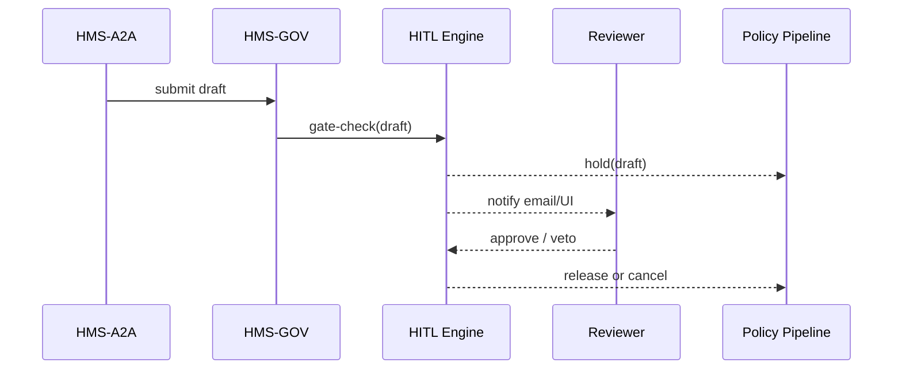

# Chapter 13: Human-in-the-Loop (HITL) Oversight  

*(You just met the very eager [AI Representative Agent (HMS-A2A)](12_ai_representative_agent__hms_a2a__.md).  
Before we let that agent—or **any** automation—flip a nationwide switch, real humans get the last word.  
That safety rail is called **Human-in-the-Loop (HITL) Oversight**.)*  

---

## 1 · Why Do We Need an “Emergency Brake”?  

### A 90-second story — “The 5¢ Postcard”

The **U.S. Postal Service (USPS)** AI finds that if postcard stamps cost **5 ¢** instead of 51 ¢, holiday volume would triple, and citizens would “love the savings.”  
Great! So the agent drafts a policy:

```yaml
id: postcard-price
version: 3
change: { priceCents: 5 }
```

But:  
* Congress sets postal prices, not chat-bots.  
* Lowering stamps by 90 % would blow a $7 B hole in the budget.  
* A public comment period is legally required.

**HITL Oversight** pauses the rollout until a **designated official** (e.g., the USPS Pricing Director) reviews the AI’s suggestion, tweaks it—or slams the veto button.

---

## 2 · Key Concepts in Plain English  

| Term                | Beginner-friendly meaning                                               |
|---------------------|---------------------------------------------------------------------------|
| Checkpoint          | The exact spot where automation must stop and wait for a human.          |
| Reviewer            | Person (or board) allowed to approve, amend, or veto.                    |
| Review Window       | How long the human has to respond (e.g., 48 h).                          |
| Action on Timeout   | What happens if nobody responds (default: **block**).                    |
| Audit Stamp         | Indelible record of who signed, what changed, and when.                  |

Analogy: A **railroad red-flag**—the train (automation) must halt until the conductor (human) waves it on.

---

## 3 · Quick Start — Add a HITL Checkpoint in 3 Steps  

We’ll protect our **postcard-price** draft.

### 3.1 Declare the Checkpoint (8-line YAML)

```yaml
# hitl/postcard-price.yaml
policyId: postcard-price
reviewers: [ "usps.pricing.director" ]
window: 48h          # human has two days
onTimeout: block     # stop rollout if no decision
```

**Explanation**  
• `policyId` ties the gate to drafts of that policy.  
• Only the **pricing director** may approve.  
• If 48 h pass with no action, the pipeline halts.

---

### 3.2 Register the Gate

```bash
hms hitl add hitl/postcard-price.yaml
```

Output:

```
✔ HITL checkpoint created (gate-17)
```

---

### 3.3 Watch It in Action

```bash
# AI agent (or analyst) submits draft v3
hms gov draft upload postcard-price-v3.yaml
```

Pipeline log:

```
compile ... ok
tests   ... ok
HITL    ... ⏸ waiting for usps.pricing.director (47h 59m left)
```

No further stage (staging, promotion) runs until the human decides.

---

## 4 · What Does the Human See? (Mini UI Snippet)

```tsx
// AdminPortal/routes/HitlInbox.tsx (14 lines)
export default function HitlInbox() {
  const [gates] = useFetch('/api/hitl/pending');
  return (
    <Table>
      {gates.map(g => (
        <tr key={g.id}>
          <td>{g.policyId}</td>
          <td>{g.proposedChange}</td>
          <td><Button onClick={()=>approve(g.id)}>Approve</Button></td>
          <td><Button onClick={()=>veto(g.id)}>Veto</Button></td>
        </tr>
      ))}
    </Table>
  );
}
```

**Explanation**  
• Fetches pending checkpoints.  
• Two buttons call `/api/hitl/approve` or `/api/hitl/veto`.  
• Under 15 lines—no fancy state management.

---

## 5 · Under the Hood (Step-by-Step)  



Only **five** participants keep the dance easy to follow.

---

## 6 · Internals — Tiny Code Tour  

### 6.1 Gate Validator (≤ 15 lines)

```ts
// hitl/validator.ts
export function needHitl(draft){
  const gate = db.gates.find(g => g.policyId === draft.id);
  if (!gate) return false;
  const now = Date.now();
  return { gateId: gate.id, expires: now + ms(gate.window) };
}
```

*Returns `false` or a “hold ticket” with expiry.*

---

### 6.2 Pipeline Middleware (18 lines)

```ts
// pipeline/middlewares/hitl.ts
export async function hitlGuard(draft, next){
  const ticket = needHitl(draft);
  if (!ticket) return next();          // no HITL required

  await db.holds.insert({ draftId:draft.id, ...ticket });
  notifyReviewer(ticket.gateId);

  throw new WaitError('HITL pending'); // pauses the job
}
```

*Blocks the pipeline by throwing a custom `WaitError`; the CI runner will poll every few minutes.*

---

### 6.3 Reviewer Decision Endpoint (12 lines)

```ts
// api/hitl.ts
app.post('/api/hitl/:gate/decision', async (req,res)=>{
  const { gate } = req.params;
  const { action } = req.body;          // 'approve' | 'veto'
  await db.holds.update({ gateId:gate }, { action, decidedBy:req.user });
  res.sendStatus(204);
});
```

*One endpoint handles both buttons from the UI.*

---

### 6.4 Automatic Timeout Job (8 lines)

```ts
// cron/hitlTimeout.ts
for (const h of db.holds.where({ action:null })){
  if (Date.now() > h.expires){
    if (h.onTimeout === 'block') cancelDraft(h.draftId);
    else if (h.onTimeout === 'auto-approve') release(h.draftId);
  }
}
```

*Runs every hour; honours `onTimeout` rule.*

---

## 7 · Common Pitfalls & Easy Fixes  

| Pitfall                                  | Fast Fix |
|------------------------------------------|----------|
| Too many checkpoints slow delivery       | Group similar policies under **one** reviewer or shorten `window`. |
| Reviewer out-of-office, window expires   | Add backup reviewer list: `[primary, deputy]`. |
| Human approves but forgets comment       | Make `comment` a required field in `/decision`. |
| Pipeline blocks forever after code bug   | Manual override: `hms hitl bypass <gateId>` (logged in audit trail). |

---

## 8 · Why Auditors & Citizens Love HITL  

* Guarantees **legal & ethical** review before deployment.  
* Stores a **tamper-proof signature** in the same ledger used by [Compliance & Audit Trail Engine](14_compliance___audit_trail_engine_.md).  
* Mirrors the **congressional review period**—government processes feel familiar and trustworthy.

---

## 9 · Recap & What’s Next  

Today you:

1. Added a **HITL checkpoint** with one small YAML file.  
2. Saw how the pipeline **pauses** until a human decides.  
3. Explored minimal code that validates, blocks, and releases drafts.  
4. Learned common traps and escape hatches.

With human sign-offs secured, we now need to **record every decision and pipeline event in an immutable ledger** for audits and Freedom-of-Information requests.  
Grab your gavel and continue to [Compliance & Audit Trail Engine](14_compliance___audit_trail_engine_.md).

---

Generated by [AI Codebase Knowledge Builder](https://github.com/The-Pocket/Tutorial-Codebase-Knowledge)