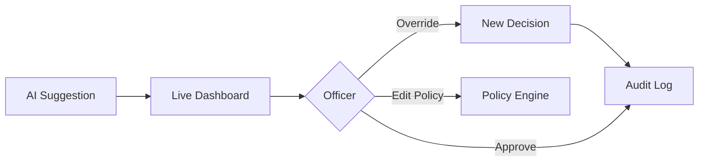

# Chapter 13: Human-in-the-Loop Oversight Console (HMS-GOV)


*[← Back to Chapter 12: Micro-Frontend Library (HMS-MFE)](12_micro_frontend_library__hms_mfe__.md)*  

---

## 0. Why Do We Need a “GOV” Console? — The Self-Driving-Bus Scare  

Picture the **U.S. Department of Transportation (DOT)** testing an autonomous shuttle in Washington D.C.:

1. An **AGT** safety-bot reviews each route and *usually* signs off.  
2. One night the bot routes the shuttle past a school during a late football game.  
3. DOT wants a human officer to **see** that suggestion, **override** it if risky, or **approve** it and take credit.  
4. Every final decision must be **logged** for future FOIA requests.

The **Human-in-the-Loop Oversight Console (HMS-GOV)** is that mission-control room.

---

## 1. Key Concepts (Beginner-Friendly)

| Concept | One-Line Job | Real-World Analogy |
|---------|--------------|--------------------|
| Live Dashboard | Shows every pending AI suggestion | Air-traffic radar |
| Override Switch | Replace AI decision with human one | Emergency brake |
| Audit Log Viewer | Time-travel through every action | Black-box recorder |
| Policy Editor | Update guardrails on the fly | Traffic-sign painter |
| Credit Badge | Stamps “Approved by” name & title | Signature on a form |

Remember this loop: **See → Decide → Record**.

---

## 2. Quick Tour in 30 Seconds  



1. A tool (agent, workflow, or service) pushes a **suggestion**.  
2. Officers watch the **Dashboard**.  
3. They **Override**, **Approve**, or **Edit Policy**.  
4. Every click lands in the **Audit Log**, readable forever.

---

## 3. “Hello GOV” — Requesting & Approving a Shuttle Route (≤ 20 Lines)

### 3.1 Agent Side (DOT safety-bot)

```python
# request_approval.py  (15 lines)
from hms_gov import request_review

route = {
  "vehicle_id": "BUS-17",
  "path": ["5th & G", "Lincoln HS", "Union Station"],
  "time": "21:45"
}

ticket = request_review(
          suggestion=route,
          topic="dot.bus.route",
          rationale="Late-night shuttle trial"
)

print("🗳️ Awaiting decision ticket:", ticket)
```

What happened?  
* `request_review` wrapped the route in an MCP envelope and published it to GOV.  
* We received a **ticket ID** we can poll for status.

### 3.2 Officer Side (click-through)

```
Live Dashboard ➜ dot.bus.route ➜ BUS-17 ➜ Override → New path avoids school.
```

### 3.3 Agent Polls Result (≤ 4 Lines)

```python
from hms_gov import poll_result
print("✅ Final decision:", poll_result(ticket))
```

Typical output:

```
{'status': 'overridden',
 'by': 'Jane Kim, DOT Safety Officer',
 'new_path': ['5th & G', 'Massachusetts Ave', 'Union Station']}
```

---

## 4. What Happens Under the Hood? (5 Actors, 7 Steps)

```mermaid
sequenceDiagram
  participant AGT as Safety-Bot
  participant GOV as GOV Core
  participant UI as GOV Dashboard
  participant OFF as DOT Officer
  participant AUD as Audit Store

  AGT->>GOV: route suggestion (MCP)
  GOV-->>UI: add to dashboard
  OFF->>UI: override click
  UI->>GOV: new decision
  GOV->>AUD: write audit row
  GOV-->>AGT: decision payload
  AUD-->>UI: log visible
```

---

## 5. Tiny Peek at GOV Core (≤ 18 Lines)

```python
# hms_gov/core.py  (simplified)
REVIEWS = {}          # ticket_id -> record

def request_review(suggestion, topic, rationale):
    tid = _uuid()
    REVIEWS[tid] = {
       "suggestion": suggestion, "topic": topic,
       "status": "pending", "rationale": rationale
    }
    _broadcast(tid)                # push to dashboard WebSocket
    return tid

def decide(ticket_id, action, officer, patch=None):
    rec = REVIEWS[ticket_id]
    rec["status"] = action         # 'approved' | 'overridden'
    rec["by"] = officer
    if patch: rec.update(patch)    # new_path, new_amount, etc.
    _audit(rec)                    # immutable write
    _notify_agent(ticket_id, rec)  # wakes poll_result()
```

Beginner notes  
1. `_broadcast` adds the card to every open GOV web UI.  
2. `_audit` writes a signed MCP envelope to the central **Audit Store** (used by [HMS-OPS](11_operational_nerve_center__hms_ops__.md)).  
3. `_notify_agent` resolves the promise created by `poll_result()`.

---

## 6. Editing a Policy on the Fly (≤ 12 Lines)

```python
# change_policy.py
from hms_gov import update_policy

update_policy(
  path="dot.rules.bus_after_9pm.school_zone",
  new_value="forbidden_radius_m=500"
)
```

Result: GOV pushes the diff to [HMS-CDF Legislative Engine](03_hms_cdf_legislative_engine_.md) and forces an instant re-validation by [HMS-ESQ](04_compliance___legal_reasoning__hms_esq__.md).

---

## 7. How GOV Connects to Other Layers

Layer | Interaction
------|-------------
[MFE Widgets](12_micro_frontend_library__hms_mfe__.md) | Dashboard UI is built from `<HmsTable/>`, `<HmsBadge/>`.
[A2A Bus](07_hms_a2a_inter_agency_messaging_bus_.md) | Decisions published on `gov.decision.made` for subscribers.
[ACT Workflows](08_hms_act_workflow_orchestrator_.md) | Steps can pause until GOV returns `approved`.
[OPS](11_operational_nerve_center__hms_ops__.md) | GOV health & decision latency metrics flow to probes.
[Data Spine](09_data_spine__hms_dta__.md) | Audit rows stored as immutable dataset `gov/decisions`.

---

## 8. Common Pitfalls (and How GOV Fixes Them)

Problem | Legacy World | With HMS-GOV
--------|--------------|-------------
Hidden AI errors | Bot auto-executes | Dashboard surfaces every suggestion
No proof of human sign-off | Email threads | Immutable Audit Log + Credit Badge
Blame game after incident | “Who clicked approve?” | Decision shows name & timestamp
Policy tweaks require deploy | Rebuild containers | Policy Editor hot-patches rules

---

## 9. Recap & What’s Next  

You learned that **HMS-GOV**:

• Lets humans **see, override, or approve** any AI or workflow decision.  
• Writes every click into an **immutable Audit Log** linked to earlier systems.  
• Provides live **Dashboards, Override Switches, and Policy Editors** — all built with HMS-MFE.  

Ready to practice in a safe sandbox *before* touching real citizens’ data?  
Jump into the next chapter: [Simulation & Training Sandbox (HMS-ESR)](14_simulation___training_sandbox__hms_esr__.md).

---

Generated by [AI Codebase Knowledge Builder](https://github.com/The-Pocket/Tutorial-Codebase-Knowledge)