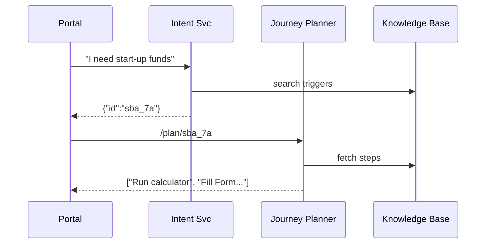

# Chapter 13: Intent-Driven Navigation / AI-Guided Journey
*Coming from [Interface Layer (HMS-MFE / Portals)](12_interface_layer__hms_mfe___portals_.md).*

---

## 1. Why Do We Need a “GPS for Government Forms”? – A 90-Second Story  

Kim, an entrepreneur in Alaska, opens **MyGov Portal** and types:

> “I need start-up funds for a seafood truck.”

Today Kim would click through *six* menus trying to guess:

1. Which agency helps?  
2. Am I eligible?  
3. Which PDF is the “right” one?  

Most people quit halfway.

**Intent-Driven Navigation (IDN)** flips the script: the portal simply asks  
**“What are you trying to accomplish?”** then *guides* Kim step-by-step—just like a car GPS recalculating turns.

Result:  
• Fewer drop-offs,  
• Happier citizens,  
• Agencies get complete, valid submissions on the first try.

---

## 2. The 4 Key Concepts (Beginner-Friendly)

| Travel Analogy | IDN Piece | One-Sentence Explanation |
|----------------|-----------|--------------------------|
| Destination | **Intent** | A short user statement (natural language) like “renew driver’s license.” |
| GPS Map | **Knowledge Base** | Machine-readable list of government tasks, forms, and rules. |
| Route Planner | **Journey Planner** | AI function that turns an intent into ordered steps. |
| Turn-by-turn voice | **Step Coach** | UI component that shows *one* clear action at a time. |

Keep these four in mind—everything in the chapter plugs into them.

---

## 3. Minimal Walk-Through: “Get a Small-Business Grant”  

### 3.1 User Interaction

```
User: I need start-up funds
System: Great! Let’s check if you qualify for the SBA 7(a) loan.
```

Behind the scenes three microservices team up:

1. **Intent Service** – Detects *grant-related* intent.  
2. **Journey Planner** – Chooses the SBA flow.  
3. **Step Coach** – Shows “Step 1: run the eligibility calculator.”

We’ll build a runnable toy version in **< 60 lines total**.

---

## 4. Coding the Pieces (All Snippets ≤ 20 Lines)

### 4.1 The Knowledge Base (JSON, 12 lines)

```json
// kb.json
[
  {
    "id": "sba_7a",
    "trigger": ["start up funds", "small business grant"],
    "steps": [
      "Run SBA eligibility calculator",
      "Fill SBA Form 1919",
      "Upload financial statements",
      "Submit before deadline 2024-09-30"
    ]
  }
]
```

*Explanation*: Each object lists trigger phrases and the official steps.  
Add more programs by appending new objects—no code changes needed!

---

### 4.2 Intent Service – Find the Best Match

```python
# intent_service.py
import json, re
KB = json.load(open("kb.json"))

def detect_intent(msg: str):
    msg = msg.lower()
    for item in KB:
        if any(re.search(p, msg) for p in item["trigger"]):
            return item["id"]
    return None
```

*What it does*: Scans the message for trigger phrases and returns a program ID (`"sba_7a"`).

---

### 4.3 Journey Planner – Fetch Ordered Steps

```python
# planner.py
import json; KB = {i["id"]: i for i in json.load(open("kb.json"))}

def plan(program_id):
    return KB[program_id]["steps"]
```

One-liner: looks up the steps in the KB.

---

### 4.4 Step Coach – Tiny React Widget (18 lines)

```jsx
// StepCoach.jsx
export default function StepCoach({steps}) {
  const [idx, setIdx] = React.useState(0);
  const next = () => setIdx(i => Math.min(i+1, steps.length-1));
  return (
    <div>
      <h2>Step {idx+1}/{steps.length}</h2>
      <p>{steps[idx]}</p>
      <button onClick={next} disabled={idx===steps.length-1}>
        {idx===steps.length-1 ? "Done" : "Next"}
      </button>
    </div>
  );
}
```

*What happens*: Shows the current step and a **Next** button—simple & clear.

---

### 4.5 Glue Code in the Portal Shell (19 lines)

```javascript
// intent_handler.js
import StepCoach from "./StepCoach.jsx";

async function onUserSubmit(txt){
  const idResp = await fetch("/ai/intent", {method:"POST",
      body:txt}).then(r=>r.json());           // calls Intent Service
  if(!idResp.id) return alert("Sorry, couldn't match.");
  const steps = await fetch(`/ai/plan/${idResp.id}`)
     .then(r=>r.json());                     // calls Planner
  loadComponent(<StepCoach steps={steps} />); // reuse loader from Ch.12
}
```

*Explanation*:  
1. POSTs the raw text to the Intent Service.  
2. GETs the ordered steps from the Planner.  
3. Renders the **Step Coach** component—no page reload.

---

## 5. End-to-End Flow (What Happens Internally)



Only **four** actors—easy to trace and debug.

---

## 6. Where Does IDN Fit in the HMS-SCM Ecosystem?

```mermaid
flowchart TD
    subgraph Interface Layer
        UI
    end
    INT(Intent Service) -->|programId| UI
    PLN(Journey Planner) -->|steps| UI
    KB --> INT & PLN
    INT --Audit--> [Security & Compliance](09_security___compliance_framework_.md)
    PLN --Policies--> [Process & Policy](03_process___policy_module_.md)
```

• Lives *inside* the Interface Layer (Chapter 12).  
• Relies on governance rules to ensure each step obeys policy (mask SSNs, deadlines, etc.).

---

## 7. Internal Implementation Details (for the Curious)

### 7.1 Sequence of Responsibilities

1. **Intent Service**  
   • Natural-language matching (regex, ML model, or OpenAI).  
   • **Outputs** program ID.

2. **Journey Planner**  
   • Reads versioned steps from PPM (see [Process & Policy Module](03_process___policy_module_.md)).  
   • Can skip or add steps based on *context* (e.g., veteran status).

3. **Step Coach**  
   • One step at a time → fewer errors.  
   • Emits events like `StepCompleted` which feed the [Event-Driven Workflow](06_event_driven_workflow_orchestration_.md).

### 7.2 Minimal Express API (Optional)

```javascript
// routes.js  (Express, 16 lines)
const express = require("express"), fs = require("fs");
const kb = JSON.parse(fs.readFileSync("kb.json"));
const app = express(); app.use(express.text());

app.post("/ai/intent",(req,res)=>{
  const id = kb.find(p=>p.trigger.some(t=>req.body.includes(t)))?.id;
  res.json({id});
});
app.get("/ai/plan/:id",(req,res)=>{
  res.json(kb.find(p=>p.id===req.params.id).steps);
});
app.listen(8080);
```

*Yes, that’s the whole back-end for our demo!*

---

## 8. Tips & Best Practices

1. **Start Simple, Grow Smart** – Regex triggers work day-one; swap in ML when traffic grows.  
2. **Version Your Steps** – Store each flow in PPM so policy teams can edit without redeploys.  
3. **Collect Feedback** – Capture `StepCompleted` events; if many users quit at step 3, improve that step.  
4. **Graceful Fallback** – If no intent matches, show a manual menu so people never feel stuck.  
5. **Respect Privacy** – Log only program IDs, not raw user sentences, unless redacted by the [Security & Compliance Framework](09_security___compliance_framework_.md).

---

## 9. Recap  

• Intent-Driven Navigation asks “What do you need?” instead of “Which menu?”  
• Four lightweight pieces—Intent, Knowledge Base, Planner, Step Coach—turn free-text into guided steps.  
• All code samples fit in **60 lines**, yet cover discovery, planning, and UX.  
• IDN plugs neatly into earlier chapters (governance, events, portals) and improves citizen success rates.

---

## 10. Up Next  

Our guided flow still needs data **outside** our platform—credit scores, tax records, legacy mainframes.  
In the next chapter we connect HMS-SCM to the outside world:  
[External System Synchronization](14_external_system_synchronization_.md)

---

Generated by [AI Codebase Knowledge Builder](https://github.com/The-Pocket/Tutorial-Codebase-Knowledge)