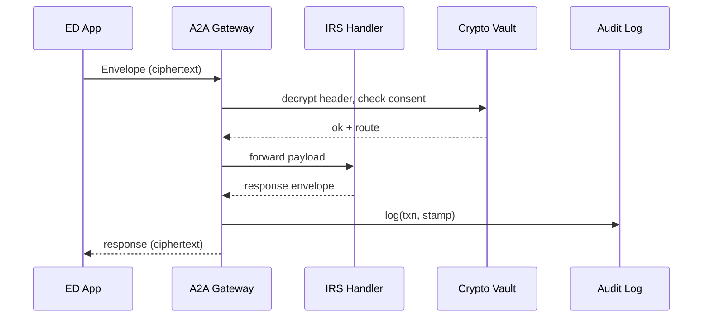

# Chapter 13: Inter-Agency Exchange Protocol (HMS-A2A)

*(Just browsed the “app-store” in [Marketplace & Capability Registry (HMS-MKT)](12_marketplace___capability_registry__hms_mkt__.md)?  
Great!  Now let’s see **how live data actually moves** between agencies once a capability is installed.)*

---

## 1. Why Do We Need HMS-A2A?  

### One Concrete Story

The **Department of Education (ED)** must verify a student’s household income before approving federal aid.  
Today that means:

1. The student prints last year’s tax return.  
2. ED staff manually type numbers into a spreadsheet.  
3. The IRS double-checks weeks later.

**HMS-A2A turns those three steps into one API call**:

```
ED → “Give me AGI for SSN-xxx with parent consent” → IRS  
< 800 ms later >  
IRS → “Here’s the verified number, signed & encrypted.”
```

No paper, no spreadsheet typos, no custom contract—*just one shared protocol*.

---

## 2. Beginner’s Mental Model

| Diplomatic Pouch Analogy | HMS-A2A Term | One-Liner |
|--------------------------|--------------|-----------|
| Sealed Envelope          | **Envelope** | Holds the bytes you’re sending. |
| Customs Form             | **Manifest** | Who sent it, what it is, legal basis. |
| Security Tape            | **Cipher Seal** | AES-256 encryption + agency keys. |
| Route Slip               | **Hop List** | “ED ➜ FedNet ➜ IRS” in machine order. |
| Wax Stamp                | **Provenance Stamp** | Cryptographic signature proving origin. |
| Visitor Badge            | **Consent Token** | Citizen-granted permission that travels with the data. |

If you remember **Envelope + Manifest + Consent Token**, you can already use A2A.

---

## 3. “Hello Cross-Agency World” in Three Tiny Scripts

All examples use a fictional `hms-a2a-sdk` (TypeScript-flavored).  
*(Each snippet ≤ 18 lines.)*

### 3.1 Build the Request (ED side)

```ts
// 01_build.ts
import { createEnvelope } from "hms-a2a-sdk";

export const env = await createEnvelope({
  to:   "IRS",
  type: "AGI_QUERY",
  body: { ssn: "123-45-6789", taxYear: 2023 },
  consentToken: "CNT-9876",     // issued via student portal
});
```

Explanation  
• `createEnvelope` auto-adds Manifest, Hop List, and Cipher Seal.  
• You get a binary blob ready for the wire.

---

### 3.2 Send & Await Reply

```ts
// 02_send.ts
import { send } from "hms-a2a-sdk";
import { env } from "./01_build";

const reply = await send(env);        // round-trip in seconds
console.log("Verified AGI:", reply.body.agi);
```

`send()`:

1. Routes through the **A2A Gateway**.  
2. Handles retries, timeouts, and key rotation transparently.

---

### 3.3 IRS Side: Register a Handler

```ts
// 03_handler.ts
import { onReceive } from "hms-a2a-sdk";

onReceive("AGI_QUERY", async (req) => {
  const agi = await db.fetchAGI(req.body.ssn, req.body.taxYear);
  return { agi };                    // SDK wraps into Envelope
});
```

When the envelope lands:

* The SDK verifies the **Provenance Stamp**.  
* Decrypts with the IRS private key.  
* Calls your handler.  
* Encrypts + stamps the response the same way back.

---

## 4. What Happens Behind the Curtain?



Five players, seven hops—**all standardized**, so any two agencies can talk the same way.

---

## 5. A Peek Inside the Engine

### 5.1 Envelope Builder (Python, 17 lines)

```py
# a2a/envelope.py
from crypt import aes_encrypt, sign

def build(to, body, token):
    header = {
        "to": to,
        "type": body.get("type", "DATA"),
        "consent": token,
        "ts": now()
    }
    ciphertext = aes_encrypt(body, key_for(to))
    blob = {"header": header, "payload": ciphertext}
    blob["stamp"] = sign(blob["header"], ORIGIN_PRIVATE_KEY)
    return blob
```

Beginners see three steps:

1. Assemble header.  
2. Encrypt body.  
3. Sign header for provenance.

---

### 5.2 Simple Route Checker (TypeScript, 14 lines)

```ts
// a2a/router.ts
export function nextHop(header){
  const table = { "ED":"IRS", "HHS":"CDC" };   // sample map
  return table[header.to] ?? "DROP";
}
```

Even the routing brain is a mini hash-map—easy to grok.

---

## 6. Where HMS-A2A Touches the Rest of HMS

| Neighbor Module | Interaction |
|-----------------|-------------|
| [Unified Data Fabric (HMS-DTA)](09_unified_data_fabric__hms_dta__.md) | Stores Consent Tokens & provenance hashes. |
| [AI Governance Layer](04_ai_governance_layer_.md) | Guardrails ensure no disallowed data type leaves the envelope. |
| [Operations & Observability Suite (HMS-OPS)](15_operations___observability_suite__hms_ops__.md) | Tracks latency, error rate, key-rotation alerts. |
| [Marketplace (HMS-MKT)](12_marketplace___capability_registry__hms_mkt__.md) | A capability listing can simply say “requires A2A route to IRS”. |
| [External System Sync Adapter](14_external_system_sync_adapter_.md) | Bridges legacy SOAP or CSV endpoints into A2A envelopes. |

---

## 7. Mini-FAQ

**Q: Do I need to manage encryption keys myself?**  
A: No.  Agency KMS plugs into the SDK—keys rotate automatically.

**Q: What if the citizen hasn’t given consent?**  
A: The Gateway checks `Consent Token` against HMS-DTA; if missing or expired, it returns `403 ConsentRequired`.

**Q: How big can a payload be?**  
A: Up to 10 MB inline.  Larger files become a signed URL in the envelope body.

**Q: Can states or counties join?**  
A: Yes—issue them Gateway certificates; the protocol is agnostic to federal vs. local domains.

---

## 8. Recap & What’s Next

In this chapter you:

• Learned why HMS-A2A is the **diplomatic pouch for data**—standard encryption, routing, and consent in one package.  
• Built and sent a cross-agency request in **two short scripts**.  
• Registered a handler in **10 lines**.  
• Peeked inside the Envelope Builder and Router.  
• Saw how A2A plugs into data fabric, governance, ops, and upcoming adapters.

Next we’ll connect **legacy systems** (old SOAP services, nightly CSV drops) to this modern protocol in  
[External System Sync Adapter](14_external_system_sync_adapter_.md).

---

Generated by [AI Codebase Knowledge Builder](https://github.com/The-Pocket/Tutorial-Codebase-Knowledge)