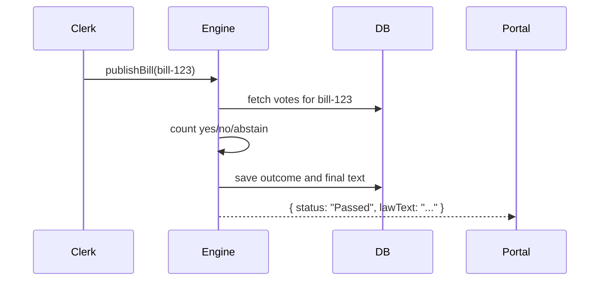

# Chapter 13: Legislative Engine (HMS-CDF)

In [Chapter 12: Agent-to-Agent Framework (HMS-A2A)](12_agent_to_agent_framework__hms_a2a__.md) we saw how AI agents collaborate. Now we’ll build the **Legislative Engine**, a high-speed Rust core that automates the full democratic workflow—drafting bills, committee reviews, voting, and publishing laws in real time.

---

## 13.1 Why “Legislative Engine”? A Real-World Analogy

Imagine a parliament clerk who:

- Receives a **bill draft** and logs its metadata.  
- Assigns it to the **Finance** and **Health** committees.  
- Collects **votes** from each member (yes/ no/ abstain).  
- Tallies results and publishes the final law text.  

Instead of manual paperwork taking months, the **Legislative Engine** does this in seconds—ensuring transparent rules, instant voting, and a full audit trail.

**Use Case**  
Your city council wants to pass a **“No Poverty Act”**:

1. A councilmember **proposes** the draft text.  
2. The engine auto-assigns it to two committees.  
3. Members **cast votes** digitally.  
4. If it passes, the law is **codified** and published.

---

## 13.2 Key Concepts of the Legislative Engine

1. **Bill Draft**  
   - Metadata: `id`, `title`, `sponsor`, `content`.  
   - Tracks versions as edits happen.

2. **Committee**  
   - Groups reviewers by domain (e.g., `Finance`).  
   - Bills can go through multiple committees in sequence.

3. **Vote**  
   - Records each member’s choice: `yes`, `no`, `abstain`.  
   - Enforces one vote per member.

4. **Tally & Outcome**  
   - Automatically counts votes.  
   - Determines if a bill **passes** or **fails**.

5. **Audit Log**  
   - Immutable history of every action for transparency.

---

## 13.3 How to Use the Legislative Engine

Below is a minimal JavaScript example using the engine’s API bindings.

```js
// 1. Import and initialize
import { LegislativeEngine } from 'hms-cdf/legislature';
const engine = new LegislativeEngine({ dbUrl: 'postgres://...' });
await engine.initialize();

// 2. Propose a new bill
const billId = await engine.proposeBill({
  title: 'No Poverty Act',
  sponsor: 'Councilmember Alice',
  content: 'All citizens shall have access to basic income...'
});
// Returns a unique billId, e.g., "bill-123"

// 3. Assign committees
await engine.assignCommittee(billId, ['Finance', 'Health']);
// Committees "Finance" and "Health" will review in order

// 4. Members cast votes
await engine.castVote(billId, 'MemberBob', 'yes');
await engine.castVote(billId, 'MemberCarol', 'no');

// 5. Publish if passed
const outcome = await engine.publishBill(billId);
console.log(outcome.status); // "Passed" or "Failed"
```

Explanation:

- We create and start the engine.  
- `proposeBill()` logs the draft.  
- `assignCommittee()` schedules reviews.  
- Each `castVote()` stores a member’s choice.  
- `publishBill()` tallies votes and, if passed, marks the bill as law.

---

## 13.4 Runtime Walkthrough

What happens when you call `publishBill(billId)`?



1. **Engine** loads all recorded votes.  
2. It **tallies** results.  
3. Saves the final law and status in the database.  
4. Returns the outcome and codified law text to the portal.

---

## 13.5 Under the Hood: Core Implementation

### 13.5.1 High-Level Flow

1. **Initialization**  
   - Connect to the database.  
   - Prepare in-memory indices for fast lookups.

2. **Bill Lifecycle**  
   - `proposeBill()`: validate and persist draft.  
   - `assignCommittee()`: link bill to committees.  
   - `castVote()`: enforce one vote per member, persist choice.  
   - `publishBill()`: run `tally()`, update status, generate immutable law record.

3. **API Exposure**  
   - Exposes REST endpoints (via HMS-API) for each operation.

### 13.5.2 Simplified Rust Core (`src/engine.rs`)

```rust
// File: src/engine.rs
pub struct LegislativeEngine { /* connection pool, caches */ }

impl LegislativeEngine {
    pub fn new(cfg: EngineConfig) -> Self { /* init DB, caches */ }
    pub fn initialize(&self) { /* migrations, indexes */ }

    pub fn propose_bill(&self, draft: BillDraft) -> BillId {
        // 1) Validate title & content
        // 2) Insert into bills table
    }

    pub fn assign_committee(&self, id: BillId, committees: Vec<String>) {
        // Insert rows into bill_committees
    }

    pub fn cast_vote(&self, id: BillId, member: String, vote: Vote) {
        // Ensure no duplicate, then insert vote row
    }

    pub fn publish_bill(&self, id: BillId) -> Outcome {
        // 1) Load and count votes
        // 2) Update bills.status = Passed/Failed
        // 3) Return Outcome with final law text
    }
}
```

Explanation:

- Each method maps to a simple DB operation.  
- The Rust core emphasizes safety, speed, and concurrent handling of many bills at once.

---

## 13.6 Recap & Next Steps

You’ve now learned how the **Legislative Engine**:

- Automates the entire lifecycle of a bill: drafting, committee review, voting, and publishing.  
- Provides a clear API for proposing bills, assigning committees, recording votes, and finalizing laws.  
- Runs on a high-speed Rust core with an audit-ready data model.

Next, we’ll explore how to uncover connections between programs, bills, and policies using the [Chapter 14: Knowledge Graph System (HMS-AGX)](14_knowledge_graph_system__hms_agx__.md). Enjoy building your digital parliament!

---

Generated by [AI Codebase Knowledge Builder](https://github.com/The-Pocket/Tutorial-Codebase-Knowledge)