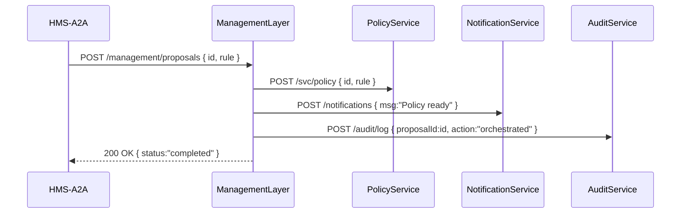

# Chapter 13: Management Layer

In [Chapter 12: Core Infrastructure (HMS-SYS)](12_core_infrastructure__hms_sys__.md) we laid the roads, power grid, and health checks for our platform. Now let’s introduce the **Management Layer**—the city manager’s office of HMS-NFO—coordinating workflows, orchestrating services, and allocating resources so every request flows smoothly.

---

## 1. Why a Management Layer?

Imagine our AI agent (HMS-A2A) suggests a new FOIA backlog optimization. Rather than each service independently handling parts of that proposal, the Management Layer:

1. **Orchestrates** the end-to-end workflow (update policy, notify officers, audit).  
2. **Coordinates** parallel calls to backend services.  
3. **Allocates** compute or rate-limit budgets for each step.  
4. **Ensures** every task follows governance rules before execution.

Without this central office, services would duplicate orchestration logic—leading to tangled code, missed steps, and inconsistent audits.

---

## 2. Key Concepts

1. **Service Orchestration**  
   Sequencing calls to many backend services (e.g., policy, notification, audit).

2. **Workflow Coordination**  
   Tracking progress, retries, and error handling across multiple steps.

3. **Resource Allocation**  
   Distributing rate-limit or compute budgets so no single workflow overloads the system.

4. **Governance Enforcement**  
   Applying policies (from [Chapter 14: Governance Layer](14_governance_layer_.md)) before tasks run.

---

## 3. Solving the FOIA Optimization Use Case

Here’s a minimal example: when a new optimization proposal arrives, the Management Layer updates the policy, sends a notification to officers, and logs the action.

### 3.1. Sequence Diagram



---

### 3.2. Orchestration Route

_File: management-server/src/routes/proposals.js_

```js
const express = require('express');
const orchestrator = require('../handlers/orchestrator');
const router = express.Router();

// Entry point for new proposals
router.post('/management/proposals', orchestrator.handleProposal);

module.exports = router;
```

*Explanation:* We expose a single HTTP endpoint where AI agents or portals POST new proposals.

---

### 3.3. Orchestrator Handler

_File: management-server/src/handlers/orchestrator.js_

```js
const workflow = require('../services/workflow');

async function handleProposal(req, res) {
  await workflow.run(req.body);      // run the multi-step workflow
  res.json({ status: 'completed' }); // simple acknowledgment
}

module.exports = { handleProposal };
```

*Explanation:* Our handler delegates to a `workflow` module that coordinates each step.

---

### 3.4. Workflow Service

_File: management-server/src/services/workflow.js_

```js
const api = require('../../backend/apiClient');

async function run(proposal) {
  // 1. Update policy rules
  await api.post('/svc/policy', proposal, proposal.token);
  // 2. Notify officers
  await api.post('/notifications', { message: `Policy #${proposal.id} live` });
  // 3. Record in audit trail
  await api.post('/audit/log', { proposalId: proposal.id, action: 'orchestrated' });
}

module.exports = { run };
```

*Explanation:* This service sequences calls in order. In a real system you’d add retries, parallelism, and rate checks.

---

## 4. Under the Hood: What Happens Step-by-Step

1. **Receive Proposal:** Management Layer’s Express router gets a new proposal.  
2. **Start Workflow:** Handler calls `workflow.run()`.  
3. **Orchestrate Services:**  
   - **PolicyService** updates backend rules.  
   - **NotificationService** sends out alerts.  
   - **AuditService** writes a permanent log.  
4. **Governance Check:** Before each step, the Governance Layer ([Chapter 14](14_governance_layer_.md)) verifies compliance.  
5. **Resource Control:** A built-in limiter ensures each step respects throughput budgets.  
6. **Acknowledge:** Management Layer replies `200 OK` once all tasks succeed.

By centralizing orchestration here, we keep backend services simple, reusable, and focused solely on their domain logic.

---

## 5. What We’ve Learned

- The **Management Layer** is the “city manager’s office,” coordinating multi-step workflows.  
- It exposes a simple orchestration endpoint, sequences backend calls, and enforces governance hooks.  
- We saw a minimal FOIA optimization example: updating policy, notifying officers, and auditing.  

Up next, we’ll dive deeper into policy rules and controls in the [Governance Layer](14_governance_layer_.md).

---

Generated by [AI Codebase Knowledge Builder](https://github.com/The-Pocket/Tutorial-Codebase-Knowledge)