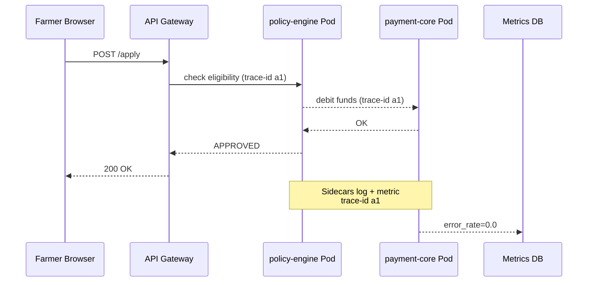

# Chapter 13: Microservice Orchestration & Observability  
*(“Who’s open, who’s busy, who’s down?” — the live air-traffic control of HMS)*  

[← Back to Chapter 12: Backend API Gateway (HMS-API)](12_backend_api_gateway__hms_api__.md)

---

## 1. Why Do We Need Orchestration *and* Observability?

Imagine the Department of Agriculture launches a new **Crop-Insurance Portal** during hurricane season.  
Behind one friendly URL, *dozens* of micro-services spin:

* `policy-engine` – checks a farmer’s acreage.  
* `payment-core` – disburses relief funds.  
* `ai-weather` – predicts storm paths.  

During the first storm surge:

1. **Traffic triples** overnight.  
2. One node in the `ai-weather` cluster **crashes**.  
3. A buried log line hints that `payment-core` is **timing out**.  

Without an autopilot (orchestration) and a cockpit dashboard (observability), engineers would scramble through SSH shells at 2 a.m. and citizens would see “503 Service Unavailable”.

Orchestration & Observability make sure:

* New copies of services **start, scale, and heal** automatically.  
* We see **logs, traces, and metrics** in one place—no mysteries.  

---

## 2. The Five Concepts You Really Need

| Term | Beginner-friendly meaning | 10-second analogy |
|------|---------------------------|-------------------|
| **Cluster** | A group of servers that act like one big computer. | Airport with many runways |
| **Pod** | 1-3 containers that live (and die) together on a cluster node. | Single airplane |
| **Service Mesh** | Sidecar helpers that let pods talk securely and measure traffic. | Control tower radios |
| **Log / Trace / Metric** | Text events, request timelines, and numeric gauges. | Black box, flight path, speedometer |
| **Auto-Scaler** | Robot that adds or removes pods based on load. | Opening extra check-in desks |

---

## 3. Quick Tour: “One Minute From Code to Running Pod”

### 3.1 Dockerfile (10 lines)

```dockerfile
# payment-core/Dockerfile
FROM node:18-alpine
WORKDIR /app
COPY . .
RUN npm ci
CMD ["node","index.js"]
```

This packages `payment-core` into a lightweight container.

### 3.2 Kubernetes Deployment (16 lines)

```yaml
# k8s/payment-core.yaml
apiVersion: apps/v1
kind: Deployment
metadata: { name: payment-core }
spec:
  replicas: 2                 # start two pods
  selector: { matchLabels: { app: pay } }
  template:
    metadata: { labels: { app: pay } }
    spec:
      containers:
      - name: core
        image: gov/payment-core:1.0
        ports: [{ containerPort: 4000 }]
```

Apply it once:

```bash
kubectl apply -f k8s/payment-core.yaml
```

Kubernetes now:

1. Schedules two pods.  
2. Restarts them if they crash.  
3. Can scale to `replicas: 10` with a single edit.

---

## 4. What Is a Service Mesh and Why Should I Care?

A **mesh** (e.g., Istio, Linkerd) silently injects a **sidecar** container into every pod:

* **Encrypts** HTTP calls pod↔pod (mTLS).  
* **Retries** failed requests automatically.  
* **Exports** golden metrics (`p95 latency`, `error_rate`) to Prometheus.

You write *zero* code; the sidecar does the heavy lifting.

---

## 5. Seeing the System: Logs • Traces • Metrics

### 5.1 One-Line Log

```js
console.log("claimId 12345 paid", {amount:5000});
```

The sidecar streams this to a log collector (e.g., Loki).  
You can now search: *“claimId 12345”* across all pods.

### 5.2 Automatic Trace Header (no code!)

When a citizen hits  
`/api/v1/claims/123`, the gateway (Chapter 12) adds header:

```
x-trace-id: a1b2c3
```

Sidecars pass it along, so Jaeger shows a **waterfall** view:

```
Gateway → policy-engine → payment-core
```

### 5.3 Metric Snapshot (Prometheus query)

```
rate(http_requests_total{app="payment-core",status=500}[5m]) = 2/min
```

Meaning: 2 errors per minute in `payment-core` during last 5 min.

---

## 6. End-to-End Walkthrough (No Code, Just Picture)



If `PC` crashes, Kubernetes restarts it and the Auto-Scaler can spin up more copies if `cpu > 80 %`.

---

## 7. A Tiny Auto-Scaler Rule (8 lines)

```yaml
apiVersion: autoscaling/v2
kind: HorizontalPodAutoscaler
metadata: { name: pay-hpa }
spec:
  scaleTargetRef: { apiVersion: apps/v1, kind: Deployment, name: payment-core }
  minReplicas: 2
  maxReplicas: 10
  metrics:
  - type: Resource
    resource: { name: cpu, target: { type: Utilization, averageUtilization: 70 } }
```

Kubernetes now adds pods until CPU falls below 70 %.

---

## 8. How the Pieces Fit With Earlier Chapters

| Earlier Chapter | How It Connects Here |
|-----------------|----------------------|
| [Backend API Gateway (HMS-API)](12_backend_api_gateway__hms_api__.md) | Injects trace IDs and forwards metrics tags. |
| [Access & Authorization Framework](11_access___authorization_framework_.md) | Sidecars ensure mTLS; tokens never leave the mesh unencrypted. |
| [Management Layer](09_management_layer__hms_svc__hms_ach__hms_a2a__.md) | Each micro-service (SVC, ACH, A2A) runs as its own Deployment. |
| [Metrics & Monitoring Dashboard](14_metrics___monitoring_dashboard_.md) | Reads Prometheus & Jaeger to draw graphs and alerts. |

---

## 9. Common Pitfalls & How to Avoid Them

| Uh-oh | Fix |
|-------|-----|
| Pods restart in a loop | Check `kubectl logs <pod>` first; bad env var 90 % of the time. |
| Can’t see traces | Ensure gateway adds `x-trace-id` and mesh sidecar is **injected** (`istio-injection=enabled`). |
| Metrics missing | Sidecar must expose `/metrics`; verify `kubectl port-forward` and curl the endpoint. |
| Over-scaling (100 pods!) | Set **maxReplicas** and add a second metric (e.g., `requests_per_second`). |

---

## 10. Try It Yourself (5-Minute Lab)

```bash
# 1. start local k3d cluster
k3d cluster create hms-demo --servers 1 --agents 2

# 2. deploy payment-core and HPA
kubectl apply -f k8s/payment-core.yaml
kubectl apply -f k8s/pay-hpa.yaml

# 3. tail logs
kubectl logs -l app=pay -f

# 4. generate load
hey -n 1000 -c 20 http://payment-core.local/pay
```

Watch pods scale from 2 → 5, and logs appear in real time.

---

## 11. What You Learned

✔️ Orchestration (Kubernetes + Auto-Scaler) keeps services alive and right-sized.  
✔️ A Service Mesh encrypts traffic, retries failures, and **exports observability data for free**.  
✔️ Logs, traces, and metrics give a 3-D view: *what happened, where it flowed, how many times*.  
✔️ Everything links back to Gateway, Auth, and Management layers.

Next we’ll build the **actual dashboard** that turns those raw metrics into red-yellow-green dials for administrators.

[→ Chapter 14: Metrics & Monitoring Dashboard](14_metrics___monitoring_dashboard_.md)

---

Generated by [AI Codebase Knowledge Builder](https://github.com/The-Pocket/Tutorial-Codebase-Knowledge)