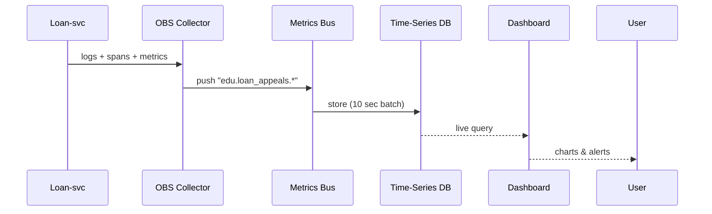

# Chapter 13: Observability & Metrics Pipeline
*A friendly sequel to* [AI Representative Agent (HMS-A2A)](12_ai_representative_agent__hms_a2a__.md)

---

## 1. Why Do We Need a “Real-Time GAO Dashboard”?

Picture the Department of Education on a busy Monday:

* At **9 a.m.** citizens begin appealing rejected student-loan discharges.  
* By **10 a.m.** the appeals endpoint crawls; call-center wait-time jumps to 40 minutes.  
* Congressional staffers phone the CIO asking, “What broke—and how fast can you fix it?”

Without a **single pane of glass** the answers live in 50 places: web logs, micro-service traces, angry tweets, and ticket queues.

**The Observability & Metrics Pipeline (HMS-OBS)** streams every crumb—logs, traces, metrics, and user sentiment—into one live dashboard.  
The AI Agent you met in the last chapter *subscribes* to that feed, spots bottlenecks, and even drafts fixes automatically.

Think of HMS-OBS as **NORAD for software**: radar screens that light up the moment a blip appears in federal cyberspace.

---

## 2. Key Concepts (Plain-English)

| Term | Beginner Explanation |
|------|----------------------|
| **Log** | A diary line: “/appeals POST 500 ms 200 OK”. |
| **Trace** | A breadcrumb trail across services for one request. |
| **Span** | A single hop in that trail (e.g., *Gateway → Loan-svc*). |
| **Metric** | A number over time: *errors/minute*, *P95 latency*. |
| **Collector** | A tiny sidecar that ships logs/traces/metrics to OBS. |
| **Stream** | A named conveyor belt like `payments.success` or `gov.audit`. |
| **Sink** | Where a stream lands: dashboard, alert, or long-term archive. |

---

## 3. A 4-Minute Walk-Through  
### Use-Case: Catching the Loan-Appeal Slowdown

### 3.1 Instrument the Endpoint (Node.js, 12 lines)

```js
// file: svc/appeals.js
import { obs } from '@hms/obs-sdk';

export async function submitAppeal(req, res) {
  const span = obs.startSpan('appeal.submit');
  try {
    // ...business logic...
    res.send({ ok: true });
    obs.metric('appeal.ok').inc();
  } catch (e) {
    obs.metric('appeal.error').inc();
    throw e;
  } finally {
    span.end();              // trace finishes here
  }
}
```

Explanation  
* `startSpan` begins a trace; every micro-service repeats this pattern.  
* `metric(name).inc()` is one line—no Prometheus math needed.

### 3.2 The Collector Sidecar (Kubernetes snippet, 8 lines)

```yaml
- name: obs-collector
  image: ghcr.io/hms/obs-collector:1.3
  env:
    - name: OBS_STREAM
      value: "edu.loan_appeals"
```

Collector auto-scrapes stdout logs, spans, and metrics every **2 seconds** and forwards them.

### 3.3 Watching the Dashboard

Open `https://dash.hms.gov/edu/loan-appeals`.  
Charts you get out-of-the-box:

* Error Rate  
* P95 Latency  
* User Sentiment (👍 / 👎 button embedded in the portal)  
* AI Agent Suggestions (from [Chapter 12](12_ai_representative_agent__hms_a2a__.md))

When error-rate > 3 % for 5 minutes, an alert posts to a **Teams** channel *and* A2A auto-tags the incident.

---

## 4. What Happens Behind the Curtain?



Five actors—easy to remember.

---

## 5. Tiny Peeks at Implementation

### 5.1 Shipping a Metric (Go, 14 lines)

```go
// file: collector/ship.go
func Ship(name string, val int) {
  rec := fmt.Sprintf("%s %d %d\n", name, val, time.Now().Unix())
  http.Post("http://bus:8200/put", "text/plain", bytes.NewBufferString(rec))
}
```

Explanation: one text line (`metric value timestamp`) ships to the Bus.  
The Bus batches 1 000 lines then forwards to the DB.

### 5.2 Simple Alert Rule (YAML, 9 lines)

```yaml
# file: alerts/loan_appeal.yaml
stream: edu.loan_appeals.appeal.error
condition: rate_5m > 0.03
action:
  - notify: teams://Loan-Alerts
  - notify: a2a://create_incident
```

OBS evaluates rules every **30 seconds**.

---

## 6. How HMS-OBS Talks to Other Layers

| Layer | Example Feed |
|-------|--------------|
| [Backend API Gateway](07_backend_api_gateway_.md) | Emits `gateway.latency` and `429_count`. |
| [Microservices Mesh](10_microservices_mesh__hms_sys__.md) | Sidecars send per-span traces. |
| [Governance Layer](03_governance_layer__hms_gov__.md) | Enforcer logs flow into `gov.audit` stream. |
| [Data Privacy & Compliance](09_data_privacy___compliance_layer_.md) | Scrubber removes PII from log lines. |
| [AI Representative Agent](12_ai_representative_agent__hms_a2a__.md) | Subscribes to OBS to detect bottlenecks and propose fixes. |

---

## 7. Quick-Start Checklist

1. `npm install @hms/obs-sdk` (or `pip install hms-obs`).  
2. Wrap endpoints with `startSpan` and `metric().inc()`.  
3. Add the **obs-collector** sidecar to your pod.  
4. Verify your stream shows up at `dash.hms.gov/<agency>/<service>`.  
5. (Optional) Add alert YAMLs under `alerts/`.

You’re now live on NORAD-style radar!

---

## 8. Beginner FAQ

**Q: Do I need to pick a time-series DB?**  
No. HMS-OBS bundles an optimized store; you only send data.

**Q: How long are logs kept?**  
Default 90 days; critical streams (`gov.audit`) keep 7 years (see Governance policy).

**Q: Can I export to Splunk or Datadog?**  
Yes—define a **sink**:

```yaml
sink:
  type: splunk
  url: https://splunk.gsa.gov:8088
```

**Q: Does OBS slow down my app?**  
Collectors batch & gzip; overhead is ~1 ms per request.

---

## 9. Summary & What’s Next

In this chapter you:

• Turned scattered logs, traces, metrics, and sentiment into one live dashboard.  
• Added three lines of instrumentation code and a sidecar—done!  
• Saw under-the-hood batching, storage, and alert rules.  
• Learned how A2A and other layers consume OBS streams.

Next, learn how humans join the loop when AI or alerts need a real person.  
Continue to [Human-in-the-Loop (HITL) Workflow](14_human_in_the_loop__hitl__workflow_.md).

---

Generated by [AI Codebase Knowledge Builder](https://github.com/The-Pocket/Tutorial-Codebase-Knowledge)