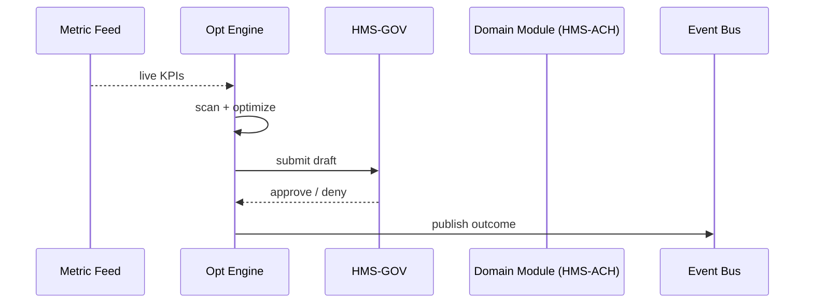

# Chapter 13: Process Optimization Engine  
*(File: `13_process_optimization_engine_.md`)*  

[← Back to Chapter&nbsp;12: Policy & Process Registry](12_policy___process_registry_.md)

---

## 1. Why Do We Need an Optimization Engine?

### Use-Case — “Turbo-Charging Building Permits”

Right now the **County Planning Office** takes **21 days** (median) to approve a residential building permit.  
Citizens complain, contractors idle, and the County loses property-tax income.

The **Process Optimization Engine (POE)** is the county’s **digital Lean-Six-Sigma consultant**:

1. Ingests live metrics (21-day median), user complaints (“I never got a status email”), and historical outcomes.  
2. Spots the biggest bottleneck (the “Zoning Review” step sits untouched for 9 days).  
3. Proposes a machine-generated **workflow revision**:  
   • Auto-assign zoning cases based on parcel size instead of alphabetical queue.  
4. Sends this proposal to [Governance Layer](01_governance_layer__hms_gov__.md).  
5. If approved, the new rule goes live; approvals drop from **21 days to 6 days**.

No phone calls, no sticky notes—just data → insight → faster service.

---

## 2. Key Concepts (Plain-English Cheat-Sheet)

| Concept | Beginner Analogy | One-Line Description |
|---------|------------------|----------------------|
| Metric Feed | Fitness tracker | Stream of numbers (avg wait time, error %). |
| Bottleneck Scanner | Traffic camera | Finds steps where items **pile up**. |
| Optimizer | Coach | Suggests a re-order, split, or auto decision. |
| Draft Policy | Rough sketch | JSON proposal the Engine writes. |
| Feedback Loop | Report card | Compares “before vs after” to learn if change helped. |

Memorize these five and you “speak POE”.

---

## 3. Using the Engine in 15 Lines

```python
from poe import analyze_process, draft_policy

# 1) Feed last 30 days of metrics ----------------------
metrics = {
    "zoning_queue_days": 9.2,
    "fire_safety_days": 4.1,
    "total_permit_days": 21.0
}

# 2) Let the engine pick the worst step ---------------
bottle = analyze_process(metrics)          # => "zoning_queue_days"

# 3) Ask it to draft a fix ----------------------------
proposal = draft_policy(bottle, target=3)  # 3 days goal
print(proposal)
```

Expected console (truncated):

```json
{
  "module": "HMS-ACH",
  "description": "Auto-assign zoning cases by parcel size",
  "impact": ["timeline", "fairness"],
  "author": "poe_v1"
}
```

You can now send `proposal` to [Governance Layer](01_governance_layer__hms_gov__.md) the same way agents and humans do.

---

## 4. What Happens Under the Hood? (Non-Code Walk-Through)



Exactly **five participants**—easy to picture.

---

## 5. Internal Implementation (Gentle Dive)

### 5.1 File Layout

```
poe/
 ├─ core.py          # public analyze_process + draft_policy
 ├─ learner.py       # simple regression to predict gains
 └─ mem_store.py     # keeps last 90 days of metrics
```

### 5.2 core.py (≤ 20 lines)

```python
import learner, mem_store

def analyze_process(metrics):
    mem_store.save(metrics)
    # pick the metric with the **highest delay**
    return max(metrics, key=metrics.get)

def draft_policy(bottleneck, target):
    gain = learner.estimate_gain(bottleneck, target)
    return {
        "module": "HMS-ACH",
        "description": f"Speed up {bottleneck} to {target} days",
        "impact": ["timeline"],
        "predicted_days_saved": gain,
        "author": "poe_v1"
    }
```

**Explanation**

* `analyze_process` is one line of math: choose the biggest delay.  
* `draft_policy` calls a mini ML helper to predict benefit, then fills a JSON dict.

### 5.3 learner.py (10 lines)

```python
_hist = {}   # bottleneck -> [past delays]

def estimate_gain(metric, target):
    prev = _hist.get(metric, [])[ -30: ]      # last 30 points
    if not prev: return 0
    baseline = sum(prev)/len(prev)
    _hist.setdefault(metric, []).append(target)
    return max(0, baseline - target)          # days saved
```

*Stores a rolling window; computes “days saved” if goal met.*

### 5.4 mem_store.py (8 lines)

```python
_buf = []
def save(m): _buf.append(m)
def last(days=30):
    return _buf[-days:]
```

*A teaching stub—production would use a time-series DB.*

---

## 6. The Feedback Loop

Once Governance approves and the change rolls out, the Engine keeps watching:

```python
from poe import analyze_process
if analyze_process(latest_metrics) == "none":
    print("🎉 Target met; no new action")
```

If KPIs improve, the Engine **raises its confidence score** (similar to the A2A Agent’s promotion in [AI Representative Agent](05_ai_representative_agent__a2a_node__.md)).  
If things get worse, it **lowers** it, making future proposals more conservative.

---

## 7. Integration with Other Layers

| Layer | Interaction |
|-------|-------------|
| [Event Bus & Real-Time Monitoring](11_event_bus___real_time_monitoring_.md) | Provides metric streams; receives `poe.proposal.*` events. |
| [Policy & Process Registry](12_policy___process_registry_.md) | Engine fetches past versions to avoid repeating failed tweaks. |
| [Governance Layer](01_governance_layer__hms_gov__.md) | Approves or rejects the generated policy JSON. |
| [Human-in-the-Loop Oversight](06_human_in_the_loop_oversight__hitl__.md) | High-risk proposals are queued for a human veto or tweak. |
| [Compliance & Audit Ledger](14_compliance___audit_ledger_.md) | Stores every metric snapshot & proposal hash for auditors. |

---

## 8. Beginner FAQ

**Q: Is this full-blown AI or just stats?**  
A: Starts simple (pick the biggest delay). You can swap in fancy ML inside `learner.py` later—API stays the same.

**Q: Can I force the Engine to ignore certain steps?**  
A: Yes—pass `skip=["legal_review"]` into `analyze_process`; the scanner skips them.

**Q: What if two bottlenecks tie?**  
A: `max()` returns the first; a tie-breaking rule will be added in v2.

---

## 9. Quick Checklist

☑ Feed metrics → get biggest bottleneck.  
☑ One JSON proposal generated with `draft_policy`.  
☑ Governance + HITL keep it safe.  
☑ Feedback loop learns from “before vs after.”  
☑ Code fits in three tiny files—easy to hack.

---

## 10. Conclusion & Next Steps

You now own a **digital process-improvement workshop** that never sleeps, constantly trimming days (or dollars) from government services.

Up next we’ll learn how **every draft, approval, and metric** is frozen in an immutable ledger for auditors and journalists alike:  
[Compliance & Audit Ledger](14_compliance___audit_ledger_.md)

---

---

Generated by [AI Codebase Knowledge Builder](https://github.com/The-Pocket/Tutorial-Codebase-Knowledge)