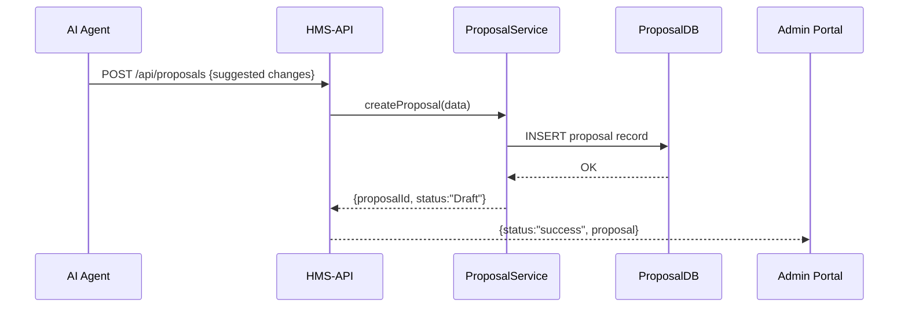

# Chapter 13: Process Proposal

In [Chapter 12: AI Representative Agent](12_ai_representative_agent_.md), we saw how our AI agent analyzes logs and feedback to generate suggestions. In this chapter, we’ll learn how those suggestions become a formal **Process Proposal**—a structured recommendation (like a white paper to Congress) that outlines changes, expected outcomes, and next steps.

---

## 1. Motivation & Central Use Case

Imagine the **Department of Motor Vehicles** is struggling with long wait times in driver-licensing offices. Our AI Representative Agent has discovered that most delays happen during document validation. Now we need a formal document to:

1. Summarize the issue (“Document checks add 30 seconds per applicant”).  
2. Propose a change (“Allow pre-upload of photos and forms online”).  
3. Outline benefits (“Reduce in-office time by 40%”).  
4. Assign owners and deadlines.

That’s a **Process Proposal**. It bundles analysis into a clear plan that managers and legislators can review, approve, and implement.

---

## 2. Key Concepts

1. **Proposal ID**  
   A unique code (e.g., `PP-2024-007`) to track each proposal.

2. **Title & Description**  
   A human-friendly name and a summary of the change.

3. **Actions**  
   An array of `{ step, owner, deadline }` items describing what to do.

4. **Expected Outcomes**  
   Metrics or targets (e.g., `20% faster service`, `15% cost savings`).

5. **Status & Lifecycle**  
   - **Draft**: being written  
   - **Submitted**: sent for review  
   - **Approved**: green-lit for implementation  
   - **Implemented**: changes live

---

## 3. Creating a Process Proposal

### 3.1 Request Example

The Admin Portal calls HMS-API to save a new proposal:

```
POST /api/proposals
Content-Type: application/json

{
  "id": "PP-2024-007",
  "title": "Online Document Pre-Upload",
  "description": "Enable applicants to upload photos and forms before visiting the office.",
  "actions": [
    { "step": "Build upload UI", "owner": "IT Team", "deadline": "2024-07-01" },
    { "step": "Integrate with DB",   "owner": "Backend Team", "deadline": "2024-07-15" }
  ],
  "expectedOutcomes": ["40% reduction in office wait time"]
}
```

### 3.2 Response Example

```json
{
  "status": "success",
  "proposal": {
    "id": "PP-2024-007",
    "status": "Draft"
  }
}
```

After saving, the proposal appears in the Admin Portal’s “AI Proposals” queue for review.

---

## 4. Under the Hood: Process Flow



1. **AI Agent** sends suggestions to HMS-API.  
2. **HMS-API** forwards them to **ProposalService**.  
3. The service saves to the **ProposalDB**.  
4. The Admin Portal sees the new Draft proposal.

---

## 5. Internal Implementation

Below is a minimal in-memory implementation. In production, you’d swap the repository for a real database.

### 5.1 ProcessProposal Entity  
File: `domain/entities/process_proposal.py`

```python
class ProcessProposal:
    def __init__(self, id, title, description, actions, expected_outcomes):
        self.id = id
        self.title = title
        self.description = description
        self.actions = actions            # list of steps
        self.expected_outcomes = expected_outcomes  # list of metrics
        self.status = 'Draft'             # initial status
```

> This class models the fields and default status for a proposal.

### 5.2 Repository  
File: `domain/repositories/process_proposal_repo.py`

```python
class ProposalRepository:
    def __init__(self):
        self._store = {}  # in-memory map

    def save(self, proposal):
        self._store[proposal.id] = proposal

    def get(self, proposal_id):
        return self._store.get(proposal_id)
```

> A simple save/get by ID. In real usage, replace with a database client.

### 5.3 Service  
File: `domain/services/process_proposal_service.py`

```python
from entities.process_proposal import ProcessProposal
from repositories.process_proposal_repo import ProposalRepository

class ProposalService:
    def __init__(self):
        self.repo = ProposalRepository()

    def create_proposal(self, data):
        p = ProcessProposal(
            id=data['id'],
            title=data['title'],
            description=data['description'],
            actions=data['actions'],
            expected_outcomes=data['expectedOutcomes']
        )
        self.repo.save(p)
        return p
```

> The service constructs an entity and persists it via the repository.

### 5.4 API Route  
File: `hms-api/routes/proposals.js`

```javascript
import express from 'express'
import ProposalService from '../domain/services/process_proposal_service.js'
const svc = new ProposalService()
const router = express.Router()

router.post('/', (req, res) => {
  const proposal = svc.create_proposal(req.body)
  res.json({ status:'success', proposal:{ id:proposal.id, status:proposal.status } })
})

export default router
```

> This route accepts JSON, calls the service, and returns the new proposal’s status.

---

## Conclusion

You’ve learned how **Process Proposals** turn AI suggestions into formal, trackable documents—complete with actions, owners, deadlines, and expected outcomes. Like submitting a white paper to Congress, these proposals provide a clear path from analysis to implementation.

Next up, we’ll look at how humans review these proposals in [Chapter 14: Human-in-the-Loop (HITL) Review](14_human_in_the_loop__hitl__review_.md).

---

Generated by [AI Codebase Knowledge Builder](https://github.com/The-Pocket/Tutorial-Codebase-Knowledge)