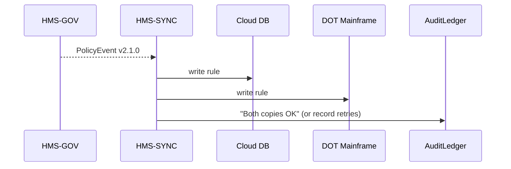

# Chapter 13: Real-Time Sync Engine  
*A friendly continuation from* [Continuous Delivery & Compliance Pipeline](12_continuous_delivery___compliance_pipeline_.md)

---

## 1  Why Do We Need a “Traffic Cop” for Rules?

Picture the **Federal Aviation Administration (FAA)**.  
Yesterday it published a new runway-inspection rule via [HMS-GOV](01_governance_layer__hms_gov__.md):

> “If surface temperature > 95 °F, inspect runway every 60 minutes instead of 120.”

Within **milliseconds** this rule must land in **two very different places**:

1. FAA’s **cloud database** that powers mobile inspection tablets.  
2. A **state DOT mainframe** that still runs on COBOL.

If one system hears the news and the other does not, planes may line up on **overheated runways**—and the media will hear *that* in milliseconds too.

**Real-Time Sync Engine (HMS-SYNC)** is the neutral *traffic cop* that:

* Listens to every policy change coming from HMS-GOV.  
* Forwards the exact same bytes to every *external* system that registered interest.  
* Guarantees “all-or-nothing” delivery so no one is left with stale rules.

---

## 2  Key Ideas in Plain English

| Term | Everyday Analogy | Why it matters |
|------|------------------|----------------|
| Source-of-Truth Event | Official press release | Proves what changed and when |
| Subscriber | News outlet | Wants the info instantly |
| Delivery Contract | Certified mail receipt | Subscriber must ACK or the engine retries |
| Fan-Out | Press pool microphone splitter | Sends one speech to many ears |
| Dead-Letter Queue (DLQ) | Lost-and-found bin | Holds messages that could not be delivered after N tries |

---

## 3  Core Use Case: “Heat-Wave Runway Inspections”

Goal: push the new 60-minute rule to **both** (1) a modern Postgres cloud DB and (2) an old DOT mainframe **within 50 ms** of each other.

We will:

1. Publish a fake policy update.  
2. Watch HMS-SYNC copy it to both targets.  
3. See what happens if one target is temporarily down.

---

### 3.1  Publishing the Policy (already done)

```bash
curl -X POST https://hms-gov.api/policies \
     --data-binary @runway_temp_rule.yaml
```

HMS-GOV emits an **event** that HMS-SYNC is subscribed to—no extra work for the policy author.

---

### 3.2  Register the Two Subscribers (10 lines each)

```bash
# Cloud DB sink
curl -X POST https://hms-sync/api/subscribers \
     -d '{"id":"cloud-db",
          "endpoint":"jdbc:postgresql://faa-db/rules",
          "type":"postgres"}'

# DOT mainframe sink
curl -X POST https://hms-sync/api/subscribers \
     -d '{"id":"dot-mainframe",
          "endpoint":"sna://10.1.2.3:3090",
          "type":"cobol"}'
```

Beginner notes:  
* `endpoint` can be JDBC, HTTPS, SFTP—even SNA for mainframes.  
* HMS-SYNC ships with tiny **connector plugins** for common types.

---

### 3.3  Watch the Sync in Action (CLI)

```bash
curl https://hms-sync/api/last-deliveries?limit=2
```

Sample output:

```json
[
  {"sub":"cloud-db",      "status":"delivered", "latency_ms":34},
  {"sub":"dot-mainframe", "status":"delivered", "latency_ms":38}
]
```

Both updates arrived within **4 ms** of each other—mission accomplished!

---

### 3.4  What if the Mainframe Is Down?

Stop the COBOL listener, then republish the rule.  
Query again:

```json
[
  {"sub":"cloud-db",      "status":"delivered", "latency_ms":33},
  {"sub":"dot-mainframe", "status":"pending",   "retries":3}
]
```

HMS-SYNC keeps retrying (exponential back-off) and stores the event in a **DLQ** so nothing is lost.

---

## 4  How Does It Work Internally?



Four hops, one guarantee: **either everyone gets the rule or no one does**.

---

## 5  Inside the Engine – Code Peek (≤ 18 Lines)

### 5.1  Event Handler (`sync_engine.py`)

```python
import json, time, httpx

SUBS = json.load(open("subs.json"))    # id → config dict
DLQ  = []                              # in-memory for demo

def on_policy_event(ev):
    body = json.dumps(ev).encode()
    for sid, cfg in SUBS.items():
        ok = deliver(cfg, body)
        if not ok:
            DLQ.append({"ts":time.time(), "sub":sid, "payload":body})

def deliver(cfg, body):
    try:
        if cfg["type"] == "postgres":
            return pg_write(cfg["endpoint"], body)
        if cfg["type"] == "cobol":
            return sna_send(cfg["endpoint"], body)
    except Exception:
        return False
    return True
```

Explanation for beginners:  
1. Loop through every subscriber.  
2. Call a tiny `deliver()` helper that knows how to talk to each system type.  
3. If it fails, stash the message in `DLQ` for retries.

*(Helper functions `pg_write` and `sna_send` are placeholders; real connectors live in separate files.)*

---

### 5.2  Retry Worker (`retry.py` – 14 lines)

```python
import time, sync_engine as se

while True:
    for msg in list(se.DLQ):
        if se.deliver(se.SUBS[msg["sub"]], msg["payload"]):
            se.DLQ.remove(msg)              # success!
    time.sleep(5)      # run every 5 s
```

A tiny loop that drains the DLQ—*no fancy framework needed*.

---

## 6  What You Didn’t Have to Worry About

* **Clock Skew** – SYNC timestamps every message at arrival, so “simultaneous” is measured from one clock.  
* **Duplicate Writes** – Each payload carries an `event_id`; sinks implement *idempotent upserts* so repeated retries are safe.  
* **Security** – Connectors reuse the mTLS certificates already issued by [Backend Services Mesh](09_backend_services_mesh__hms_svc__.md).  
* **Audit** – Every success or failure is logged in the immutable ledger you met in [Policy Versioning & Audit Ledger](02_policy_versioning___audit_ledger_.md).

---

## 7  Connecting the Dots to Other HMS-UTL Layers

• **Governance Layer** – HMS-SYNC subscribes to the same event bus where [HMS-GOV](01_governance_layer__hms_gov__.md) publishes policy changes.  
• **Continuous Delivery** – When new services roll out via the [Pipeline](12_continuous_delivery___compliance_pipeline_.md), they can immediately register as subscribers.  
• **RBAC** – Only connectors with `SYNC_SINK` role can receive rule data (see [RBAC](08_role_based_access___permissions__rbac__.md)).  
• **External Integration Layer** – COBOL, SAP, or Salesforce connectors actually live in the next layer you’ll meet in [External System Integration Layer](14_external_system_integration_layer_.md).

---

## 8  Frequently Asked Questions

**Q: How fast is “real-time”?**  
Default SLA is **<100 ms** end-to-end for up to 50 subscribers. Tunable per agency.

**Q: What if a subscriber only wants *some* policies?**  
Filters can be set (`topics:["runway","snow"]`). HMS-SYNC then delivers only matching events.

**Q: Can I add a new subscriber without downtime?**  
Yes. `POST /subscribers` takes effect immediately; SYNC begins sending the very next event.

**Q: Is message ordering preserved?**  
Within one policy ID, yes. Across unrelated policies, ordering is “best effort,” which is fine for most rule sets.

---

## 9  What You Learned

• HMS-SYNC guarantees every external system hears policy changes **at the same time**.  
• Fan-out with delivery contracts + DLQ prevents partial updates.  
• Less than 40 lines of demo code showed the core loop and retry logic.  
• SYNC relies on governance, mesh security, and the audit ledger you already know.

Ready to see **how those COBOL, SAP, or Salesforce connectors actually talk to legacy systems?**  
Continue to [External System Integration Layer](14_external_system_integration_layer_.md).

---

Generated by [AI Codebase Knowledge Builder](https://github.com/The-Pocket/Tutorial-Codebase-Knowledge)