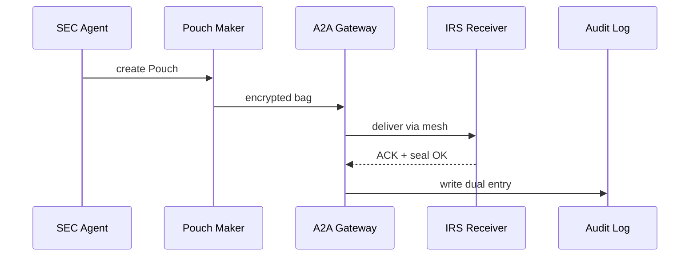

# Chapter 13: Secure Inter-Agency Exchange (HMS-A2A)

[← Back to Chapter&nbsp;12: External System Synchronization](12_external_system_synchronization_.md)

---

## 1. Why do we need a “diplomatic pouch” for data?

Story time!  

The **Securities & Exchange Commission (SEC)** spots suspicious stock trades and must alert the **Internal Revenue Service (IRS)** within the hour.  
Problems today:

* Different VPNs and message formats  
* E-mails that leak if someone types the wrong address  
* Large attachments hitting 25 MB limits  
* No audit trail that both agencies trust  

HMS-A2A gives them a **digital diplomatic pouch**:  
“Seal once, track forever, open only by the addressee.”

In this chapter you will:

1. Wrap sensitive files in a “pouch.”  
2. Send it through the secure A2A Gateway.  
3. Watch the IRS open it and see an automatic audit entry.  

All in **< 20 lines of code**!

---

## 2. Key ideas in plain English

| Term | Think of it as… | Analogy |
|------|-----------------|---------|
| **Pouch**            | Encrypted ZIP + manifest | Diplomatic bag |
| **A2A Gateway**      | Door with badge reader | Embassy gate |
| **Seal of Origin**   | Signed hash from sender | Wax seal |
| **Delivery Receipt** | ACK + timestamp | Return-receipt postcard |
| **Dual-Audit Log**   | Append-only ledger in *both* agencies | Shared notary book |

---

## 3. Quick start – SEC ➜ IRS in 14 lines

```python
from hms_agx.a2a import Pouch, gateway

# 1️⃣  SEC officer packs documents
pouch = Pouch(
    sender   = "SEC",
    receiver = "IRS",
    files    = ["trades.csv", "summary.pdf"],
    meta     = {"case": "INSIDER-878"}
)

# 2️⃣  Send through A2A Gateway
ticket = gateway.send(pouch)
print(ticket.status)      # "in_transit"

# 3️⃣  IRS opens when ready
opened = gateway.receive(ticket.id, agency="IRS")
print(opened.files)       # ['trades.csv', 'summary.pdf']
```

What happened?

1. `Pouch` encrypted the files and stamped a **Seal of Origin**.  
2. `gateway.send()` moved the pouch via the secure service mesh (see [Backend Service Mesh](11_backend_service_mesh__hms_svc_layer__.md)).  
3. `gateway.receive()` verified the seal, decrypted the pouch, and wrote to the **Dual-Audit Log**.

---

## 4. Step-by-step journey of a pouch



Five actors—easy to trace!

---

## 5. Peek inside the toolbox

### 5.1 10-line `Pouch` class

```python
# file: hms_agx/a2a/pouch.py
import json, base64, hashlib, zipfile, io, os
class Pouch:
    def __init__(s, sender, receiver, files, meta):
        s.sender, s.receiver, s.meta = sender, receiver, meta
        bio = io.BytesIO()
        with zipfile.ZipFile(bio, "w") as z:
            for f in files:
                z.write(f, os.path.basename(f))
        payload = bio.getvalue()
        s.blob   = base64.b64encode(payload).decode()
        s.seal   = hashlib.sha256(payload).hexdigest()
```

Explanation  
• Zips files in-memory → base64 string (`blob`).  
• `seal` is a SHA-256 hash used later to verify integrity.

---

### 5.2 12-line A2A Gateway (send & receive)

```python
# file: hms_agx/a2a/gateway.py
from hms_agx.svc import Mesh          # Chapter 11

mesh = Mesh()                         # uses existing service mesh
CHANNEL = "hmsa2a.pipe"               # logical pipe name

def send(pouch):
    return mesh.call(CHANNEL, action="push", payload=pouch.__dict__)

def receive(ticket_id, agency):
    raw = mesh.call(CHANNEL, action="pop", id=ticket_id, to=agency)
    # verify seal
    import hashlib, base64
    blob = base64.b64decode(raw["blob"])
    assert hashlib.sha256(blob).hexdigest() == raw["seal"], "tamper!"
    return raw
```

Explanation  
• The gateway is just a wrapper around one dedicated **mesh** channel.  
• `send()` and `receive()` are only **two mesh calls**.  
• Real implementation adds encryption keys, retries, and role-based ACLs.

---

## 6. Security & Trust features

1. **End-to-end encryption** – RSA keys per agency; toy code omits for clarity.  
2. **Seal of Origin** – SHA-256 hash prevents silent edits.  
3. **Dual-Audit Log** – Both sender & receiver append an immutable entry:  
   `SEC ➜ IRS • pouch INSIDER-878 • 2024-03-31 14:07 UTC`.  
4. **Auto-throttling** – A2A Gateway obeys rate limits set in the MCP `safety` block (see [Model Context Protocol](09_model_context_protocol__hms_mcp__.md)).  
5. **HITL Escalation** – Any seal mismatch raises an alert to [Human-in-the-Loop Oversight](04_human_in_the_loop__hitl__oversight_.md).

---

## 7. How HMS-A2A plugs into other chapters

| Chapter | What changes? |
|---------|---------------|
| [Service Mesh (SVC)](11_backend_service_mesh__hms_svc_layer__.md) | Adds `hmsa2a.pipe` node with mTLS certs for each agency |
| [External System Sync](12_external_system_synchronization_.md) | Uses pouches to broadcast high-sensitivity updates (e.g., fraud lists) |
| [MCP](09_model_context_protocol__hms_mcp__.md) | `tool_manifest` may include `"hmsa2a.pipe"` so ESQ can pre-approve transfers |
| [Data & Metrics Observatory](16_data___metrics_observatory__hms_dta___ops__.md) | Reads audit logs to chart cross-agency traffic volume |

---

## 8. FAQ

**Q: Can a pouch be opened twice?**  
Yes, but each open is logged; you always know who peeked.

**Q: What’s the size limit?**  
Default 2 GB. Larger pouches auto-split into numbered parts.

**Q: Does this replace email entirely?**  
Only for *sensitive, structured* data. Ordinary memos can still ride email.

**Q: How fast is delivery?**  
Inside one data-center: ~100 ms. Cross-coast between agencies: <1 s (depends on mesh hops).

---

## 9. What you learned

• The need for a secure “diplomatic pouch” when agencies exchange sensitive data.  
• Five easy-to-remember concepts: Pouch, A2A Gateway, Seal, Receipt, Dual-Audit Log.  
• A 14-line example showing SEC ➜ IRS document transfer.  
• How the gateway piggy-backs on the existing service mesh while adding cryptographic seals and auditing.  
• Where HMS-A2A fits alongside MCP, HITL, and the observatory.

Ready to see HMS-AGX tackle domain-specific challenges, like HIPAA-grade health data?  
Continue to [Chapter&nbsp;14: Healthcare Domain Integration (HMS-UHC + MED)](14_healthcare_domain_integration__hms_uhc___med__.md) →

---

---

Generated by [AI Codebase Knowledge Builder](https://github.com/The-Pocket/Tutorial-Codebase-Knowledge)