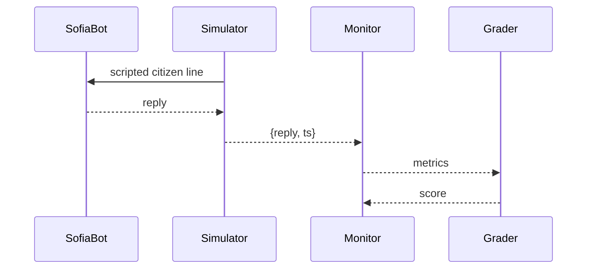

# Chapter 13: Simulation & Training Suite (HMS-ESR + HMS-EDU)

[← Back to Chapter&nbsp;12: Microservices Infrastructure (HMS-SYS & Friends)](12_microservices_infrastructure__hms_sys___friends__.md)

---

## 1. Why Do We Need a Flight-Simulator for Government Bots?

Picture **Sofia**, a brand-new “Driver-License Renewal Bot” built by a state DMV.  
Before she is allowed to talk to real citizens she must prove she can:

1. Handle a polite caller.  
2. Survive an *angry* caller who lost paperwork.  
3. Quote the *correct* fee even if the payment API is down.  

If we test Sofia on production traffic, we risk real mistakes and bad press.

**Simulation & Training Suite** is the *flight-school* where every AI clerk practices on **synthetic but realistic dossiers** while instructors watch, grade, and issue a pass card.

* HMS-ESR (Emulated Service Requests) = the flight simulator.  
* HMS-EDU (Education Layer) = the classroom, stopwatch, and report card.

---

## 2. Key Concepts (Pilot-School Analogies)

| Suite Piece | Flying School Analogy | What It Means |
|-------------|----------------------|---------------|
| Scenario    | Flight route         | A scripted situation (e.g., “angry caller + outage”). |
| Dossier     | Practice checklist   | Fake but realistic citizen data set. |
| Simulator (ESR) | Flight simulator box | Runs the conversation & injects edge cases. |
| Monitor (EDU)   | Instructor seat   | Watches every step and records metrics. |
| Grader     | Pass/Fail buzzer      | Turns metrics into a numeric score. |
| Leaderboard | Pilot score board    | Shows best bots & where they need work. |

Remember: **Scenario + Dossier** go **into the Simulator**, the **Monitor** collects data, the **Grader** issues a score, and the **Leaderboard** shows progress.

---

## 3. 3-Minute Hands-On Tour – “Renewal Bot Bootcamp”

We will:

1. Create a training dossier.  
2. Define a scenario with a tricky outage.  
3. Run Sofia the bot through the simulator.  
4. View the score on the leaderboard.

### 3.1  Create a Dossier (≤ 12 lines)

```js
// dossiers/alice.json
{
  "name"     : "Alice Johnson",
  "licenseId": "AJ-987-654",
  "address"  : "42 Liberty Ave, Anytown, VA",
  "visionOK" : false          // will force vision form
}
```

**Explanation** – Totally fake but shaped exactly like real DMV records.

---

### 3.2  Register a Scenario (≤ 18 lines)

```js
// scenarios/outage.js
import { defineScenario } from 'hms-esr';

defineScenario('renewal-with-payment-down', {
  dossier : 'alice.json',
  steps   : [
    { user:'I need to renew my license.' },
    { sysOutage:'payment-api', duration:30 }, // 30 s outage
    { user:'Why is payment failing?!' },
    { expectBot:'offer alt payment within 10s' }
  ],
  success : ctx => ctx.metrics.altPaymentOffered && ctx.time < 45
});
```

**Explanation** – A human-readable script: chats, a forced outage, and a `success` rule.

---

### 3.3  Launch the Simulation (≤ 16 lines)

```js
// train.js
import { runSim } from 'hms-esr';
import { leaderboard } from 'hms-edu';

const score = await runSim({
  bot       : 'sofia-dmv-bot',
  scenario  : 'renewal-with-payment-down'
});

console.log('Score:', score);           // e.g., 92/100
console.table(await leaderboard());
```

**Explanation** – `runSim` boots the simulator, replays the scenario, and returns a numeric score. The leaderboard shows every bot’s latest grade.

---

### 3.4  What Sofia Sees (≤ 12 lines)

```text
Citizen  : I need to renew my license.
SofiaBot : Sure! Let’s start. Have you passed vision?
Citizen  : Yes, but payment keeps failing!
SofiaBot : Our card line is down. You can pay at kiosk #12 or by check.
```

She offered an alternate payment within 10 seconds → success flag true.

---

## 4. What Happens Behind the Curtain?

### 4.1 Step-by-Step (Plain English)

1. `runSim()` loads **Scenario** & **Dossier**.  
2. **Simulator (ESR)** plays citizen lines into Sofia’s inbox and flips the *payment-api* switch off.  
3. Sofia’s replies flow back to the **Monitor (EDU)**.  
4. Monitor timestamps every reply, checks them against `expectBot` rules, and gathers metrics (latency, accuracy, empathy).  
5. **Grader** converts metrics to a 0-100 score.  
6. Score is stored in the **Leaderboard** collection inside [HMS-DTA](06_central_data_repository__hms_dta__.md).  
7. If score ≥ 90 the bot earns a “Ready for Production” badge; else it repeats training.

### 4.2 Mini Sequence Diagram (≤ 5 nodes)



---

## 5. A Quick Peek at the Engines

### 5.1  Simulator Core Loop (≤ 15 lines)

```js
// hms-esr/core.js
export async function runSim({ bot, scenario }){
  const script = load(scenario);
  const chan   = attachBot(bot);       // WebSocket or queue

  for (const step of script.steps){
    if (step.sysOutage) toggle(step.sysOutage, false);
    if (step.user) await chan.send(step.user);

    const reply = await chan.recv(10_000);   // 10s timeout
    monitor(step, reply);                    // collects metrics
  }
  const score = grade(script.success);
  return score;
}
```

**Explanation** – Under 15 lines: send lines, flip outage flags, collect replies, grade.

---

### 5.2  Simple Grader (≤ 10 lines)

```js
// hms-edu/grade.js
export function grade(passFn){
  const m = metrics();           // latency, empathy, etc.
  let score = 100;
  if (!passFn({metrics:m, time:m.total})) score -= 30;
  score -= m.latencyMs / 100;    // 1 pt per 100 ms
  return Math.max(0, Math.round(score));
}
```

**Explanation** – Naïve but readable: subtract points for failures & slowness.

---

## 6. How the Suite Connects to Earlier Layers

| Need | Where It Comes From |
|------|--------------------|
| Bot code & auth | [Core Agent Framework (HMS-AGT)](05_core_agent_framework__hms_agt__.md) |
| Synthetic data storage | [Central Data Repository (HMS-DTA)](06_central_data_repository__hms_dta__.md) |
| Security checks | [Security & Compliance Engine](10_security___compliance_engine__hms_esq___hms_ops__.md) runs during simulation too. |
| Rollout after a pass | Next chapter’s [Policy Deployment Pipeline](14_policy_deployment_pipeline__backend_api___hms_svc__.md) moves the bot to prod. |

---

## 7. Frequently Asked Questions

1. **Can I record *real* calls and replay them?**  
   Yes—import them as dossiers, but strip PII or mark tags `PRIVATE`.

2. **How many bots can train in parallel?**  
   The simulator is containerised; auto-scales via [HMS-SYS](12_microservices_infrastructure__hms_sys___friends__.md).

3. **What if a bot cheats by hard-coding answers?**  
   Create a scenario with randomised fields (`{{random_zip}}`). Hard-coding will fail.

4. **Do humans ever watch live?**  
   Absolutely—Monitors can stream the session to a [HITL](07_human_in_the_loop_oversight__hitl__.md) reviewer.

5. **Is scoring customisable?**  
   Provide your own `grader.js`; as long as it returns 0-100, EDU accepts it.

---

## 8. Summary & What’s Next

You learned how the **Simulation & Training Suite**:

* Builds **Scenarios** with synthetic **Dossiers**.  
* Runs them in a safe **Simulator** that can flip outages on and off.  
* Lets a **Monitor** capture metrics and a **Grader** turn them into scores.  
* Fills a **Leaderboard** so agencies can decide when a bot is production-ready.

Once Sofia graduates, how does she move from the training cluster into live DMV traffic **without downtime**?  
Enter the automated rollout conveyor belt in  
[Chapter 14: Policy Deployment Pipeline (Backend API / HMS-SVC)](14_policy_deployment_pipeline__backend_api___hms_svc__.md) – see you there!

---

Generated by [AI Codebase Knowledge Builder](https://github.com/The-Pocket/Tutorial-Codebase-Knowledge)