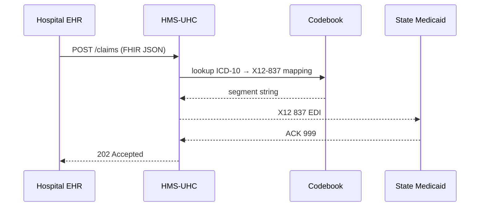

# Chapter 13: Universal Health Care Adapter (HMS-UHC)

[← Back to “Inter-Agency Bridge (HMS-A2A)”](12_inter_agency_bridge__hms_a2a__.md)

---

## 1. Why Do We Need a “Universal Adapter”?

A children’s hospital in **Chicago** submits a surgery claim coded as:

```
ICD-10 0FT44ZZ   (Liver Transplant)
```

• **State Medicaid** demands X12 837 EDI.  
• **Blue Shield** wants HL7 FHIR JSON.  
• **Veterans Affairs** still consumes a CSV with column “PROC_CODE”.

Without a bridge the hospital IT team must write **three separate exporters** and chase every yearly change.

**HMS-UHC** is the **single translator**:

```text
Hospital (any format) ─► HMS-UHC ─► Payor (their format)
```

Change a mapping once—every payor instantly speaks the same “language”.

---

## 2. A 2-Minute Story



One API call—no healthcare IT tears.

---

## 3. Key Concepts (Plain English)

| Term               | Think of it as…                                        |
|--------------------|--------------------------------------------------------|
| **Codebook**       | A big bilingual dictionary: ICD ⇄ X12, CPT ⇄ FHIR…    |
| **Connector**      | Driver that knows *how* to speak one protocol (FHIR, X12, CSV) |
| **Transform**      | The act of rewriting a payload using Codebook rules    |
| **Validation Profile** | Checklist that ensures the target format is legal (e.g., X12 997 rules) |
| **Claim Envelope** | Tiny header (`payer_id`, `format`, `revision`) wrapped around the transformed message |

If you can use Google Translate on a document, you already “get” UHC.

---

## 4. Quick-Start: Convert One Claim in 14 Lines

```php
use HMS\UHC\Codebook;
use HMS\UHC\Adapter;

// 1. Raw FHIR Procedure resource (truncated)
$fhir = ['code' => ['coding' => [['system'=>'ICD-10','code'=>'0FT44ZZ']]]];

// 2. Tell UHC where the claim must go
$target = ['format' => 'X12_837', 'payer_id' => 'IL_MEDICAID'];

// 3. Perform the magic
$x12 = Adapter::to($target)
      ->transform($fhir)          // ICD-10 JSON → X12 string
      ->validate()                // applies Validation Profile
      ->payload;                  // final EDI text

echo substr($x12,0,60).'...';
```

Output (first 60 chars):

```
ISA*00*          *00*          *ZZ*HOSPITAL123  *ZZ*ILMEDICAID...
```

Explanation  
1. We pass **any** source; UHC inspects it.  
2. `to()` picks the correct **Connector**.  
3. `transform()` looks up codes in the **Codebook**.  
4. `validate()` ensures the EDI won’t be rejected.  

No hospital coder touched an X12 manual!

---

## 5. What Happens Under the Hood?

1. **Detect Source** – Is it FHIR, CSV, or plain JSON?  
2. **Map Codes** – Query Codebook tables (`icd10 → x12_seg`).  
3. **Assemble Segments** – Connector stitches LX, SV2, NTE…  
4. **Run Validators** – Lengths, mandatory loops, checksum.  
5. **Emit Envelope** – Adds `payer_id`, `revision`, and logs a copy to [Central Data Lake](15_central_data_lake__hms_dta__.md).

---

## 6. Tiny Internal Code Peek

### 6.1  Codebook Lookup (10 Lines)

```php
class Codebook
{
    public static function map(string $fromSys, string $toSys, string $code): ?string
    {
        return \DB::table('codebook')
                  ->where('from_sys',$fromSys)
                  ->where('to_sys',  $toSys)
                  ->where('from_code',$code)
                  ->value('to_code');     // returns "SV2*...*0FT44ZZ"
    }
}
```

### 6.2  Connector Skeleton (18 Lines)

```php
class X12837Connector
{
    public function transform(array $fhir): string
    {
        $icd = $fhir['code']['coding'][0]['code'];
        $sv2 = Codebook::map('ICD10','X12_SV2',$icd);

        $segments = [
           'ISA*00*          *00*          *ZZ*HOSPITAL123*ZZ*ILMEDICAID',
           'GS*HC*HOSP*ILMED*20240601*1200*1*X*005010X222A1',
           $sv2,               // procedure line
           'SE*25*0001',
           'GE*1*1',
           'IEA*1*000000905'
        ];
        return implode('~',$segments);
    }
}
```

Lines removed: boring filler loops—focus is on the mapping!

---

## 7. Registering a New Mapping (9 Lines SQL)

```sql
INSERT INTO codebook
(from_sys, to_sys, from_code, to_code) VALUES
('ICD10','X12_SV2','0FT44ZZ',
 'SV2*0300*^1000*UN*1***B*0FT44ZZ');
```

Immediately all future claims reuse the new line—no code deploy.

---

## 8. Hands-On Exercise (10 Minutes)

1. Migrate the demo tables:

```bash
php artisan migrate --path=database/migrations/uhc
php artisan db:seed   --class=UhcDemoSeeder
```

2. Copy the “Quick-Start” snippet into `tinker`.  
3. Confirm EDI text prints.  
4. Change the SQL mapping’s dollar amount from `1000` → `2000`, rerun, and watch the segment update—live proof of **dynamic mapping**!

---

## 9. Where UHC Talks to Other Chapters

| Need | Touchpoint | Chapter |
|------|------------|---------|
| Program & payer IDs | [Program Registry](01_program_registry__program_model__.md) |
| Policy about which payer formats are allowed | [Policy Engine](09_policy_engine__hms_cdf__.md) |
| Legal validation (HIPAA, FERPA) | [Compliance Reasoner](10_compliance_reasoner__hms_esq__.md) |
| Publishes transformed files to legacy payors | [External System Sync Bus](11_external_system_sync_bus_.md) |
| Cross-agency code-set updates | [Inter-Agency Bridge](12_inter_agency_bridge__hms_a2a__.md) |
| Billing agents discover new connectors | [Service & Agent Marketplace](14_service___agent_marketplace__hms_mkt__.md) |

---

## 10. Government Analogy Cheat-Sheet

| Real-World Item | HMS-UHC Equivalent |
|-----------------|--------------------|
| UN simultaneous translation booth | Connector |
| Official glossary of diplomatic terms | Codebook |
| “Diplomatic pouch” with customs form | Claim Envelope |
| Embassy legal desk checking phrasing | Validation Profile |
| Change to glossary auto-faxed to all embassies | Dynamic mapping via Sync Bus |

---

## 11. What You Learned

✔ The pain HMS-UHC solves: **one claim → many payors, zero re-coding**.  
✔ Core pieces: **Codebook, Connector, Transform, Validation Profile, Claim Envelope**.  
✔ How to convert a FHIR claim to X12 in **14 lines**.  
✔ How mappings live in SQL, not code—policy staff can tweak them.  
✔ Where UHC fits inside the wider HMS-API galaxy.

Next you will see how third-party vendors and AI agents can **publish or sell their own connectors and mapping services** inside the ecosystem.

[Continue to “Service & Agent Marketplace (HMS-MKT)”](14_service___agent_marketplace__hms_mkt__.md)

---

Generated by [AI Codebase Knowledge Builder](https://github.com/The-Pocket/Tutorial-Codebase-Knowledge)