# Chapter 13: Universal Health Care Integration (HMS-UHC / HMS-MED)

*(coming from [Financial Transaction Core (HMS-ACH)](12_financial_transaction_core__hms_ach__.md))*  

---

## 1 · Why Do We Need “USB-C for Health Data”?

> Use-Case — **“One-Stop Prenatal Care”**  
> 1. A pregnant Air-Force veteran (Maria) applies for *Prenatal Benefit Coverage* on a federal portal.  
> 2. The portal must instantly…  
>    • verify she is *eligible* under TRICARE, **and**  
>    • pull her most recent *lab results* from a civilian hospital, **and**  
>    • schedule a *care-coordination call* with a VA nurse.  
> 3. All traffic must follow **HIPAA**, respect Maria’s *consent preferences*, feed national *HIE* (Health-Information Exchange) statistics **and** stay **audit-ready** for inspectors.

Doing that with custom point-to-point code for every hospital, insurer, and agency would take *years* and break the moment a rule changes.  
**HMS-UHC / HMS-MED** is the missing **USB-C port**: one standard plug that any EHR, lab, insurer, or federal program can connect to.

---

## 2 · Key Concepts (Plain English)

| Idea | Beginner Analogy | Why You Care |
|------|------------------|--------------|
| FHIR Gateway | Universal phone charger | One API that fits Epic, Cerner, & tiny clinics |
| Eligibility Engine | TSA ID check | Confirms the citizen really has coverage |
| Consent Registry | Privacy settings panel | Stores who can see what, for how long |
| HIE Bridge | Highway on-ramp | Publishes data to state & national exchanges |
| De-ID Sandbox | Blur faces in photos | Lets analysts see trends without PHI |

---

## 3 · Five-Minute Quick-Start  
Goal: **Fetch Maria’s latest A1C lab result** (FHIR) **if** she previously granted consent.

```python
# fetch_lab.py    (19 lines)
from hms_uhc import FHIR, Consent, Eligibility

user = "maria.vet@va.gov"
patient_id = "pat_48f"

# 1️⃣ confirm she is eligible for prenatal benefit
if not Eligibility.check(user, benefit="prenatal"):
    raise SystemExit("❌ No active coverage")

# 2️⃣ verify consent to pull civilian lab data
if not Consent.allowed(patient_id, purpose="treatment"):
    raise SystemExit("⚠️ Consent missing")

# 3️⃣ pull latest A1C through the FHIR gateway
lab = FHIR.get(
    resource="Observation",
    params={"code": "4548-4", "_sort": "-date", "_count": 1},
    patient=patient_id
)
print("Latest A1C:", lab["value"], lab["unit"])
```

### What happened?

1. **Eligibility.check** calls CMS & TRICARE once, caches the answer.  
2. **Consent.allowed** looks up a signed preference in the registry.  
3. **FHIR.get** hides OAuth, hospital endpoints, and HL7 quirks—returns plain JSON ready for your UI.

---

## 4 · Step-By-Step Under the Hood

```mermaid
sequenceDiagram
    participant UI as Prenatal Portal
    participant UHC as HMS-UHC
    participant ELG as Eligibility Svc
    participant EHR as Hospital EHR
    participant CNS as Consent Reg.
    UI->>UHC: request A1C (patient_id)
    UHC->>ELG: verify_coverage()
    ELG-->>UHC: ✅
    UHC->>CNS: check_consent()
    CNS-->>UHC: ✅
    UHC->>EHR: FHIR /Observation?code=4548-4
    EHR-->>UHC: lab JSON
    UHC-->>UI: lab JSON
```



Only **five** actors; each hop is TLS-encrypted, logged, and (where required) signed.

---

## 5 · Digging Deeper — Mini-Implementation

### 5.1  FHIR Gateway Wrapper (≤ 18 lines)

```python
# hms_uhc/fhir.py
import requests, os

def _session():
    tok = os.environ["UHC_FHIR_TOKEN"]         # OAuth2 PAT
    s = requests.Session()
    s.headers["Authorization"] = f"Bearer {tok}"
    return s

def get(resource, params, patient):
    base = os.environ["UHC_FHIR_URL"]
    url  = f"{base}/{resource}"
    params["patient"] = patient
    r = _session().get(url, params=params, timeout=5)
    r.raise_for_status()
    return r.json()["entry"][0]["resource"]
```

*Beginner takeaways*  
• Only one environment variable swap moves from **Dev** hospital sandbox to **Prod** Epic cluster.  
• No HL7, XML, or JWT complexity exposed to app developers.

### 5.2  Consent Check (≤ 14 lines)

```python
# hms_uhc/consent.py
import json, time

REG = "/opt/uhc/consent_store.json"   # simple file for demo

def allowed(patient, purpose):
    store = json.load(open(REG))
    rule  = store.get(patient, {})
    ok    = rule.get("purpose") == purpose and rule.get("expires")>time.time()
    return ok
```

Real deployments point to a hashed, auditable database—but the logic is still a **dictionary lookup**.

---

## 6 · Daily Life of Three Typical Calls

| Caller | UHC Endpoint | What Happens Behind Scenes |
|--------|--------------|----------------------------|
| Front-end wizard | `/eligibility/check` | Talks to SSA, CMS, VA → returns `eligible = true/false` |
| AI Care Agent | `/schedule/coordination` | Books slot in VA calendar + sends HL7v2 ADT message |
| Public-health analyst | `/sandbox/query` | Runs SQL on de-identified replica, **never** touches PHI |

Each call looks like a normal REST POST, keeping developers happy.

---

## 7 · Hands-On Exercise

1. `pip install hms-uhc`  
2. Set env vars:  
   ```bash
   export UHC_FHIR_URL=https://sandbox-hospital.gov/fhir
   export UHC_FHIR_TOKEN=demo123
   ```  
3. Copy `fetch_lab.py` and run it.  
4. Flip consent in `consent_store.json` to `"expires": 0` and rerun—watch the script exit with the consent warning.

---

## 8 · Frequently Asked Beginner Questions

**Q: Is HMS-UHC a full EHR?**  
A: No. It’s an **integration hub**. Hospitals keep their own EHRs; UHC just moves data legally & safely.

**Q: What standards does it speak?**  
A: FHIR R4 for clinical data, X12 270/271 for eligibility, HL7v2 ADT for admissions, plus REST JSON for internal calls.

**Q: How does de-identification work?**  
A: A built-in “safe-harbor” pipeline removes 18 HIPAA identifiers, then hashes patient IDs so the same person can be tracked across time **without** revealing identity.

**Q: Can states plug in Medicaid rules?**  
A: Yes—upload a YAML policy file in [Governance Portal (HMS-GOV)](01_governance_portal__hms_gov__.md); UHC reloads without code changes.

---

## 9 · Where UHC Touches Other HMS Pieces

* **Front-Ends** – `<hms-lab-viewer>` brick in [HMS-MFE](04_micro_frontend_interface_layer__hms_mfe__.md) calls `FHIR.get`.  
* **Workflows** – `EligibilityConfirmed` feeds [HMS-ACT](08_activity___workflow_orchestrator__hms_act___hms_oms__.md).  
* **Inter-Agency Hub** – Medicaid data uses [HMS-A2A](10_inter_agency_communication_hub__hms_a2a__.md) instead of public internet.  
* **Financial Core** – Claim reimbursements post to [HMS-ACH](12_financial_transaction_core__hms_ach__.md).  
* **AI Agents** – A care-coordination bot from [HMS-AGT](06_ai_agent_framework__hms_agt___hms_agx__.md) reads care gaps directly via UHC.

---

## 10 · What You Learned

1. HMS-UHC / HMS-MED is the **USB-C port for health data**—one plug, many systems.  
2. You pulled a real lab result in **under 20 lines** while honoring eligibility & consent.  
3. Under the hood are simple dictionary lookups and REST calls, wrapped with HIPAA-grade security.  
4. The hub ties into every other HMS layer—UI, workflow, payments, AI, and audits.

Next we’ll leave health behind and see how the platform measures **cross-border micro-trade** in real time:  
[International Micro-Trade Analytics (HMS-MBL)](14_international_micro_trade_analytics__hms_mbl__.md) 🚀

---

Generated by [AI Codebase Knowledge Builder](https://github.com/The-Pocket/Tutorial-Codebase-Knowledge)