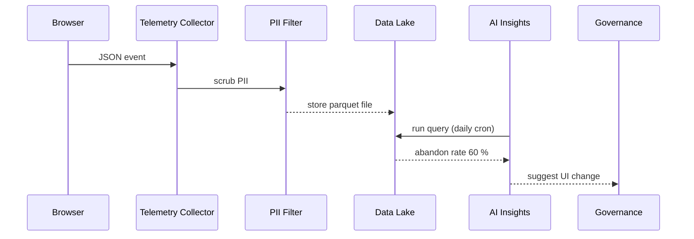

# Chapter 13: User Feedback & Telemetry Hub
[← Back to Chapter 12: External System Sync Adapter](12_external_system_sync_adapter_.md)

---

## 0. Why Bother Collecting Every Click?

Imagine the Department of Education rolling-out a new **FAFSA Step-by-Step wizard**.  
Three weeks later an analyst notices 60 % of students abandon the form on **Step 5 – “Parent Financials.”**  
But nobody knows **why**:

* Browser freeze?  
* Confusing wording?  
* Timeout on the IRS-data pull?

Enter the **User Feedback & Telemetry Hub (UFTH)**—our **traffic camera network** for every HMS-ACT screen and API.  
It quietly records:

* UI events (clicks, hovers, focus-loss)  
* Form errors & validation messages  
* “Was this helpful?” thumbs-up / down  
* API latency & HTTP codes

…then funnels the lot into an internal, privacy-scrubbed **data lake**.  
An AI agent (covered in [AI Representative Agent](04_ai_representative_agent__hms_a2a__.md)) digs through the lake and suggests fixes like:

> “Shorten FAFSA Step 5—split into two pages; projected abandonment ↓ 25 %.”

---

## 1. Key Concepts (Plain-English Cheatsheet)

| Term                    | What It Means | Simple Analogy |
|-------------------------|---------------|----------------|
| Event Pixel             | Tiny snippet that sends UI events. | Toll-booth camera. |
| Telemetry Collector     | Service that receives raw events.  | Central traffic tower. |
| Anonymizer / PII Filter | Removes SSN, names, etc.           | Blurring license plates. |
| Data Lake               | Scalable object store of events.   | Huge city archive room. |
| Insight Query           | SQL/Graph query that finds patterns. | Detective combing files. |
| Feedback Widget         | “Was this helpful?” thumbs widget. | Suggestion box on the counter. |

---

## 2. Hands-On: Instrument FAFSA Step 5 in 8 Lines

Add the **event pixel** to the React component:

```jsx
// FafsaStep5.jsx  (≤ 8 lines)
import { track } from '@hms/telemetry';

function FafsaStep5() {
  const handleSubmit = () => {
    track('FAFSA_STEP5_SUBMIT');           // 1️⃣ record success attempt
  };
  const handleError = (msg) => {
    track('FAFSA_STEP5_ERROR', { msg });   // 2️⃣ record error text
  };
  /* ...form code... */
}
```

Explanation  
1. `track(eventName)` ships a small JSON to the Telemetry Collector.  
2. Optional 2nd arg sends **non-PII** context (error enum, browser type, etc.).

---

### 2.1 Drop-In Feedback Widget (Vue, 10 Lines)

```vue
<!-- Helpful.vue -->
<template>
  <div>
    Was this page helpful?
    <button @click="vote(true)">👍</button>
    <button @click="vote(false)">👎</button>
  </div>
</template>

<script>
import { track } from '@hms/telemetry';
export default {
  methods:{ vote(v){ track('HELPFUL_VOTE',{ step:5, value:v }) } }
}
</script>
```

One component—re-used on every screen.

---

## 3. What Happens Behind the Curtain?



Only **five** actors—easy to reason about.

---

## 4. Internal Implementation (Super-Light)

### 4.1 Minimal Collector (Python Flask, 18 Lines)

```python
# collector/app.py
from flask import Flask, request, jsonify
import queue, time, json
app, BUF = Flask(__name__), queue.Queue()

@app.post("/event")
def ingest():
    event = request.json
    event["ts"] = time.time()
    BUF.put(event)                 # in-memory buffer
    return jsonify({"ok": True})

def drain():
    while True:
        batch = [BUF.get() for _ in range(min(100, BUF.qsize()))]
        if batch: anonymize_and_store(batch)

def anonymize_and_store(batch):
    clean = [e for e in batch if not contains_pii(e)]
    # pretend write to S3/ObjectStore
    open("/tmp/lake", "a").write("\n".join(map(json.dumps, clean)))

def contains_pii(e):
    return any(k in e.get("msg","") for k in ["SSN","@", "123-"])
```

Beginner notes  
• `/event` is **stateless**—returns in <10 ms.  
• `drain()` runs in a background thread or Lambda to flush to disk.  
• `contains_pii()` is a toy regex; in production you’d call [Security & Privacy Guardrails](08_security___privacy_guardrails_.md).

### 4.2 Simple SQL Insight (DuckDB, 9 Lines)

```python
import duckdb, datetime
day = (datetime.date.today()-datetime.timedelta(days=1)).isoformat()
qry = f"""
SELECT COUNTIF(name='FAFSA_STEP5_ERROR') as errors,
       COUNTIF(name='FAFSA_STEP5_SUBMIT') as submits
FROM read_parquet('s3://lake/{day}/*.parquet');
"""
errors, submits = duckdb.query(qry).fetchone()
print("Abandonment:", round(errors/submits*100,1), "%")
```

Run this daily via cron; publish result to Slack.

---

## 5. File Layout Cheat-Sheet

```
user-feedback-telemetry/
├─ collector/
│  └─ app.py
├─ sdk/
│  └─ index.js        # tiny wrapper around fetch("/event")
├─ widgets/
│  └─ Helpful.vue
└─ insights/
   └─ fafsa_abandon.py
```

Each folder < 100 loc—easy for new hires to grok.

---

## 6. Privacy & Security Hooks

* **Anonymizer** calls the same regex / ML models used in [Security & Privacy Guardrails](08_security___privacy_guardrails_.md).  
* Raw data **never** leaves the agency’s AWS GovCloud bucket.  
* Aggregated stats (< 1 row/100 users) may be shared with cross-agency analytics.  
* Access to the data lake requires the `Telemetry_Analyst` role from [Role-Based Access & Entitlement Matrix](07_role_based_access___entitlement_matrix_.md).

---

## 7. Querying Telemetry in 3 Lines

```bash
aws s3 cp s3://lake/2024-06-01/fafsa.parquet .
duckdb -c "SELECT name, COUNT(*) FROM 'fafsa.parquet' GROUP BY name;"
```

Output:

```
FAFSA_STEP5_ERROR | 1200
FAFSA_STEP5_SUBMIT | 2000
HELPFUL_VOTE       | 350
```

Now you have concrete numbers to present at the next sprint review.

---

## 8. Frequently Asked Questions

**Q: Will this slow down the page?**  
A: Events are batched and sent via `navigator.sendBeacon()`—the browser fires and forgets, even if the tab closes.

**Q: Do we need Google Analytics?**  
A: No. UFTH is self-hosted; no 3rd-party cookies, fully FedRAMP-compliant.

**Q: How large is the data lake?**  
A: Roughly 1 GB per million events when stored as Parquet + gzip—cheap on S3 Glacier.

**Q: Can citizens opt-out?**  
A: Yes. The SDK respects `Do-Not-Track` and stores consent decisions in the **Consent Ledger** portion of [Security & Privacy Guardrails](08_security___privacy_guardrails_.md).

---

## 9. What You Learned

• UFTH captures clicks, errors, and feedback into a privacy-safe lake.  
• A drop-in SDK + 1-line `track()` calls are enough for dev teams.  
• AI agents mine the lake to pinpoint UX bottlenecks (e.g., FAFSA Step 5).  
• PII is scrubbed inside the agency enclave; only aggregates leave.  
• Insights flow onward to both humans and automation layers.

Ready to turn these raw events into **unalterable audit evidence** for IGs and GAO?  
Continue to [Chapter 14: Audit & Compliance Ledger](14_audit___compliance_ledger_.md).

---

Generated by [AI Codebase Knowledge Builder](https://github.com/The-Pocket/Tutorial-Codebase-Knowledge)