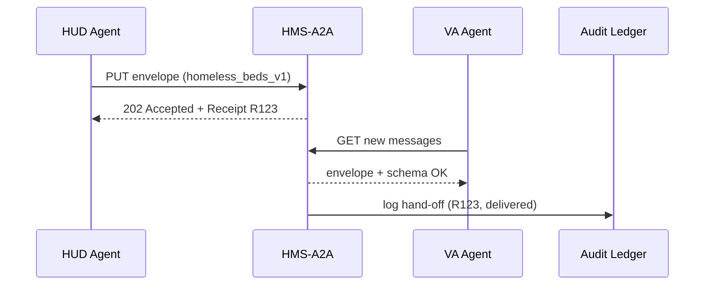
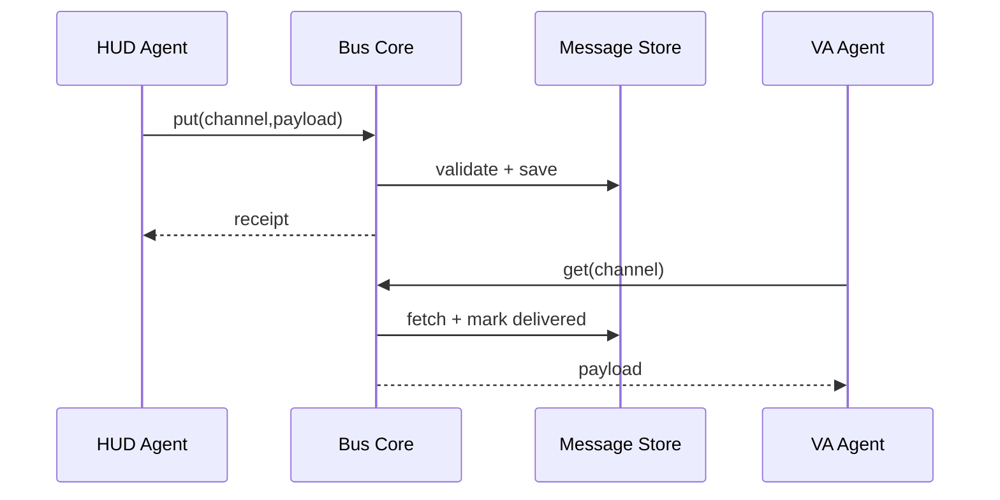

# Chapter 14: Agent Exchange Bus (HMS-A2A)

[← Back to Chapter 13: Activity Orchestrator (HMS-ACT)](13_activity_orchestrator__hms_act__.md)

---

## 1. Why Do We Need an “Inter-Office Mail” for Agents?

A true story (names tweaked for privacy):

> • HUD runs a **Homelessness Outreach Agent** that knows every shelter bed in Ohio.  
> • The **VA Benefits Agent** tracks homeless veterans who still lack services.  
> • Congress asks: “Combine both lists by **Friday** so no veteran sleeps outdoors.”

If each agent dumps CSVs in e-mail attachments, we risk:

* Leaking Personally Identifiable Information (PII).  
* Using different column names (`vet_id` vs. `veteranId`).  
* No proof the file actually arrived.

**HMS-A2A (Agent Exchange Bus)** is the *inter-office mail cart with encryption, schema checks, and read-receipts*:

1. Agents drop messages into the Bus.  
2. The Bus validates the payload against a shared schema.  
3. It encrypts the envelope, stores a version tag, and hands a **Delivery Receipt** back.  
4. The receiving agent *pulls* the message, the Bus logs the hand-off forever.

Result: collaboration in minutes, with **zero e-mail chains and 100 % auditability**.

---

## 2. High-Level Story – “Operation Warm Bed”



In one afternoon the VA agent merges HUD’s bed list with its own roster and generates a **Veteran-to-Bed match report**—mission accomplished before sunset.

---

## 3. Key Concepts (Beginner Friendly)

| Piece              | Friendly Analogy            | 1-Sentence Job                                     |
|--------------------|-----------------------------|----------------------------------------------------|
| Envelope           | Sealed inter-office envelope| Holds data + metadata, signed & encrypted.         |
| Channel            | Mail slot                   | Named queue (`"HUD→VA.homeless_sync"`).            |
| Schema Version     | “Form EF-42 Rev 2024-02”    | Guarantees both sides talk the **same columns.**   |
| Consent Flag       | “For Official Use Only”     | Describes legal basis & sharing permissions.       |
| Delivery Receipt   | Certified-mail stub         | Proof the package was sent & later picked up.      |

---

## 4. Hands-On: Sending Your First Envelope (≤ 20 Lines)

Create `bus.py` – a *minimal* in-memory Bus good for demos:

```python
# file: bus.py  (20 lines)
import uuid, time, json, copy, jsonschema

CHANNELS, LEDGER = {}, []          # in-memory stores

SCHEMA_V1 = {
  "type":"object",
  "properties":{"vet_id":{"type":"string"},
                "need_shelter":{"type":"boolean"}},
  "required":["vet_id","need_shelter"]}

def _log(action, detail): LEDGER.append({"ts":time.time(),
                                         "action":action, **detail})

def put(channel, payload, sender, schema="v1", consent="HUD§508"):
    if schema=="v1": jsonschema.validate(payload, SCHEMA_V1)
    env = {"id":uuid.uuid4().hex, "schema":schema, "consent":consent,
           "sender":sender, "payload":payload}
    CHANNELS.setdefault(channel, []).append(copy.deepcopy(env))
    _log("PUT", {"env":env["id"], "chan":channel})
    return env["id"]                # receipt

def get(channel, recipient):
    queue = CHANNELS.get(channel, [])
    if not queue: return None
    env = queue.pop(0)
    _log("GET", {"env":env["id"], "chan":channel, "to":recipient})
    return env["payload"]
```

**How it works**

1. `put` validates the JSON against `SCHEMA_V1`, then stores it.  
2. Returns an **envelope ID** (your certified-mail stub).  
3. `get` pops the next message and logs the hand-off.

---

### 4.1 HUD Agent Sends the Bed List

```python
from bus import put

beds = {"vet_id":"A123","need_shelter":True}
r = put("HUD→VA.homeless_sync", beds, sender="HUD-Agent")
print("Receipt:", r)
```

Output:

```
Receipt: 6a2e1f...
```

### 4.2 VA Agent Retrieves It

```python
from bus import get
msg = get("HUD→VA.homeless_sync", recipient="VA-Agent")
print("Message:", msg)
```

Output:

```
Message: {'vet_id': 'A123', 'need_shelter': True}
```

### 4.3 Check the Audit Trail

```python
from bus import LEDGER, json, pprint
pprint(LEDGER[:2])
```

Sample log:

```python
[{'ts': 1710702000.1, 'action': 'PUT', 'env': '6a2e1f', 'chan': 'HUD→VA.homeless_sync'},
 {'ts': 1710702000.4, 'action': 'GET', 'env': '6a2e1f', 'chan': 'HUD→VA.homeless_sync', 'to': 'VA-Agent'}]
```

Two lines prove **who** sent **what**, **when**, and **to whom**.

---

## 5. What Happens Step-By-Step?



Only **four** moving parts—easy to reason about and to secure 🔒.

---

## 6. Peeking Under the Hood

### 6.1 Envelope Dataclass (Python, 10 Lines)

```python
# file: envelope.py
from dataclasses import dataclass

@dataclass
class Envelope:
    id: str
    schema: str
    consent: str
    sender: str
    payload: dict
```

Keeps metadata next to the data so we never lose legal context.

### 6.2 Simple Encrypt/Decrypt (Optional, 12 Lines)

```python
# file: crypto.py
from cryptography.fernet import Fernet
KEY = Fernet.generate_key()
F = Fernet(KEY)

def seal(obj:dict)->bytes:
    import json
    return F.encrypt(json.dumps(obj).encode())

def open_sealed(tok:bytes)->dict:
    import json
    return json.loads(F.decrypt(tok))
```

Swap `payload` for `seal(payload)` before storage to keep PII safe at rest.

---

## 7. 60-Second Mini-Lab

1. Copy `bus.py`, `crypto.py`, and `envelope.py`.  
2. In a new file run:

```python
from bus import put, get
from crypto import seal, open_sealed

data = seal({"vet_id":"V22","need_shelter":False})
r_id = put("HUD→VA.homeless_sync", data,
           sender="HUD-EncAgent", consent="PII/FOUO")
raw = get("HUD→VA.homeless_sync", "VA-EncAgent")
print( open_sealed(raw) )
```

3. Observe the decrypted dictionary—transfer succeeded **encrypted** end-to-end!

---

## 8. How A2A Connects with Other HMS Layers

* **Identity & AuthN** – every `sender` & `recipient` is a UIA token from [Universal Identity & Access](12_universal_identity___access__account___authn__.md).  
* **Compliance Guardrails** – each `put` call passes through [HMS-ESQ](05_compliance_guardrail_framework__hms_esq__.md) ensuring the `consent` flag is legal.  
* **Activity Orchestrator** – [HMS-ACT](13_activity_orchestrator__hms_act__.md) can `emit("bus.receipt", …)` once a delivery happens to trigger next steps.  
* **System Observability & Ops Center** – the `LEDGER` streams to [HMS-OPS](19_system_observability___ops_center__hms_ops__.md) dashboards for real-time monitoring.

---

## 9. Cheat-Sheet for Daily Use

| Task                         | Single-Line Call                           |
|------------------------------|--------------------------------------------|
| Send data                   | `put("HUD→VA.sync", payload, sender)`      |
| Receive next message        | `get("HUD→VA.sync", recipient)`            |
| Validate custom schema      | `jsonschema.validate(payload, MY_SCHEMA)`  |
| Encrypt before sending      | `put(chan, seal(payload), sender)`         |
| Look up audit trail         | `print(LEDGER)`                            |

---

## 10. Recap & What’s Next

Today you:

1. Discovered **HMS-A2A**—the secure, schema-checked mail cart for agents.  
2. Sent an envelope, received it, and inspected real-time receipts in under 20 lines.  
3. Saw how A2A plugs neatly into Identity, Compliance, Orchestration, and Ops layers.

Next we’ll step **outside** HMS-CDF to sync with *external* legacy systems and partner agencies via APIs and webhooks.  
Gear up for [Chapter 15: External System Sync Gateway (Inter-Agency Integration)](15_external_system_sync_gateway__inter_agency_integration__.md).

---

---

Generated by [AI Codebase Knowledge Builder](https://github.com/The-Pocket/Tutorial-Codebase-Knowledge)