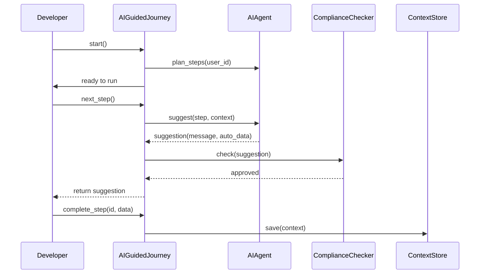

# Chapter 14: AI-Guided Journey

In [Chapter 13: AI Representative Agent](13_ai_representative_agent_.md), we saw how an AI assistant can analyze data and draft proposals. Now, let’s build an **end-to-end AI-Guided Journey**: an automated, step-by-step workflow where AI agents act like expert caseworkers—anticipating needs, auto-populating forms, suggesting next steps, and enforcing compliance until a user’s process (for example, a student’s financial aid application) is complete.

---

## 1. Motivation: Student Aid as a Guided Service

Imagine a student applying for federal financial aid:

1. AI welcomes the student and **auto-fills** personal info on the FAFSA form.
2. It **checks eligibility** rules (income, enrollment status).
3. It **reminds** the student to upload transcripts.
4. It **suggests** the next action (“complete entrance counseling”).
5. It loops until all requirements are met and the award letter is generated.

All the while, the AI agent ensures every suggestion passes policy checks—just like a caseworker in the Department of Education.

---

## 2. Key Concepts

1. **Journey**  
   The full workflow from start to finish.  
2. **Step**  
   A single task in that workflow (fill form, upload doc).  
3. **AIAgent**  
   The component that performs or suggests each step.  
4. **Context**  
   A data store tracking completed steps and user inputs.  
5. **ComplianceChecker**  
   Ensures each AI suggestion follows rules from the [Policy Engine](10_policy_engine_.md).  

---

## 3. Using the AI-Guided Journey

Below is a minimal example showing how a developer might orchestrate a student’s aid process.

```python
# File: app.py
from hms_ach.ai_guided_journey import AIGuidedJourney

# 1. Initialize and start
journey = AIGuidedJourney(user_id="student123")
journey.start()  # Kick off the AI planning

print("Journey started. Let’s follow the AI’s lead!")
```
This sets up a new journey for `student123` and lets the internal AI plan the required steps.

```python
# Continue in app.py
# 2. Loop until all steps are done
while not journey.is_complete():
    step = journey.next_step()
    print("AI suggests:", step.message)
    # Simulate auto-fill or user action
    journey.complete_step(step.id, data=step.auto_data or {"confirmed": True})

print("🎉 All steps completed! Your application is ready.")
```
Here, `next_step()` returns the AI’s suggestion (with a human-friendly message and optional `auto_data`), and `complete_step()` records progress. The loop ends when the journey reaches its final step.

---

## 4. Under the Hood: Step-by-Step Flow



1. **start()** → AIAgent builds an ordered list of steps.
2. **next_step()** → AIAgent suggests the next action based on current context.
3. **ComplianceChecker** vets each suggestion.
4. **complete_step()** records the outcome and advances the journey.

---

## 5. Peek at the Implementation

Here’s a simplified look at `hms_ach/ai_guided_journey.py`.

```python
# File: hms_ach/ai_guided_journey.py
from hms_ach.policy_engine import PolicyEngine

class AIGuidedJourney:
    def __init__(self, user_id):
        self.user_id = user_id
        self.steps = []
        self.index = 0
        self.context = {}
        self.policy = PolicyEngine()  # for compliance

    def start(self):
        # Plan initial steps (e.g., auto-fill forms, eligibility checks)
        self.steps = AIPlanner(self.user_id).plan()

    def is_complete(self):
        return self.index >= len(self.steps)
```

This sets up the journey, context store, and a policy engine to validate AI suggestions.

```python
# continue in ai_guided_journey.py
    def next_step(self):
        step = self.steps[self.index]
        suggestion = AIAgent().assist(step, self.context)
        if self.policy.evaluate("Compliance", suggestion.data)["approved"]:
            return suggestion
        raise Exception("Suggestion failed compliance")

    def complete_step(self, step_id, data):
        # Save results and move to the next step
        self.context[step_id] = data
        self.index += 1
```

- **AIPlanner**: defines what needs doing.  
- **AIAgent**: generates the message and any auto-filled data.  
- **PolicyEngine**: checks against compliance rules.  
- **Context**: stores step outcomes for future suggestions.

---

## 6. Conclusion

You’ve learned how to build an **AI-Guided Journey** that:

- Plans a full, end-to-end workflow with **AIPlanner**.  
- Guides users step-by-step via **AIAgent**.  
- Auto-populates forms when possible.  
- Validates every suggestion with the [Policy Engine](10_policy_engine_.md).  
- Records progress in a **Context** object until completion.

Next, we’ll add live dashboards and alerts to watch these journeys in action in [Real-Time Monitoring](15_real_time_monitoring_.md).

---

Generated by [AI Codebase Knowledge Builder](https://github.com/The-Pocket/Tutorial-Codebase-Knowledge)