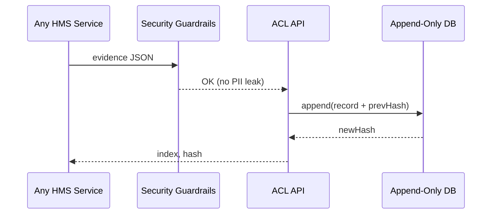

# Chapter 14: Audit & Compliance Ledger  
[← Back to Chapter 13: User Feedback & Telemetry Hub](13_user_feedback___telemetry_hub_.md)

---

## 0. Why Do We Need an “Un-Shred-able” Paper Trail?

Imagine the Office of Personnel Management (OPM) shifts **200 analysts** from Washington D.C. to Denver.  
A year later Congress asks:

> “Who decided this? When? Based on what data?”

Without a **tamper-evident ledger**, managers dig through emails, spreadsheets, and sticky notes—weeks of pain, and the public still doubts the answer.

**Audit & Compliance Ledger (ACL)** is HMS-ACT’s “black box recorder.”  
Every important decision—AI suggestion, human override, policy deploy, patient data upload—lands here **once** and can **never** be silently edited or deleted.

Result: Investigators, FOIA officers, and Inspectors General can replay the exact timeline in minutes, while day-to-day teams stay focused on their work.

---

## 1. Key Concepts (Beginner Cheat-Sheet)

| Term | Friendly Explanation | Analogy |
|------|----------------------|---------|
| Append-Only Log | You can only **add** rows—never change or delete. | A notebook where you glue pages instead of erasing. |
| Hash Chain | Each record stores the hash of the previous one. | Links in a bicycle chain—break one, the bike fails. |
| Evidence Record | The actual JSON of *who/what/why/when*. | A timestamped, notarized photo. |
| Verification Proof | Small file you can hand to auditors. | Receipt stamped “Certified Copy.” |
| Query API | Read-only search interface. | Library card catalog—look but never rewrite. |

> **You don’t need to understand blockchain math—just remember: once it’s in, it’s locked.**

---

## 2. Quick Use-Case: “Trace the Denver Relocation Decision”

### 2.1 How Data Gets In (3 Steps)

1. **AI Agent** proposes moving analysts → record `A2A_SUGGESTION`.  
2. **Manager** hits “Approve” in [HITL Override](05_human_in_the_loop__hitl__override_.md) → record `HITL_DECISION`.  
3. **Deployment Pipeline** rolls out new office assignments → record `DEPLOY_SUCCESS`.

All three events flow straight into ACL. Six months later an auditor issues:

```
GET /ledger?decision=DenverRelocation
```

and receives an ordered JSON list including timestamps, user IDs, and hash proofs.

---

## 3. Using the Ledger (It’s Only Two API Calls)

### 3.1 Append an Evidence Record (POST)

```http
POST /ledger/v1/append
Content-Type: application/json

{
  "type": "HITL_DECISION",
  "actor": "mgr-77",
  "payload": {
    "suggestionId": "sug-501",
    "decision": "APPROVE"
  }
}
```

Response (trimmed):

```json
{ "status":"OK", "index":104857, "hash":"a4f9...e2" }
```

### 3.2 Verify the Chain Later (GET)

```http
GET /ledger/v1/proof?index=104857
```

Returns the original record **plus** a verification proof you can run offline.

---

## 4. What Happens Under the Hood?



Only **4 participants**—easy to remember.

---

## 5. Tiny Internal Implementation (≤ 20 Lines Each)

### 5.1 Folder Snapshot

```
audit-ledger/
├─ api/
│  └─ app.py
├─ core/
│  ├─ ledger.py
│  └─ verify.py
└─ store/
   └─ ledger.db   # SQLite for demo
```

### 5.2 Append Logic (`core/ledger.py` – 18 lines)

```python
import sqlite3, json, hashlib, time, pathlib
DB = sqlite3.connect(pathlib.Path(__file__).parent/'../store/ledger.db')
DB.execute("CREATE TABLE IF NOT EXISTS log(idx INTEGER PRIMARY KEY, ts INT, data TEXT, hash TEXT)")

def append(record: dict) -> tuple[int,str]:
    blob = json.dumps(record, separators=(',',':')).encode()
    cur = DB.execute("SELECT hash FROM log ORDER BY idx DESC LIMIT 1")
    prev = cur.fetchone()
    prev_hash = prev[0] if prev else ""
    digest = hashlib.sha256(prev_hash.encode()+blob).hexdigest()
    ts = int(time.time())
    DB.execute("INSERT INTO log(ts,data,hash) VALUES(?,?,?)",(ts,blob.decode(),digest))
    DB.commit()
    idx = DB.execute("SELECT last_insert_rowid()").fetchone()[0]
    return idx, digest
```

**What it does:**  
1. Reads last hash (`prev_hash`).  
2. SHA-256 of `prev_hash + newJSON`.  
3. Inserts row with index, timestamp, data, and new hash.

### 5.3 Proof Verification (`core/verify.py` – 12 lines)

```python
import sqlite3, hashlib, json, pathlib
DB = sqlite3.connect(pathlib.Path(__file__).parent/'../store/ledger.db')

def verify(idx: int) -> bool:
    row = DB.execute("SELECT data,hash FROM log WHERE idx=?", (idx,)).fetchone()
    if not row: return False
    data, stored_hash = row
    prev = DB.execute("SELECT hash FROM log WHERE idx=?", (idx-1,)).fetchone()
    prev_hash = prev[0] if prev else ""
    calc = hashlib.sha256(prev_hash.encode()+data.encode()).hexdigest()
    return calc == stored_hash
```

Run `verify(104857)` and you’ll get `True`—or the function screams if someone tampered.

### 5.4 Minimal REST Wrapper (`api/app.py` – 20 lines)

```python
from flask import Flask, request, jsonify
from core import ledger, verify

app = Flask(__name__)

@app.post("/ledger/v1/append")
def add():
    rec = request.json
    idx, h = ledger.append(rec)
    return jsonify({"status":"OK","index":idx,"hash":h})

@app.get("/ledger/v1/proof")
def proof():
    idx = int(request.args["index"])
    ok = verify.verify(idx)
    return jsonify({"valid": ok})

if __name__ == "__main__":
    app.run(port=7700)
```

---

## 6. How ACL Connects to Other Layers

* **Security & Privacy Guardrails** ([Chapter 8](08_security___privacy_guardrails_.md)) inspect every record before it is accepted.  
* **Role Matrix** ([Chapter 7](07_role_based_access___entitlement_matrix_.md)) decides which callers may **read** sensitive evidence.  
* **HITL Override** ([Chapter 5](05_human_in_the_loop__hitl__override_.md)) automatically appends every decision token.  
* **Deployment Pipeline** ([Chapter 10](10_backend_policy_deployment_pipeline_.md)) logs scan results and rollbacks.  
* **Autonomous Accountability Engine** (next chapter) continuously audits the ledger for anomalies.

---

## 7. 3-Minute Hands-On Lab

```bash
git clone https://github.com/example/hms-act
cd audit-ledger && pip install flask
python api/app.py &     # Ledger on :7700

# 1. Append a dummy record
curl -X POST localhost:7700/ledger/v1/append \
     -H "Content-Type: application/json" \
     -d '{"type":"TEST","actor":"cli","payload":{"msg":"hello"}}'

# 2. Verify it
curl "localhost:7700/ledger/v1/proof?index=1"
# => {"valid": true}
```

Try opening `store/ledger.db` with SQLite Browser—you’ll see rows but can’t change hashes without breaking verification.

---

## 8. Frequently Asked Questions

**Q: Is this a full blockchain?**  
A: No mining, no coins—just a simple **hash chain** inside SQLite/PostgreSQL or AWS QLDB.  
Everything stays in your FedRAMP enclave.

**Q: How big can it grow?**  
A: 1 million JSON records ≈ 1 GB.  
Partition by month or archive old chunks to S3 Glacier; hashes still link across partitions.

**Q: What if someone has DB admin rights?**  
A: Changing any row breaks all subsequent hashes, and auditors rerun `verify()` nightly. Tamper attempts surface immediately.

**Q: Can citizens request their own record?**  
A: Yes. Expose a filtered Query API that redacts PII but keeps timestamps and event types, satisfying FOIA.

---

## 9. What You Learned

• ACL is an append-only, hash-linked ledger that nobody can silently edit.  
• Two simple endpoints—**append** and **verify**—cover 90 % of needs.  
• Every HMS-ACT layer logs to the ledger for iron-clad accountability.  
• Even a basic SQLite demo proves how tamper evidence works.

Ready to see how the platform **self-monitors** and auto-flags suspicious patterns inside this ledger?  
Jump ahead to [Chapter 15: Autonomous Accountability Engine](15_autonomous_accountability_engine_.md).

---

Generated by [AI Codebase Knowledge Builder](https://github.com/The-Pocket/Tutorial-Codebase-Knowledge)