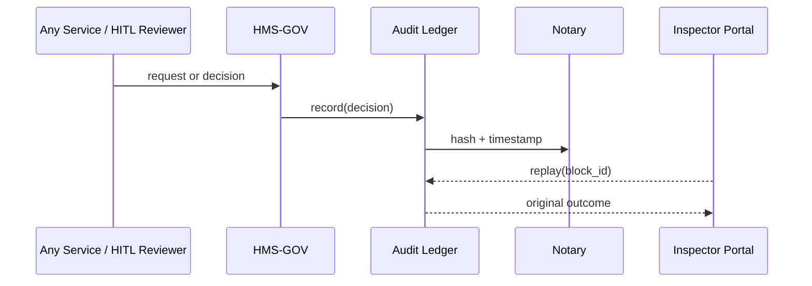
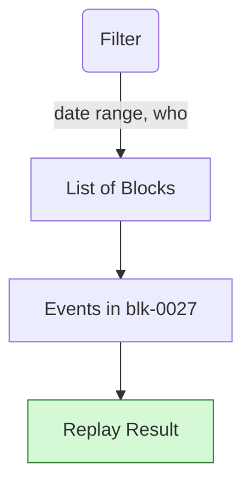

# Chapter 14: Compliance & Audit Ledger  
*(File: `14_compliance___audit_ledger_.md`)*  

[← Back to Chapter&nbsp;13: Process Optimization Engine](13_process_optimization_engine_.md)

---

## 1. Why Do We Need an Audit Ledger?  

### Central Use-Case — “Did the IRS Bot Treat Me Fairly?”  

Emma receives a **$2 400 under-withholding penalty** from the IRS.  
She files an appeal that claims:

> “An AI rule mis-classified my exemption status on Feb 3rd.”

The Treasury Inspector General must now **prove or disprove** Emma’s claim by showing:

1. The exact AI rule version executed on Feb 3rd.  
2. The raw inputs the rule used (Emma’s W-2, filing status).  
3. The human sign-off chain that approved that rule.  
4. Digital signatures showing **no one tampered** with the record afterward.

The **Compliance & Audit Ledger (CAL)** provides this end-to-end “black box” recording—**immutable, replayable, and cryptographically chained**.

Without CAL the agency would scramble through log files and e-mails, risking FOIA headaches and public mistrust.

---

## 2. Key Concepts (Plain-English Cheat-Sheet)

| Concept | Friendly Analogy | One-Line Description |
|---------|------------------|----------------------|
| Block | Page in a diary | Holds a batch of decisions & events. |
| Hash Chain | Page numbers in invisible ink | Each page’s hash seals the next—break the chain, alarms ring. |
| Notary Service | County clerk | Stamps each block’s hash + timestamp. |
| Replay Engine | Instant-replay TV booth | Re-runs past decisions with the original code & data. |
| Inspector Portal | Reading room | UI where auditors browse, filter, and replay. |

Memorize these five and you “speak CAL”.

---

## 3. Writing to the Ledger — 15 Lines Is Enough

```python
from cal import record, replay   # public API

# 1) Decision object (AI or human) --------------------
decision = {
    "who":   "irs_bot_v3",
    "what":  "calc_penalty",
    "target":"TAXPAYER-991",
    "input": {"gross": 62000, "withheld": 3500},
    "out":   {"penalty": 2400}
}

# 2) Append to the immutable ledger -------------------
block_id = record(decision)
print("✍️  stored in block", block_id)

# 3) Later, an inspector replays the event ------------
print(replay(block_id, "TAXPAYER-991"))
```

Expected console:

```
✍️  stored in block blk-0027
{'penalty': 2400}
```

Takeaways for beginners  
• **One call** to `record()` stores anything.  
• **One call** to `replay()` proves what happened—no SQL spelunking.

---

## 4. What Happens Behind the Curtain? (Step-By-Step)



Exactly **five participants**—easy to remember.

---

## 5. Internal Implementation (Beginner-Friendly)

### 5.1 Tiny File Layout

```
cal/
 ├─ core.py        # public record() + replay()
 ├─ store.py       # append-only blocks
 └─ crypto.py      # hash helpers
```

### 5.2 `core.py` — 18 Lines

```python
import time, store, crypto

def record(decision):
    """
    Append a decision/event to the current block.
    Returns the block_id so auditors can replay later.
    """
    blk = store.current_block()
    blk["events"].append(decision)
    if len(blk["events"]) >= 50:          # roll every 50 events
        store.seal_block(blk)
    return blk["id"]

def replay(block_id, target_id):
    blk = store.get(block_id)
    crypto.verify_chain(block_id)         # alarm if tampered
    for ev in blk["events"]:
        if ev["target"] == target_id:
            return ev["out"]
```

Highlights  
1. **Auto-rolls** a new block every 50 events (keep code tiny).  
2. `crypto.verify_chain` ensures no page was edited.  
3. Returns the output **exactly as stored**—no recomputation needed.

### 5.3 `store.py` — 16 Lines

```python
_blocks = []      # in-memory for demo

def current_block():
    if not _blocks or _blocks[-1]["sealed"]:
        _blocks.append({"id": _make_id(), "events": [], "sealed": False})
    return _blocks[-1]

def seal_block(blk):
    blk["sealed"] = True
    blk["hash"]   = _hash(blk)
    # link to previous
    if len(_blocks) > 1:
        blk["prev"] = _blocks[-2]["hash"]

def get(block_id):
    return next(b for b in _blocks if b["id"] == block_id)

# helpers ----------
import uuid, json, hashlib
def _make_id(): return "blk-" + uuid.uuid4().hex[:4]
def _hash(blk): return hashlib.sha256(json.dumps(blk, sort_keys=True)
                                      .encode()).hexdigest()[:12]
```

Beginners’ takeaways  
• Append-only list represents our ledger.  
• `prev` forms the **hash chain**—change any old block, hashes break.

### 5.4 `crypto.py` — 8 Lines

```python
import store, hashlib, json
def verify_chain(block_id):
    idx = next(i for i,b in enumerate(store._blocks) if b["id"]==block_id)
    while idx > 0:
        cur, prev = store._blocks[idx], store._blocks[idx-1]
        expected = hashlib.sha256(json.dumps(prev, sort_keys=True).encode()
                   ).hexdigest()[:12]
        assert cur["prev"] == expected, "Tamper detected!"
        idx -= 1
```

If anyone alters an older page, the assertion trips and alerts auditors.

---

## 6. Inspector Portal Sneak-Peek (UI Mock)



Beginners only need to know: select → click → replay.

---

## 7. Glue to Other Layers

| Layer | What It Stores or Reads |
|-------|-------------------------|
| [Governance Layer](01_governance_layer__hms_gov__.md) | Stores all approve/deny outcomes. |
| [Access & Authorization Matrix](03_access___authorization_matrix_.md) | Writes every token grant & revoke. |
| [Human-in-the-Loop Oversight](06_human_in_the_loop_oversight__hitl__.md) | Logs reviewer decisions + comments. |
| [Event Bus & Real-Time Monitoring](11_event_bus___real_time_monitoring_.md) | Pushes block-sealed alerts for dashboards. |
| [Policy & Process Registry](12_policy___process_registry_.md) | Links each block to the policy version hash used. |

---

## 8. Beginner FAQ

**Q: Is this a full blockchain?**  
A: No mining, no coins—just a **hash-chained log** inside one agency. Same tamper detection without crypto complexity.

**Q: How long are blocks kept?**  
A: Policy default is **10 years**; export to cold storage after.

**Q: Can citizens query the ledger directly?**  
A: Not raw blocks. They use FOIA portals that proxy the `replay()` API with proper redactions.

**Q: What if the ledger server crashes?**  
A: Blocks are streamed nightly to the **Deployment & Versioning Service**’s object store (next chapter).

---

## 9. Quick Hands-On Checklist

☑ `record()` once per decision/event.  
☑ Auto-rolls & hashes every 50 events.  
☑ `replay()` returns original outcome; tamper triggers assert.  
☑ Five-participant sequence diagram clarifies flow.  
☑ Other layers already write into CAL—no extra code.

---

## 10. Conclusion & What’s Next  

You now wield an **immutable black-box recorder**: every AI choice, human override, or policy tweak is frozen in a cryptographic diary that even the most skeptical auditor can trust.

In the final chapter we’ll learn how new code, models, and even ledger snapshots **roll out safely across environments** with the [Deployment & Versioning Service](15_deployment___versioning_service_.md).

---

Generated by [AI Codebase Knowledge Builder](https://github.com/The-Pocket/Tutorial-Codebase-Knowledge)