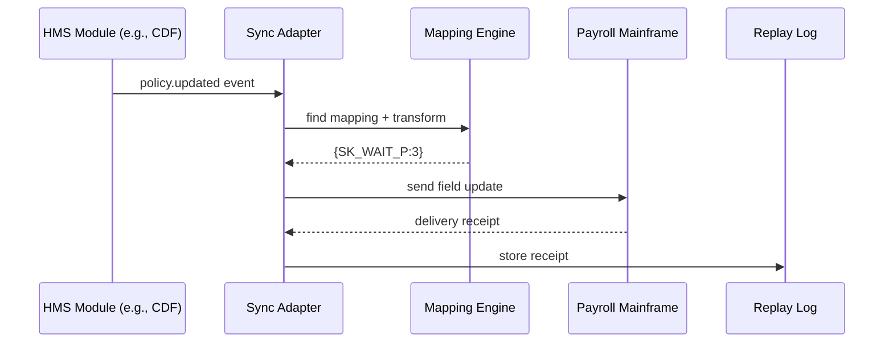

# Chapter 14: External System Sync Adapter  

*(Fresh off moving live data between agencies in [Inter-Agency Exchange Protocol (HMS-A2A)](13_inter_agency_exchange_protocol__hms_a2a__.md)?  
Great!  Now let’s keep **every old database and third-party tool** in perfect step with those changes.)*  

---

## 1. Why Do We Need the Adapter?

A true story (names changed, pain real):

1. **County HR Portal** uses HMS-OMS workflows for employee leave-requests.  
2. **Legacy Mainframe Payroll** (built 1988) still runs actual paychecks.  
3. Every time HR tweaks a rule (e.g., *“Family-leave now 8 weeks”*) someone must re-type the same change into COBOL screens.  
4. One Friday they forget.  127 employees are **under-paid**—and the county treasurer’s phone melts.

**External System Sync Adapter (HMS-SYNC)** is the *universal translator* that:

* Listens for changes anywhere in HMS-SME.  
* Transforms each event into the dialect a third-party system understands (REST, SOAP, SFTP, flat-file, message queue, you name it).  
* Sends it instantly and confirms delivery—no more double entry, no more data drift.

---

## 2. Key Concepts (Plain English)

| Analogy | SYNC Term | One-line Explanation |
|---------|-----------|----------------------|
| Phrasebook | **Mapping** | “HMS field `leaveDays` ↔ COBOL field `LV_DYS`.” |
| Interpreter Booth | **Connector** | Code that speaks one protocol: REST, SFTP, Kafka… |
| Customs Stamp | **Delivery Receipt** | Proof the target system stored the update. |
| Time Machine | **Replay Log** | Re-plays missed events after downtime. |
| Translator’s Notebook | **Transform Script** | Tiny snippet that reshapes payloads (JSON ➜ CSV, etc.). |

Beginners really only need **Mapping** and **Connector**; the rest run automatically.

---

## 3. Quick-Start: Mirror a Leave-Policy Change to a Mainframe

> Goal: When HR shortens “Sick Leave Waiting Period” from **5 ➜ 3 days** in HMS-CDF, the mainframe field `SK_WAIT_P` updates within seconds.

### 3.1 Describe the Mapping (one time)

```yaml
# mappings/payroll_leave.yml   (≤15 lines)
source:
  module: HMS-CDF
  event:  policy.updated
  filter: policyId == "sick_leave_wait"
target:
  connector: cobol_tcp
  host: "10.44.0.14:3270"
  fieldMap:
    waitingPeriod: "SK_WAIT_P"
```

Explanation  
• Whenever **policy.updated** fires for that ID, we’ll send the `waitingPeriod` value to COBOL field `SK_WAIT_P`.

---

### 3.2 Register the Connector (one time)

```ts
// register.ts    (≤18 lines)
import { addConnector } from "hms-sync-sdk";

await addConnector({
  name: "cobol_tcp",
  type: "3270_screen",          // built-in driver
  creds: { user:"SYNCBOT", pass:"•••" }
});
```

The Adapter now knows **how** to log into the mainframe.

---

### 3.3 Sit Back & Watch It Work

When HR edits the policy (UI or API), no code is needed.  
For demo, we fake the event:

```ts
// fake_event.ts  (≤12 lines)
import { emit } from "hms-sync-sdk";

emit("policy.updated", {
  policyId: "sick_leave_wait",
  waitingPeriod: 3
});
```

Console output:

```
[SYNC] Mapping payroll_leave triggered
[SYNC] Transformed → {SK_WAIT_P: "3"}
[SYNC] Delivered ✔️  (327 ms)
```

Done—mainframe and HMS now match.

---

## 4. What Happens Behind the Curtain?



If COB goes offline, SYNC writes the event to **Replay Log** and retries until success.

---

## 5. A Peek Inside the Engine

### 5.1 Minimal Mapping Resolver (Python, 15 lines)

```py
# sync/mapper.py
def resolve(event, mapping):
    if mapping["filter"] and not eval(mapping["filter"], {}, event):
        return None
    out = {}
    for src, tgt in mapping["target"]["fieldMap"].items():
        out[tgt] = event[src]
    return out          # e.g., {"SK_WAIT_P": 3}
```

Beginners see:  
1. Check the filter.  
2. Copy & rename fields.

---

### 5.2 Connector Skeleton (TypeScript, 18 lines)

```ts
// sync/connectors/3270.ts
export async function send(host, creds, payload){
  const sock = await connect3270(host);
  await sock.login(creds.user, creds.pass);
  for (const [field, value] of Object.entries(payload)){
    await sock.fill(field, value);      // type into screen
  }
  await sock.commit();
  return "receipt#" + Date.now();
}
```

One helper per protocol; you’ll rarely write a new one—most are built-in.

---

## 6. How SYNC Interacts With Other Modules

| Module | Relationship |
|--------|--------------|
| [HMS-DTA](09_unified_data_fabric__hms_dta__.md) | Stores Replay Logs and Delivery Receipts for querying. |
| [HMS-ACT](07_action_orchestration_service__hms_act__.md) | Emits events SYNC can mirror to CRMs or BI tools. |
| [HMS-OPS](15_operations___observability_suite__hms_ops__.md) | Monitors connector uptime & retry counts. |
| [AI Governance Layer](04_ai_governance_layer_.md) | Guardrails block mappings that expose restricted data. |
| [HMS-A2A](13_inter_agency_exchange_protocol__hms_a2a__.md) | A2A moves data **between** agencies; SYNC keeps **external/legacy** systems aligned. |

---

## 7. Mini-FAQ

**Q: What if the target system only accepts nightly CSV uploads?**  
A: Use the built-in **`sftp_csv`** connector; SYNC will batch events and drop one file at midnight.

**Q: Can one event feed multiple targets?**  
A: Yes—just create multiple mappings referencing the same `source` but different `target` connectors.

**Q: How big is the Replay Log?**  
A: Auto-purges after successful delivery + 30 days (configurable).

**Q: Do I need to code transforms in JavaScript?**  
A: YAML `fieldMap` handles 95 % of cases. For fancy math, point `transformScript` to a tiny JS file (still < 20 lines!).

---

## 8. Recap & What’s Next

You learned:

• Why the **External System Sync Adapter** is the translator that keeps legacy mainframes, SaaS tools, and data warehouses in lock-step with HMS updates.  
• How to create a **Mapping** and a **Connector** in two short files—no more double entry.  
• Peeked at the internal mapper and connector code.  
• Saw how SYNC slots into DTA storage, OPS monitoring, and Governance guardrails.

Ready to **watch** all those connectors, queues, and retries in real-time dashboards?  
Head to our final stop: [Operations & Observability Suite (HMS-OPS)](15_operations___observability_suite__hms_ops__.md).

---

Generated by [AI Codebase Knowledge Builder](https://github.com/The-Pocket/Tutorial-Codebase-Knowledge)