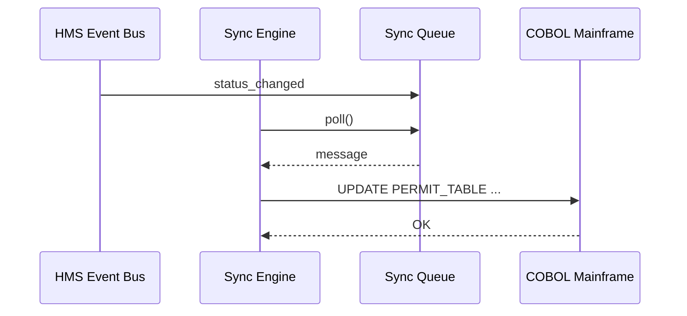
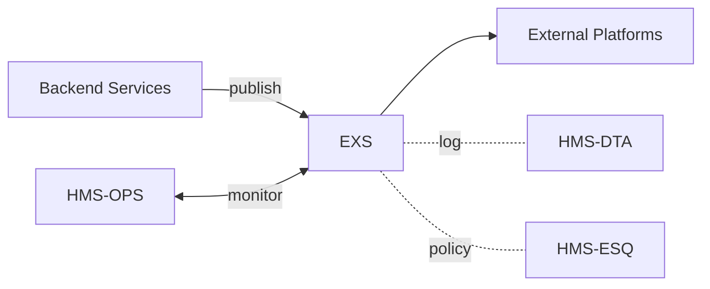

# Chapter 14: External System Synchronization Interface  

*(A smooth hand-off from [Backend Service Layer (HMS-SVC)](13_backend_service_layer__hms_svc__.md))*  

> “When our shiny new HMS says **‘Approved’** but the 1994 mainframe still shows **‘Pending’**,  
> phones melt down. *EXS* prevents the meltdown.”  
> —City Clerk, Monday 8 a.m.

---

## 1. Why Do We Need an External System Synchronization Interface (EXS)?

### 1.1 A Concrete Story – “Same-Day Patio Permit”

1. **Ana** submits an online patio-expansion permit in Austin.  
2. HMS reviewers finish in two hours – status = **Approved**.  
3. City zoning clerks still live inside a **COBOL** system from 1987.  
4. If that COBOL screen is not updated **instantly**, clerks will block Ana’s construction crew.

**EXS** is the bilingual clerk that whispers every HMS status change to:

* the COBOL mainframe 🤖  
* the public SMS tracker 📱  
* the contractor’s scheduling app 🗓️  

Result: one truth everywhere, no phone-tag.

---

## 2. Five Beginner-Friendly Concepts

| # | Concept | Plain-English Job | Emoji |
|---|---------|------------------|-------|
| 1 | Connector | Physical plug to an external app | 🔌 |
| 2 | Mapping Table | Translates HMS fields ↔ legacy fields | 🗺️ |
| 3 | Change Log | Tiny diary of “what changed” | 📖 |
| 4 | Sync Queue | Traffic lane so nothing is lost | 🚚 |
| 5 | Conflict Resolver | Decides who wins if both sides changed | ⚖️ |

Remember **C-M-L-Q-R** — Connector, Mapping, Log, Queue, Resolver.

---

## 3. Declaring a Sync Job (≤ 18 Lines)

Create `cobol_permit.sync.yaml`:

```yaml
id: PermitStatus_To_COBOL
source_topic: permits.status        # published by HMS-SVC
destination: COBOL_Mainframe
connector: odbc://city-mainframe:3060
mapping:
  HMS:status        -> COBOL:PERMIT_STAT
  HMS:updated_at    -> COBOL:LAST_CHG_TS
schedule: realtime                    # realtime | hourly | nightly
conflict_rule: HMS_WINS               # or LAST_WRITE_WINS
retry_policy:
  max_attempts: 5
  backoff_seconds: 30
```

One file = the **sync contract** between two eras of software.

---

## 4. Using EXS in Code – 3 Calls, <20 Lines

### 4.1 Start the Sync Job  

```python
import exs_sdk as exs

job = exs.load("cobol_permit.sync.yaml")
exs.start(job)
print("✅ Sync running:", job["id"])
```

### 4.2 Emit a Status Change (HMS side)

```python
from svc_sdk import publish   # from Chapter 13

publish("permits.status", {"permit_id":"P-123", "status":"Approved"})
```

### 4.3 Observe the Result

```python
log = exs.peek_log(job, last=3)
print(log)
# ➜ [{'permit_id':'P-123','status':'Approved','dest_row':'OK'}]
```

What happened?  
1. `publish` drops a message onto **Sync Queue 🚚**.  
2. EXS reads it, looks up the **Mapping 🗺️**, and fires SQL via the **Connector 🔌**.  
3. A diary entry goes to the **Change Log 📖**.  

All in <30 seconds with no clerk intervention.

---

## 5. Step-by-Step Walk-Through



Five actors — easy to audit.

---

## 6. Peeking Under the Hood (Tiny Modules, ≤ 18 Lines)

### 6.1 Sync Queue (in-memory demo)

```python
# exs/queue.py
import queue, threading
Q = queue.Queue()

def push(msg): Q.put(msg)
def pop():  return Q.get(timeout=1)
```

### 6.2 Mapper

```python
# exs/mapper.py
def apply(mapping, msg):
    row = {}
    for k,v in mapping.items():        # "HMS:status -> COBOL:PERMIT_STAT"
        src, dst = k.split(':')[1], v.split(':')[1]
        row[dst] = msg[src]
    return row
```

### 6.3 Engine Loop

```python
# exs/engine.py
import queue, mapper, connector, log

def run(job):
    while True:
        msg = queue.pop()
        row = mapper.apply(job["mapping"], msg)
        ok  = connector.upsert(job["connector"], row)
        log.write(job["id"], msg, ok)
```

*Real deployments swap in RabbitMQ or Kafka; logic stays identical.*

---

## 7. Conflict Resolution (⚖️ in 10 Lines)

```python
# exs/conflict.py
def resolve(existing, incoming, rule):
    if rule == "HMS_WINS":       # ignore mainframe edits
        return incoming
    if rule == "LAST_WRITE_WINS":
        newer = max([existing, incoming], key=lambda x: x["updated_at"])
        return newer
```

Change the YAML, you change the law of the land—zero code edits.

---

## 8. Talking to Other HMS Layers



* SVC raises events.  
* EXS syncs them outward.  
* DTA stores every push.  
* ESQ can veto illegal fields (e.g., PII to a public Git repo).  
* Upcoming [Operations & Monitoring](15_operations___monitoring__hms_ops__.md) will watch health.

---

## 9. Quick “Did I Do It Right?” Checklist

☐ `.sync.yaml` lists **source_topic**, **destination**, **mapping**  
☐ `exs.start()` returns without crashing  
☐ Publishing a test message updates the external system (check log)  
☐ Conflict rule behaves (simulate a race)  
☐ DTA shows a Change Log entry (`dta.find(topic="exs.changelog")`)

Nail all five and your HMS now speaks fluent **Legacy-ese**!

---

## 10. Conclusion & What’s Next

You just built a **universal translator** that keeps HMS, smartphones, and 1980s mainframes perfectly in sync—citizens and clerks see *one* truth.

But how do we *keep it running* at 3 a.m. Sunday?  
Time to wire up dashboards, alerts, and auto-healing in the next chapter:  
[Operations & Monitoring (HMS-OPS)](15_operations___monitoring__hms_ops__.md)

Happy syncing!

---

Generated by [AI Codebase Knowledge Builder](https://github.com/The-Pocket/Tutorial-Codebase-Knowledge)