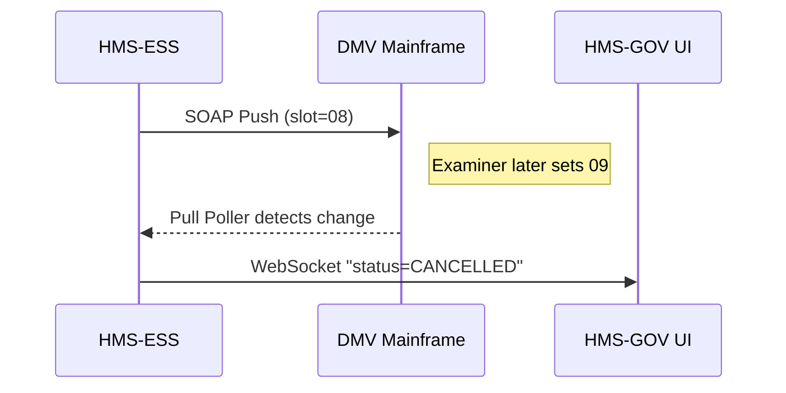

# Chapter 14: External System Synchronization  
*(Jump back to [Model Context Protocol (HMS-MCP)](13_model_context_protocol__hms_mcp__.md))*  

---

## 1  Why Do We Need “Sync Connectors”?

Story time:  
The **Virginia DMV** still runs a 1998‐era mainframe. Citizens book driving-tests through its web portal, yet the state also joined our modern **HMS** platform to power a new “One-Stop License Renewal” mobile app.

If the DMV mainframe shows **“Tuesday 9 a.m. slot free”** while our app shows **“Already taken,”** chaos reigns—double bookings, angry citizens, and newspaper headlines.

**External System Synchronization (ESS)** solves this by acting like a **bilingual interpreter**: every change in HMS (the “master record”) is mirrored to the mainframe, and every mainframe update is echoed back—usually within **≤1 second**.

---

## 2  Key Concepts (Plain English)

| Term | Beginner Analogy |
|------|------------------|
| **Sync Connector** | A plug-in translator headset that understands HMS *and* the legacy system. |
| **Mapping Table**  | A bilingual dictionary—*“APPT_PENDING”* → *“CODE 07.”* |
| **Push Event**     | HMS taps the mainframe on the shoulder: “New booking!” |
| **Pull Poller**    | A tiny robot that checks the mainframe every X seconds for changes. |
| **Conflict Rule**  | Tie-breaker instructions—“If both changed, trust whichever was edited last.” |

Keep these five handy: *Connector, Mapping, Push, Pull, Conflict*.

---

## 3  5-Minute Walk-Through: Keep a DMV Slot in Sync

### 3.1 Register a Connector (HMS Side)

```python
# register_connector.py  (≤15 lines)
import httpx, json
connector = {
  "system": "VA_DMV_MAINFRAME",
  "type":   "SOAP",                 # REST, FTP, DB, etc.
  "endpoint": "https://dmv.va.gov/soap/v1",
  "auth":  { "user":"hms_sync", "pass":"•••" }
}
r = httpx.post("/api/ess/connectors", json=connector).json()
print(r)        # → {'id':'CONN-22','status':'REGISTERED'}
```

You just told HMS **where** and **how** to talk to the DMV.

### 3.2 Describe a Mapping

```bash
curl -X POST /api/ess/mappings -d '{
  "connectorId":"CONN-22",
  "localField":"status",
  "remoteField":"APPT_CODE",
  "pairs": { "PENDING":"07", "CONFIRMED":"08", "CANCELLED":"09" }
}' -H "Content-Type: application/json"
# → { "mappingId":"MAP-9","status":"SAVED" }
```

Now HMS knows how to translate status words.

### 3.3 Book a Test in HMS

```javascript
// book_test.js  (≤12 lines)
const res = await fetch("/api/dmv/appointments", {
  method:"POST",
  headers:{ "Content-Type":"application/json" },
  body: JSON.stringify({ slot:"2025-04-12T09:00", citizen:"maria@example.com" })
});
console.log(await res.json());
// → { id:"APT-501", status:"CONFIRMED" }
```

Behind the scenes a **Push Event** fires—our connector will soon send **08** to the mainframe.

### 3.4 Legacy System Cancels the Slot (Pull Path)

An examiner on the DMV green-screen types “CODE 09”. Our **Pull Poller** sees it, maps **09** → **CANCELLED**, and updates HMS automatically:

```bash
curl /api/dmv/appointments/APT-501
# → { "id":"APT-501","status":"CANCELLED","source":"VA_DMV_MAINFRAME" }
```

Citizen and staff both see the same truth—no double work.

---

## 4  What Happens Under the Hood?



1. **Push** path: HMS converts `"CONFIRMED"` → `08` and calls the mainframe.  
2. **Pull** path: Poller finds `09`, maps it back, and notifies every interested UI via WebSocket.

---

## 5  Inside the Code (Tiny Snippets)

### 5.1 Push Handler (Node.js, 18 lines)

```js
// services/ess/push.js
router.post('/events', async (req,res)=>{
  const { connectorId, record } = req.body;         // record from HMS
  const conn  = await Connectors.find(connectorId);
  const map   = await Mapping.forField(connectorId,'status');
  const code  = map.pairs[record.status];           // e.g. "CONFIRMED"→"08"
  await Soap.call(conn.endpoint, 'UpdateAppt', { id:record.id, code });
  res.sendStatus(200);
});
```

Beginner notes:  
• Looks up the connector & translation.  
• Calls a helper `Soap.call` (details hidden).  
• Responds immediately so UI stays snappy.

### 5.2 Pull Poller (Python-style, 15 lines)

```python
def poll(conn):
    resp = soap.get_appointments(conn.endpoint, since=conn.lastSeen)
    for appt in resp:
        code = appt["APPT_CODE"]
        status = map_code_to_status(code)         # "09"→"CANCELLED"
        if newer_than_local(appt["ID"], appt["TS"]):
            hms.update("/appointments/"+appt["ID"], {"status":status})
    conn.lastSeen = now()
```

Runs every 30 s via a cron-like scheduler in ESS. Only updates HMS if the mainframe copy is newer (simple **Conflict Rule**).

### 5.3 Conflict Rule Table (SQL, 6 lines)

```sql
CREATE TABLE conflict_rules (
  connector   TEXT,
  field       TEXT,
  strategy    TEXT  -- 'LAST_WRITE_WINS' or 'MASTER_ALWAYS_WINS'
);
```

One row per field decides who wins during clashes.

---

## 6  How ESS Talks to Other HMS Layers

| Layer | Interaction |
|-------|-------------|
| [HMS-GOV](01_governance_layer___admin_portal__hms_gov__.md) | UI for registering connectors & viewing sync health. |
| [HMS-OPS](12_operational_monitoring___logging__hms_ops__.md) | Receives metrics (`sync_lag_ms`, errors). |
| [HMS-ACT](06_agent_orchestration_engine__hms_act__.md) | Inserts **sync.ensure** tasks at the end of complex plans. |
| [HMS-ESQ](08_legal___compliance_module__hms_esq__.md) | Verifies data-sharing agreements before a connector goes live. |
| [HMS-DTA](07_central_data_repository__hms_dta__.md) | Stores mapping tables, sync logs, and conflict resolutions. |

---

## 7  Frequently Asked Questions

**“Pulling every 30 seconds sounds heavy—can we use webhooks?”**  
If the legacy system can shoot webhooks, set the connector `mode:"WEBHOOK"` and ESS will accept pushes instead of polling.

**“What if both sides change the same record within 2 seconds?”**  
Configure `strategy:"LAST_WRITE_WINS"` or choose `MASTER_ALWAYS_WINS` to trust HMS. ESS logs the loser version for audits.

**“Can I transform date formats?”**  
Yes. Add a *transform* script to the mapping (e.g., `MM/DD/YYYY` ↔ ISO 8601). Scripts are tiny JS snippets executed in a sandbox.

---

## 8  What You Learned

• **External System Synchronization** keeps HMS and legacy/third-party databases perfectly aligned.  
• You registered a connector, defined a mapping, and watched a two-way sync in action—all under 40 lines of code.  
• Under the hood, *Push Events*, *Pull Pollers*, and *Conflict Rules* guarantee nobody is double-booked.  

Next up, we’ll enter a **safe playground** to test these integrations without breaking real systems—head to  
[Simulation & Training Environment (HMS-ESR)](15_simulation___training_environment__hms_esr__.md).

---

Generated by [AI Codebase Knowledge Builder](https://github.com/The-Pocket/Tutorial-Codebase-Knowledge)