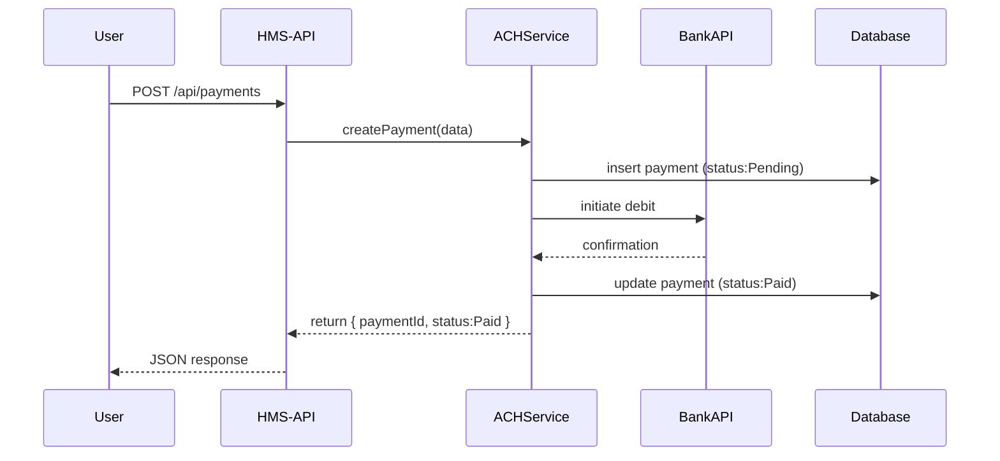

# Chapter 14: Financial Systems (HMS-ACH)

Welcome back! In [Chapter 13: Backend Services (HMS-API / HMS-SVC / HMS-MKT)](13_backend_services__hms_svc___hms_api___hms_mkt__.md) we built endpoints, business logic, and external adapters. Now we’ll focus on the **Financial Systems (HMS-ACH)**—the treasury‐like services that handle payments, reconciliations, and reporting so public funds flow securely and in compliance with regulations.

---

## 1. Why Financial Systems?

Imagine the Office of Natural Resources Revenue (ONRR) collects royalty payments from energy leases. They need to:

1. Let companies **initiate** payments online.  
2. **Reconcile** bank statements—matching incoming funds to invoices.  
3. Generate **financial reports** for auditors and leadership.

Without a dedicated financial subsystem, payments get lost, bank fees go untracked, and reports are error-prone. HMS-ACH solves this by wrapping payment rails and bookkeeping into a simple, audit-ready service.

### Central Use Case

A drilling company pays its monthly lease fee:

1. They click “Pay Now” in the citizen portal.  
2. Our API calls the ACH service to charge their bank account.  
3. Once the bank confirms, we mark the invoice paid.  
4. Treasury officers pull a report showing all reconciled payments this month.

---

## 2. Key Concepts

1. **Payment Initiation**  
   Create a payment order (invoice, amount, account) and send it to the bank.

2. **Reconciliation**  
   Periodically fetch bank transactions, match them to invoices, and flag discrepancies.

3. **Financial Reporting**  
   Summarize payments, outstanding invoices, fees, and balances for audits and dashboards.

4. **Idempotency & Audit Trail**  
   Ensure each payment or reconciliation step runs once, logs every action, and can be replayed safely.

---

## 3. Using HMS-ACH

### 3.1 Initiate a Payment

Here’s a minimal Express route to create a payment:

```js
// src/api/payments.js
const express = require('express');
const { createPayment } = require('../services/paymentService');
const router = express.Router();

router.post('/', async (req, res) => {
  // req.body: { invoiceId, amount, bankAccount }
  const payment = await createPayment(req.body);
  res.json(payment);  // { paymentId, status: "Pending" }
});

module.exports = router;
```

This route:
- Accepts invoice details.
- Calls `createPayment()`.
- Returns a `paymentId` and initial status.

### 3.2 Generate a Report

To get all reconciled payments for a month:

```js
// src/api/reports.js
const express = require('express');
const { monthlyReport } = require('../services/reportService');
const router = express.Router();

router.get('/:year/:month', async (req, res) => {
  const report = await monthlyReport(req.params);
  res.json(report);  // e.g. [{ invoiceId, paidOn, amount }, …]
});

module.exports = router;
```

This returns a JSON array of all payments that were successfully reconciled.

---

## 4. Under the Hood: Sequence Diagram



1. **API** receives the payment request.  
2. **ACHService** logs it as “Pending.”  
3. It calls the **BankAPI**, then marks it “Paid.”  
4. The updated status is returned to the user.

---

## 5. Internal Implementation

### 5.1 Payment Service

```js
// src/services/paymentService.js
const db = require('../sys/db');
const { debitAccount } = require('../mkt/bankConnector');

async function createPayment({ invoiceId, amount, bankAccount }) {
  const { rows } = await db.query(
    'INSERT INTO payments(invoice_id, amount, account, status) VALUES($1,$2,$3,$4) RETURNING id',
    [invoiceId, amount, bankAccount, 'Pending']
  );
  const paymentId = rows[0].id;
  // Call bank and update status
  await debitAccount({ paymentId, amount, bankAccount });
  await db.query('UPDATE payments SET status=$1 WHERE id=$2', ['Paid', paymentId]);
  return { paymentId, status: 'Paid' };
}

module.exports = { createPayment };
```

- We insert a “Pending” record.  
- Call `debitAccount()` in **HMS-MKT**.  
- On success, set status to “Paid.”

### 5.2 Bank Connector

```js
// src/mkt/bankConnector.js
const fetch = require('node-fetch');

async function debitAccount({ paymentId, amount, bankAccount }) {
  // Simplified call to bank’s ACH API
  await fetch('https://bank.gov/ach/debit', {
    method: 'POST',
    headers:{ 'Content-Type':'application/json' },
    body: JSON.stringify({ paymentId, amount, bankAccount })
  });
}

module.exports = { debitAccount };
```

This adapts our call into the external bank’s REST API.

### 5.3 Reconciliation Service

```js
// src/services/reconciliationService.js
async function reconcileBankStatement() {
  const transactions = await fetchBankStatement(); // external call
  for (const t of transactions) {
    await db.query(
      `UPDATE payments SET status='Reconciled'
       WHERE invoice_id=$1 AND amount=$2`,
      [t.invoiceId, t.amount]
    );
  }
}
module.exports = { reconcileBankStatement };
```

- Fetch transactions.  
- Match to `payments` by invoice and amount.  
- Mark them “Reconciled.”

---

## 6. Why This Matters

- **Accuracy:** Automated reconciliation cuts manual work and errors.  
- **Compliance:** Every step is logged so auditors can see who did what and when.  
- **Security:** Bank calls are isolated in **HMS-MKT**, keeping credentials out of core logic.  
- **Transparency:** Reports give leadership a clear, up-to-date view of cash flows.

---

## Conclusion

You’ve learned how to build **Financial Systems (HMS-ACH)** that initiate ACH transfers, reconcile bank statements, and generate audit-ready reports. These services act like a treasury office—ensuring secure, accurate, and compliant fund flows.  

This concludes the HMS-AGX tutorial. Thank you for following along, and happy coding!

---

Generated by [AI Codebase Knowledge Builder](https://github.com/The-Pocket/Tutorial-Codebase-Knowledge)