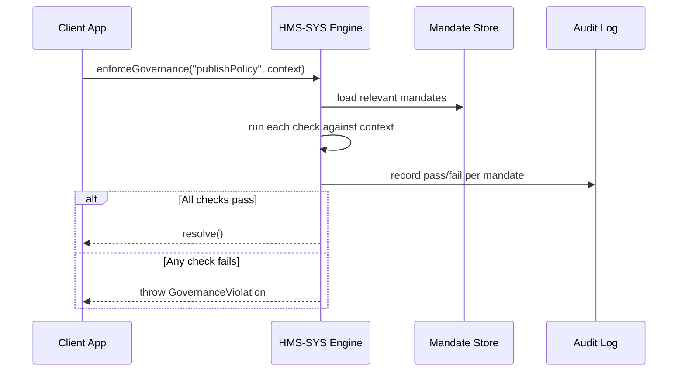

# Chapter 14: Governance Layer (HMS-SYS)

In the previous chapter we saw how [Data Governance & Compliance](13_data_governance___compliance_.md) handles field-level rules on PII. Now we’ll zoom out to the **Governance Layer (HMS-SYS)**, our system’s “constitution and referee,” making sure every module follows agency mandates—transparency, privacy, ethics, and federal guidelines like FHEO.

---

## 1. Why a Governance Layer?

Imagine the Bureau of Land Management (BLM) wants to publish a new public-access policy for wilderness areas. Before that policy goes live, HMS-SYS must ensure:

1. A public notice has been published (transparency).  
2. No full Social Security Numbers were logged in the change request (privacy).  
3. The policy text meets ethical guidelines against cultural bias (ethics).

Instead of sprinkling checks throughout every service, we call a single “Governance Engine” that loads high-level mandates and either **allows** the action or **blocks** it with a clear error. Beginners get one simple API; experts can extend or audit mandates without touching core code.

---

## 2. Key Concepts

1. **Mandate Store**  
   A JSON configuration of high-level policies (transparency, privacy, ethics).

2. **Governance Engine**  
   Loads mandates at startup and evaluates them on every critical action.

3. **Action Context**  
   A lightweight object you pass in (e.g., `{ user, params, data }`) so checks can inspect inputs.

4. **Audit Trail**  
   Every governance evaluation is logged—what mandate ran, who requested it, pass/fail.

5. **Extensible Policies**  
   Add or modify mandates in config without changing JavaScript. Auditors can review policy versions.

---

## 3. Using the Governance Layer

Below is a minimal example in your application code when publishing a policy update.

```js
// src/publishPolicy.js
import { enforceGovernance } from 'hms-sys'

export async function publishPolicy(user, policy) {
  // 1. Enforce high-level mandates before proceeding
  await enforceGovernance('publishPolicy', { user, policy })

  // 2. If no exception, go ahead and call the backend
  return fetch('/api/policies', { method: 'POST', body: JSON.stringify(policy) })
}
```

Explanation:  
- `enforceGovernance` checks all “publishPolicy” rules.  
- If a mandate fails, it throws an error like `GovernanceViolation: fheo-transparency`.  
- Otherwise your code continues normally.

---

## 4. Sequence of Events



---

## 5. Under the Hood

### 5.1 Mandate Configuration

File: `hms-sys/config/mandates.json`

```json
[
  {
    "id": "fheo-transparency",
    "actions": ["publishPolicy"],
    "description": "Policy changes need a public notice first",
    "checks": ["context.policy.noticePublished === true"]
  },
  {
    "id": "privacy-no-ssn-logs",
    "actions": ["publishPolicy","deletePolicy"],
    "description": "Requests must not log full SSNs",
    "checks": ["!context.user.requestLog.includes('ssn')"]
  }
]
```

Explanation:  
- Each mandate has an `id`, a list of `actions` it applies to, human-readable `description`, and an array of JavaScript `checks`.

### 5.2 Mandate Store

File: `hms-sys/src/mandateStore.js`

```js
import mandates from '../config/mandates.json'

export function getMandatesFor(action) {
  return mandates.filter(m => m.actions.includes(action))
}
```

Explanation:  
Loads the JSON and returns only mandates relevant to the requested action.

### 5.3 Governance Engine

File: `hms-sys/src/governanceService.js`

```js
import { getMandatesFor } from './mandateStore'
import { logAudit }       from './auditLogger'

// Very simple JS evaluator
function evaluate(check, context) {
  // eslint-disable-next-line no-new-func
  return new Function('context', `return ${check}`)(context)
}

export async function enforceGovernance(action, context) {
  const failed = []
  for (const m of getMandatesFor(action)) {
    const passed = evaluate(m.checks[0], context)  // one check for brevity
    await logAudit({ mandateId: m.id, action, passed, user: context.user.id })
    if (!passed) failed.push(m.id)
  }
  if (failed.length) {
    throw new Error('GovernanceViolation: ' + failed.join(','))
  }
}
```

Explanation:  
- We load mandates, run each `check` against your `context`, log the result, and gather failures.  
- If any mandate fails, we throw a clear error listing the violated IDs.

---

## 6. Why This Matters

- **Single Source of Truth**: All high-level rules live in one place—no duplicate checks scattered across services.  
- **Audit & Compliance**: Every enforcement is recorded, making audits painless.  
- **Agility**: Update mandates in JSON, redeploy the governance service, and instantly protect new rules.  
- **Trust & Transparency**: Citizens and officials know your system always follows federal or agency mandates.

---

## Conclusion

In this chapter you learned how the **Governance Layer (HMS-SYS)** provides a central “constitution and referee” for HMS-OPS—enforcing transparency, privacy, ethics, and compliance checks across modules. You saw how to call `enforceGovernance`, how mandates are configured, and how the engine runs checks and logs results.

That wraps up our core layers! Feel free to explore the code and adapt mandates for your agency’s needs. Since this is the last chapter in our tutorial, we hope you now have a full picture of HMS-OPS—from interface to governance—and can confidently build compliant, trustworthy federal services.

---

Generated by [AI Codebase Knowledge Builder](https://github.com/The-Pocket/Tutorial-Codebase-Knowledge)